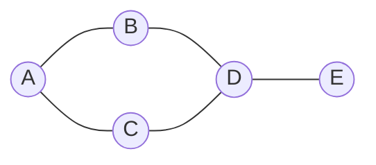
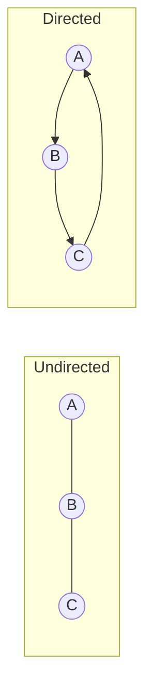

# 🕸 Graph Theory

## 📑 Table of Contents
1. [What is a Graph?](#1-what-is-a-graph)
2. [Types of Graphs](#2-types-of-graphs)
3. [Representing Graphs in Code](#3-representing-graphs-in-code)
4. [Traversals (BFS, DFS)](#4-traversals-bfs-dfs)
5. [Real-world Applications](#5-real-world-applications)

---

## 1. 📍 What is a Graph?

A **Graph** is a data structure consisting of **vertices** (also called nodes) and **edges** that connect them.

**Real-world examples:**
- **Social Networks**: Vertices represent people, and edges represent friendships.
- **Maps**: Vertices represent cities, and edges represent roads.
- **The Internet**: Vertices represent websites, and edges represent hyperlinks.



---

## 2. 🗂 Types of Graphs

### By Directionality

- **Undirected Graph**: Edges have no direction (e.g., mutual friendship).
- **Directed Graph (Digraph)**: Edges have a specific direction (e.g., following someone on Twitter).



### By Weighted Edges

- **Weighted Graph**: Edges are assigned a value (e.g., distance, travel cost).
- **Unweighted Graph**: All edges are considered equal.

### By Connectivity

- **Connected Graph**: A path exists between every pair of vertices.
- **Disconnected Graph**: Contains isolated vertices or components.

---

## 3. 💾 Representing Graphs in Code

There are two primary methods for storing graphs:

### 1. Adjacency List — Highly Recommended ✅

Each vertex maintains a list (or slice) of its neighboring vertices.

```go
type Graph struct {
    adjacencyList map[int][]int
}

func NewGraph() *Graph {
    return &Graph{
        adjacencyList: make(map[int][]int),
    }
}

func (g *Graph) AddEdge(from, to int) {
    g.adjacencyList[from] = append(g.adjacencyList[from], to)
    // For an undirected graph, add the reverse edge
    g.adjacencyList[to] = append(g.adjacencyList[to], from)
}

// Usage example
func main() {
    graph := NewGraph()
    graph.AddEdge(1, 2)
    graph.AddEdge(1, 3)
    graph.AddEdge(2, 4)
    
    // Resulting structure:
    // 1 -> [2, 3]
    // 2 -> [1, 4]
    // 3 -> [1]
    // 4 -> [2]
}
```

**Pros:**
- Memory-efficient for sparse graphs (graphs with few edges).
- Finding neighbors is very fast.

**Cons:**
- Checking if a specific edge exists between two vertices takes $O(\text{degree of vertex})$ time.

---

### 2. Adjacency Matrix

A 2D array where `matrix[i][j] = 1` indicates an edge exists from vertex $i$ to vertex $j$.

```go
type GraphMatrix struct {
    matrix [][]int
    size   int
}

func NewGraphMatrix(size int) *GraphMatrix {
    matrix := make([][]int, size)
    for i := range matrix {
        matrix[i] = make([]int, size)
    }
    return &GraphMatrix{
        matrix: matrix,
        size:   size,
    }
}

func (g *GraphMatrix) AddEdge(from, to int) {
    g.matrix[from][to] = 1
    g.matrix[to][from] = 1 // Assuming undirected
}

func (g *GraphMatrix) HasEdge(from, to int) bool {
    return g.matrix[from][to] == 1
}
```

**Pros:**
- Edge existence check is $O(1)$ (constant time).

**Cons:**
- Always consumes $O(V^2)$ memory, even if the graph has very few edges.

---

## 4. 🚶‍♂️ Traversals (BFS, DFS)

### BFS (Breadth-First Search)

BFS explores the graph in **layers**: it visits all immediate neighbors first, then moves to their neighbors.

**Mechanism**: Uses a **Queue**.

```go
func BFS(graph *Graph, start int) {
    visited := make(map[int]bool)
    queue := []int{start}
    visited[start] = true
    
    for len(queue) > 0 {
        // Dequeue current node
        node := queue[0]
        queue = queue[1:]
        
        fmt.Println("Visiting:", node)
        
        // Add all unvisited neighbors to the queue
        for _, neighbor := range graph.adjacencyList[node] {
            if !visited[neighbor] {
                visited[neighbor] = true
                queue = append(queue, neighbor)
            }
        }
    }
}
```

**Common Applications:**
- Shortest path search (in unweighted graphs).
- Connectivity checks.
- Finding connected components.

**Complexity**: $O(V + E)$ where $V$ is vertices and $E$ is edges.

---

### DFS (Depth-First Search)

DFS explores as **deeply** as possible along each branch before backtracking.

**Mechanism**: Uses a **Stack** (explicitly or via recursion).

```go
func DFS(graph *Graph, start int, visited map[int]bool) {
    if visited == nil {
        visited = make(map[int]bool)
    }
    
    visited[start] = true
    fmt.Println("Visiting:", start)
    
    for _, neighbor := range graph.adjacencyList[start] {
        if !visited[neighbor] {
            DFS(graph, neighbor, visited)
        }
    }
}

// Iterative version using an explicit stack
func DFSIterative(graph *Graph, start int) {
    visited := make(map[int]bool)
    stack := []int{start}
    
    for len(stack) > 0 {
        // Pop the top element
        node := stack[len(stack)-1]
        stack = stack[:len(stack)-1]
        
        if visited[node] {
            continue
        }
        
        visited[node] = true
        fmt.Println("Visiting:", node)
        
        for _, neighbor := range graph.adjacencyList[node] {
            if !visited[neighbor] {
                stack = append(stack, neighbor)
            }
        }
    }
}
```

**Common Applications:**
- Cycle detection.
- Topological sorting.
- Finding strongly connected components.
- Solving mazes and puzzles.

**Complexity**: $O(V + E)$.

---

### Comparison: BFS vs. DFS

| Feature | BFS | DFS |
|:---|:---|:---|
| **Data Structure** | Queue | Stack / Recursion |
| **Approach** | Level-by-level (Breadth) | Probe deep (Depth) |
| **Shortest Path** | ✅ Finds it (unweighted) | ❌ Does not guarantee it |
| **Memory** | $O(V)$ | $O(h)$ where $h$ is max depth |
| **Use Cases** | Search nearby, levels | Paths, cycles, sorting |

---

## 5. 🎯 Real-world Applications

### Social Networks

```go
// Finding all "Friends of Friends" (2 steps away)
func findFriendsOfFriends(graph *Graph, userID int) []int {
    friends := make(map[int]bool)
    visited := make(map[int]bool)
    queue := []int{userID}
    visited[userID] = true
    level := 0
    
    for len(queue) > 0 && level < 2 {
        size := len(queue)
        for i := 0; i < size; i++ {
            node := queue[0]
            queue = queue[1:]
            
            for _, neighbor := range graph.adjacencyList[node] {
                if !visited[neighbor] {
                    visited[neighbor] = true
                    queue = append(queue, neighbor)
                    if level == 1 { // These are friends of friends
                        friends[neighbor] = true
                    }
                }
            }
        }
        level++
    }
    
    result := []int{}
    for friend := range friends {
        result = append(result, friend)
    }
    return result
}
```

### Recommendation Engines
Representing users and products as nodes, with edges representing "purchased" or "viewed" actions.

---

## 💡 Key Takeaways

- **A Graph** = Vertices + Edges.
- **The Adjacency List** is usually the preferred storage method.
- **BFS** is best for level-based exploration and shortest paths.
- **DFS** is better for cycles, sorting, and deep pathfinding.
