# 🧠 Logic and Set Theory

## 📑 Table of Contents
1. [Boolean Logic](#1-boolean-logic)
2. [Truth Tables](#2-truth-tables)
3. [Set Theory](#3-set-theory)
4. [De Morgan's Laws](#4-de-morgans-laws)
5. [Implementation in Go](#5-implementation-in-go)

---

## 1. 🚦 Boolean Logic

In Boolean logic, variables can only take one of two values: `True` (1) or `False` (0).

Core Operations:
*   **NOT (`!`)**: Inverts the value.
*   **AND (`&&`)**: True only if **BOTH** operands are true.
*   **OR (`||`)**: True if **AT LEAST ONE** operand is true.
*   **XOR (`^`)**: True if the operands are **DIFFERENT**.

### Go Examples

```go
func logicExamples() {
    a, b := true, false
    
    // NOT
    fmt.Println(!a)      // false
    fmt.Println(!b)      // true
    
    // AND
    fmt.Println(a && a)  // true
    fmt.Println(a && b)  // false
    fmt.Println(b && b)  // false
    
    // OR
    fmt.Println(a || a)  // true
    fmt.Println(a || b)  // true
    fmt.Println(b || b)  // false
    
    // XOR (Go uses ^ for numeric bitwise XOR; for bool, use the inequality operator:)
    fmt.Println(a != b)  // true (different)
    fmt.Println(a != a)  // false (identical)
}
```

### Practical Application: Conditions

```go
func canVote(age int, isCitizen bool) bool {
    // Eligible if age >= 18 AND is a citizen
    return age >= 18 && isCitizen
}

func canEnter(hasTicket bool, isVIP bool) bool {
    // Entry allowed if they have a ticket OR have VIP status
    return hasTicket || isVIP
}

func accessAllowed(isAdmin bool, isOwner bool, hasPermission bool) bool {
    // Access granted if (Admin OR Owner) AND specific permission exists
    return (isAdmin || isOwner) && hasPermission
}
```

---

## 2. 📊 Truth Tables

| A | B | NOT A | A AND B | A OR B | A XOR B |
|:---:|:---:|:---:|:---:|:---:|:---:|
| 0 | 0 | 1 | 0 | 0 | 0 |
| 0 | 1 | 1 | 0 | 1 | 1 |
| 1 | 0 | 0 | 0 | 1 | 1 |
| 1 | 1 | 0 | 1 | 1 | 0 |

### Bitwise Operations in Go

```go
func bitwiseExamples() {
    a, b := 5, 3  // 5 = 0101, 3 = 0011 in binary
    
    // AND (&): Results in 1 only if both bits are 1
    fmt.Printf("%d & %d = %d (0101 & 0011 = 0001)\n", a, b, a&b) // 1
    
    // OR (|): Results in 1 if at least one bit is 1
    fmt.Printf("%d | %d = %d (0101 | 0011 = 0111)\n", a, b, a|b) // 7
    
    // XOR (^): Results in 1 if the bits are different
    fmt.Printf("%d ^ %d = %d (0101 ^ 0011 = 0110)\n", a, b, a^b) // 6
    
    // NOT (^): Bitwise inversion (in Go, use the ^ operator prefix)
    fmt.Printf("^%d = %d\n", a, ^a) // -6 (all bits inverted)
    
    // bitwise shifts
    fmt.Printf("%d << 1 = %d (equivalent to multiplying by 2)\n", a, a<<1)  // 10
    fmt.Printf("%d >> 1 = %d (equivalent to floor division by 2)\n", a, a>>1) // 2
}
```

### Practical Application: Permission Flags

```go
const (
    ReadPermission  = 1 << 0 // 0001 = 1
    WritePermission = 1 << 1 // 0010 = 2
    ExecPermission  = 1 << 2 // 0100 = 4
    AdminPermission = 1 << 3 // 1000 = 8
)

func hasPermission(userPerms, requiredPerm int) bool {
    return (userPerms & requiredPerm) == requiredPerm
}

func addPermission(userPerms, newPerm int) int {
    return userPerms | newPerm
}

func removePermission(userPerms, perm int) int {
    return userPerms &^ perm // Bit clearing (AND NOT)
}

func main() {
    // User starts with READ and WRITE permissions
    user := ReadPermission | WritePermission // 0011 = 3
    
    fmt.Println(hasPermission(user, ReadPermission))   // true
    fmt.Println(hasPermission(user, WritePermission))  // true
    fmt.Println(hasPermission(user, ExecPermission))   // false
    
    // Grant EXEC permission
    user = addPermission(user, ExecPermission) // 0111 = 7
    fmt.Println(hasPermission(user, ExecPermission))   // true
    
    // Revoke WRITE permission
    user = removePermission(user, WritePermission) // 0101 = 5
    fmt.Println(hasPermission(user, WritePermission))  // false
}
```

---

## 3. 📦 Set Theory

A **Set** is an unordered collection of unique elements (no duplicates).

### Fundamental Operations

*   **Union ($\cup$)**: Contains all elements present in either set A **OR** set B.
*   **Intersection ($\cap$)**: Contains only elements present in set A **AND** set B.
*   **Difference ($A \setminus B$)**: Contains elements present in set A but **NOT** in set B.
*   **Symmetric Difference**: Elements in exactly one of the sets. $(A \setminus B) \cup (B \setminus A)$.

```mermaid
flowchart TD
    subgraph "A ∪ B (Union)"
        A1["A: {1, 2, 3}"]
        B1["B: {3, 4, 5}"]
        R1["Result: {1, 2, 3, 4, 5}"]
    end
    
    subgraph "A ∩ B (Intersection)"
        A2["A: {1, 2, 3}"]
        B2["B: {3, 4, 5}"]
        R2["Result: {3}"]
    end
    
    subgraph "A \\ B (Difference)"
        A3["A: {1, 2, 3}"]
        B3["B: {3, 4, 5}"]
        R3["Result: {1, 2}"]
    end
```



---

## 4. ⚖️ De Morgan's Laws

Essential laws for simplifying complex logical expressions:

1.  **`!(A && B)` is equivalent to `!A || !B`**  
    "NOT (A AND B)" equals "NOT A OR NOT B."

2.  **`!(A || B)` is equivalent to `!A && !B`**  
    "NOT (A OR B)" equals "NOT A AND NOT B."

### Demonstration in Go

```go
func deMorganExample() {
    a, b := true, false
    
    // Law 1 check:
    left1 := !(a && b)
    right1 := !a || !b
    fmt.Println(left1 == right1) // true
    
    // Law 2 check:
    left2 := !(a || b)
    right2 := !a && !b
    fmt.Println(left2 == right2) // true
}
```

### Practical Application: Condition Simplification

```go
// ❌ HARD TO READ:
if !(age >= 18 && hasDrivingLicense) {
    fmt.Println("Driving restricted")
}

// ✅ CLEARER: Applying De Morgan's law
if age < 18 || !hasDrivingLicense {
    fmt.Println("Driving restricted")
}
```

---

## 5. 💻 Implementation in Go

### Sets using Maps

While Go does not have a native `Set` type, you can easily implement one using `map[T]bool`:

```go
type Set map[int]bool

func NewSet(values ...int) Set {
    s := make(Set)
    for _, v := range values {
        s[v] = true
    }
    return s
}

func (s Set) Add(value int) {
    s[value] = true
}

func (s Set) Remove(value int) {
    delete(s, value)
}

func (s Set) Contains(value int) bool {
    return s[value]
}

func (s Set) Size() int {
    return len(s)
}

// Union
func (s Set) Union(other Set) Set {
    result := NewSet()
    for k := range s {
        result.Add(k)
    }
    for k := range other {
        result.Add(k)
    }
    return result
}

// Intersection
func (s Set) Intersection(other Set) Set {
    result := NewSet()
    for k := range s {
        if other.Contains(k) {
            result.Add(k)
        }
    }
    return result
}

// Difference
func (s Set) Difference(other Set) Set {
    result := NewSet()
    for k := range s {
        if !other.Contains(k) {
            result.Add(k)
        }
    }
    return result
}

func main() {
    a := NewSet(1, 2, 3, 4)
    b := NewSet(3, 4, 5, 6)
    
    union := a.Union(b)
    fmt.Println("A ∪ B:", union)            // {1, 2, 3, 4, 5, 6}
    
    intersection := a.Intersection(b)
    fmt.Println("A ∩ B:", intersection)     // {3, 4}
    
    difference := a.Difference(b)
    fmt.Println("A \ B:", difference)      // {1, 2}
}
```

### Subset Checking

```go
func (s Set) IsSubsetOf(other Set) bool {
    for k := range s {
        if !other.Contains(k) {
            return false
        }
    }
    return true
}

func main() {
    a := NewSet(1, 2)
    b := NewSet(1, 2, 3, 4)
    
    fmt.Println(a.IsSubsetOf(b)) // true: A ⊆ B
}
```

---

## 💡 Practical Use Cases

### 1. Account Filtering

```go
func filterActiveUsers(allUsers, bannedUsers Set) Set {
    // Active = All minus Banned
    return allUsers.Difference(bannedUsers)
}
```

### 2. Matching Interests

```go
func findCommonInterests(user1Interests, user2Interests Set) Set {
    // Common interests = the intersection of both sets
    return user1Interests.Intersection(user2Interests)
}
```

### 3. Duplicate Detection

```go
func hasDuplicates(arr []int) bool {
    seen := NewSet()
    for _, num := range arr {
        if seen.Contains(num) {
            return true // Duplicate found within the set
        }
        seen.Add(num)
    }
    return false
}
```

---

## 💡 Recap

| Concept | Operation | Go Implementation |
|:---|:---|:---|
| **Logic** | AND, OR, NOT, XOR | `&&`, `||`, `!`, `!=` |
| **Bitwise** | &, |, ^, <<, >> | Bitmasks, Permission flags |
| **Sets** | Union, Intersection | `map[T]bool` / `map[T]struct{}` |
| **Laws** | De Morgan's | Code logical simplification |

> [!TIP]
> Use `map[T]struct{}` instead of `map[T]bool` to save memory, as `struct{}` occupies exactly 0 bytes!
