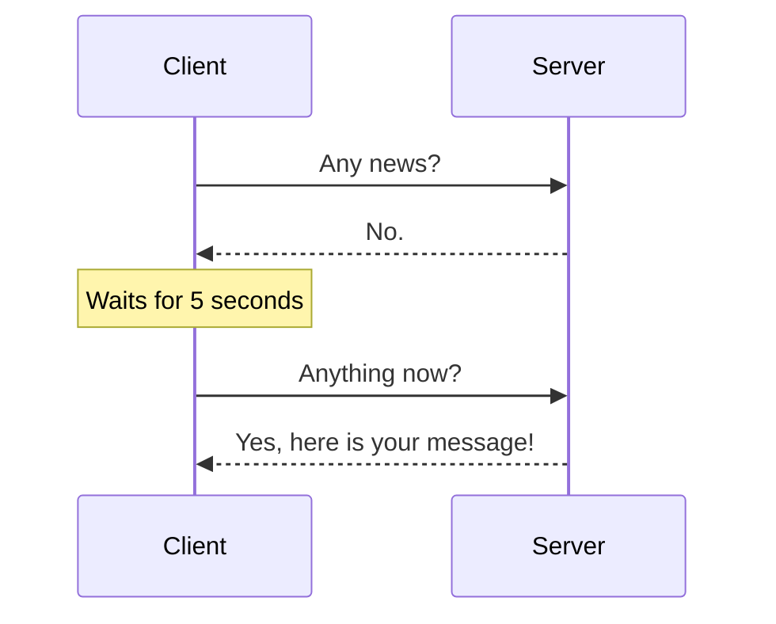
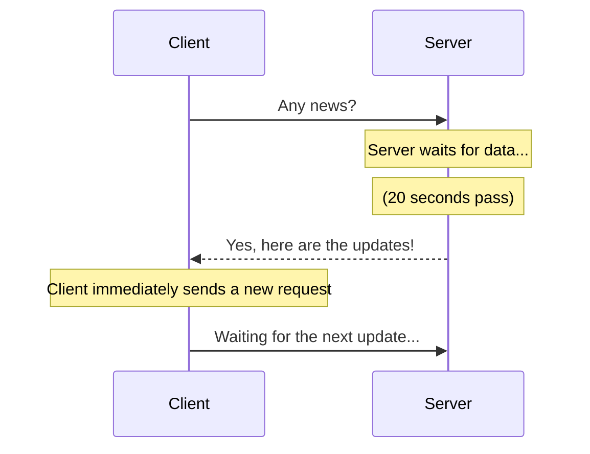
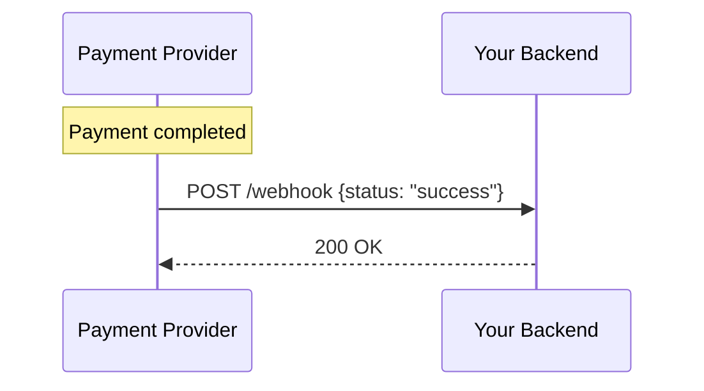
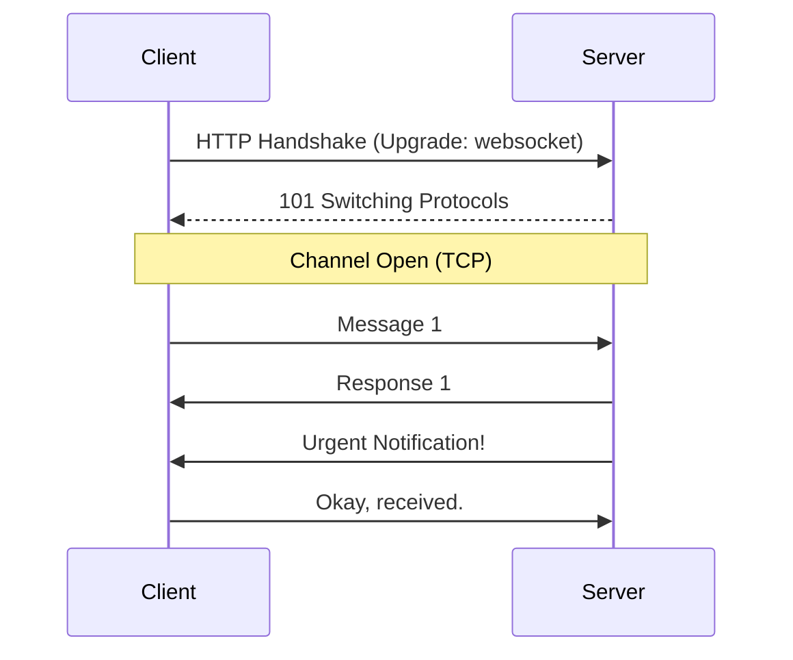

# 📡 Data Exchange: Polling, Webhooks, WebSockets

## 📑 Table of Contents
1. [Short Polling](#short-polling)
2. [Long Polling](#long-polling)
3. [Webhooks](#webhooks)
4. [WebSockets](#websockets)
5. [Server-Sent Events (SSE)](#server-sent-events-sse)
6. [Technology Comparison](#technology-comparison)

---

How does a server notify a client that something new has happened? In standard HTTP, the server remains silent until it is explicitly asked for information. Several approaches have been developed to solve this problem.

---

## 1. ⏱️ Short Polling

The simplest and most "naive" method. The client periodically "spams" the server with the question: "Is there anything new?"

> [!WARNING]
> **Cons**: Significant unnecessary load on the server and network. 99% of requests may return empty data, yet resources are still consumed to establish each HTTP connection.

---

## 2. ⏳ Long Polling

An optimized version of polling. The client makes a request, and rather than responding immediately, the server **holds** the request open until data becomes available (or a timeout occurs).

> [!TIP]
> This is a good compromise if you don't require ultra-fast real-time synchronization but want to save on server resources.

---

## 3. ⚓ Webhooks

This is "inverted" HTTP. Instead of the client reaching out to the server, the **server reaches out to the client**.

> [!IMPORTANT]
> **Accessibility Requirement**: Your backend must have a public IP/URL so the external service can reach it. This is commonly used for integrations with services like Stripe, GitHub, or Telegram.

---

## 4. 🔌 WebSockets

A full-duplex, bidirectional communication protocol. After an initial "handshake," the client and server act as equal participants in the conversation.

- **Pros**: Minimal latency and low overhead since headers are reduced.
- **Cons**: Difficult to scale horizontally; every client keeps an open connection, which consumes server memory and connection limits.

---

## 5. Server-Sent Events (SSE)

A unidirectional "streaming" method from the server to the client over a standard HTTP connection.

> [!NOTE]
> SSE is ideal for news feeds or stock tickers where the client only needs to listen to updates and doesn't need to send data back to the server over the same channel.

---

## 6. 📊 Technology Comparison

| Technology | Direction | Latency | Implementation Complexity |
|:---|:---|:---:|:---|
| **Short Polling** | Client -> Server | High | Low |
| **Long Polling** | Client -> Server | Medium | Medium |
| **Webhooks** | Server -> Client | Low | Medium |
| **WebSockets** | Bidirectional | Minimal | High |

---

## 🎯 Key Takeaways

- **Short Polling**: Best for MVPs or non-critical, simple tasks.
- **Long Polling**: Use when WebSockets are not feasible.
- **Webhooks**: Standard for server-to-server notifications.
- **WebSockets**: Essential for chat applications, multiplayer games, and real-time financial dashboards.
