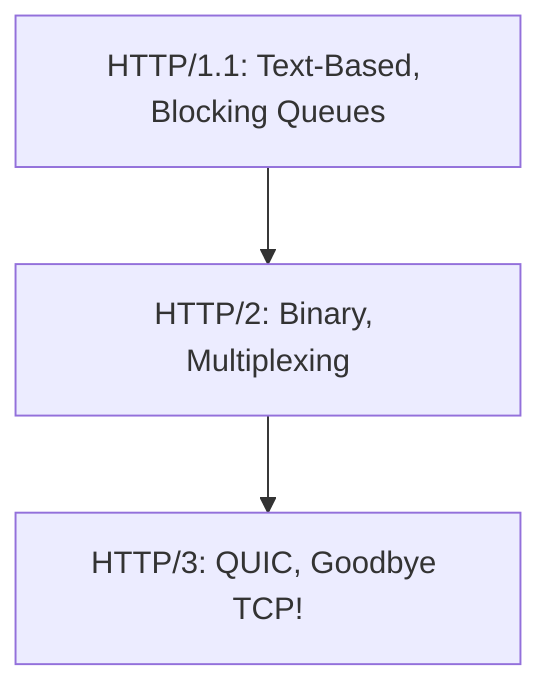
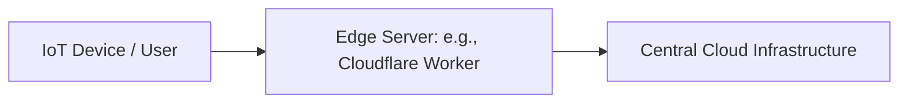

# 🌟 Modern Networking Trends

## 📑 Table of Contents
1. [The Evolution of HTTP (1.1 -> 2 -> 3)](#evolution-of-http)
2. [The QUIC Protocol](#http3-quic)
3. [Edge Computing](#edge-computing)
4. [Zero Trust Architecture](#zero-trust-architecture-zta)
5. [5G and IoT](#fifth-generation-networks-5g)

---

Networking is becoming faster yet more complex. The primary modern focus is on minimizing latency and maximizing security at every layer.

---

## 1. 📈 The Evolution of HTTP

- **HTTP/1.1**: Faces the **Head-of-Line Blocking** issue. If the first resource (like a large image) loads slowly, all subsequent resources in the queue must wait.
- **HTTP/2**: Introduced multiplexing, allowing multiple resources to be sent over a single TCP connection simultaneously. However, if ONE packet is lost, TCP pauses ALL streams until it is retransmitted.
- **HTTP/3 (QUIC)**: Transitions the foundation to **UDP**. Now, a packet loss affecting one resource does not interfere with the loading of others.

---

## 2. 🚀 QUIC (Quick UDP Internet Connections)

QUIC is Google's new foundation for the internet, designed to address the limitations of TCP.

### Why UDP?
TCP is aging and rigid. Establishing a secure connection (TLS) over TCP requires multiple "round-trip" handshakes (3-4). QUIC accomplishes this in just 1 or 2 round trips.

> [!TIP]
> QUIC enables seamless "Connection Migration." For example, you can switch from Wi-Fi to 4G (like when leaving your house) without dropping your active connection to the server.

---

## 3. 🏔️ Edge Computing

Why send data to a central cloud in the US for processing when you can process it "at the edge" of the network, closer to the user?

- **Edge Functions (Cloudflare Workers, AWS Lambda@Edge)**: Your code executes in the data center physically closest to the end user.
- **The Result**: Latency is reduced from ~200ms down to 5-10ms.

---

## 4. 🔐 Zero Trust Architecture

The principle of "Never Trust, Always Verify." This assumes that the internal network is just as hostile as the public internet.

- **Core Tenets**:
  - Every single request must be authenticated and authorized.
  - No device is automatically "trusted" just because it's on a specific subnet or in an office.
  - **Least Privilege**: Users and services are only granted the specific access required for their current task.

---

## 🎯 Key Takeaways

- **HTTP/3** is the new standard, already adopted by giants like Google and Facebook.
- **QUIC** resolves the fundamental performance bottlenecks inherent in TCP.
- **Edge Computing** shifts logic from the core to the periphery to achieve near-instantaneous response times.
- **Zero Trust** replaces traditional perimeter-based security (like standard VPNs) with holistic, request-level verification.
