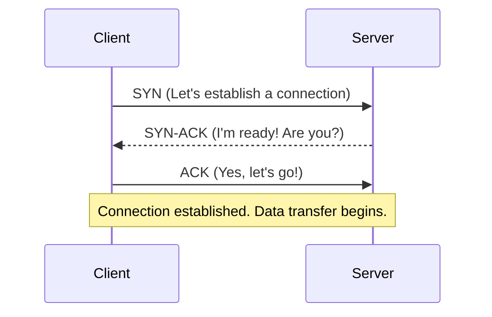

# 🚛 OSI L4: The Transport Layer

## 📑 Table of Contents
1. [TCP: Order and Reliability](#transmission-control-protocol-tcp-reliability)
2. [UDP: Speed and Risk](#user-datagram-protocol-udp-speed-vs-reliability)
3. [Ports and Sockets](#ports-and-sockets-how-applications-communicate)
4. [The TCP 3-Way Handshake](#three-way-handshake)

---

The Transport Layer is what connects **application to application**, rather than just computer to computer.

---

## 1. 🤝 TCP — The "Reliability First" Protocol

**TCP (Transmission Control Protocol)** provides a guarantee: if you send 1GB of data, the server will receive exactly that 1GB, and every byte will be in the correct original order.

### The Three-Way Handshake
Before any actual data is sent, TCP performs a negotiation to ensure that both the sender and the receiver are ready and synchronized.

---

## 2. 🏁 UDP — The "Speed First" Protocol

**UDP (User Datagram Protocol)** does not waste time with handshakes or delivery verification. it simply sends packets into the network. If a packet is lost along the way—it stays lost.

> [!TIP]
> UDP is ideal for **VoIP (Zoom/Skype) and Gaming**. It is more important to hear a live voice *right now* than to wait 2 seconds for a system to re-request a lost syllable from the past.

---

## 3. 🚪 Ports and Sockets

While an IP address gets data to the "building" (the server), the **Port** gets it to the correct "apartment" (the specific software process).

- **Standard Ports**:
  - **80 / 443**: Web Traffic (HTTP/HTTPS).
  - **5432 / 3306**: Database Traffic (PostgreSQL/MySQL).

> [!IMPORTANT]
> **Socket** = [IP Address] + [Protocol Type] + [Port Number]. This represents a unique virtual "wire" connecting a specific client to a specific server application.

---

## 4. 📊 Quick Comparison

| Feature | TCP | UDP |
|:---:|:---:|:---:|
| **Reliability** | Guaranteed Delivery | Best Effort (No Guarantees) |
| **Ordering** | Strict Order Preserved | Packets May Arrive Out of Order |
| **Speed** | Slower (Significant Overhead) | Maximum Possible Speed |
| **Typical Use Cases** | HTTP, Databases, Email | Live Video, Online Games, DNS |

---

## 🎯 Key Takeaways

- **TCP** is used for critical data where accuracy is paramount (e.g., financial transactions, source code).
- **UDP** is used for real-time data where speed is more important than perfect recovery (e.g., voice, video).
- **Ports** allow a single computer with one IP address to run hundreds of different network applications simultaneously.
