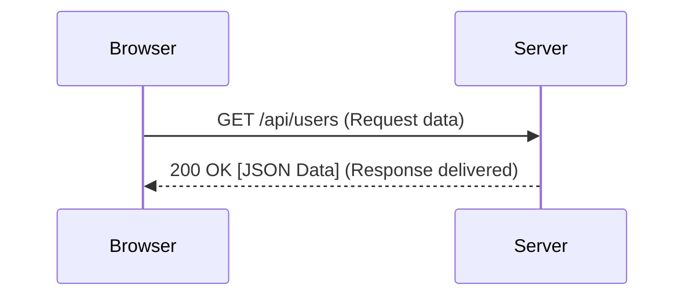

# 🚀 OSI L5-L7: The Application Layer

## 📑 Table of Contents
1. [The Tip of the Iceberg: L7](#application-layer-overview)
2. [HTTP and REST](#http-and-https-protocols)
3. [Email Protocols (SMTP/IMAP)](#email-protocols-smtp-imap-pop3)
4. [Modern Standards: gRPC and WebSockets](#grpc-and-websockets)

---

The Application Layer (which in the TCP/IP model combines OSI layers 5, 6, and 7) is exactly what you interact with as a software engineer 90% of the time.

---

## 1. 👑 HTTP/HTTPS — The King of the Web

HTTP follows a fundamental "request-response" pattern.

- **L5 (Session Layer)**: Manages the "session"—managing logins, logouts, and persistent connections.
- **L6 (Presentation Layer)**: Formats the data (JSON, XML) and handles encryption and decryption (TLS/SSL).
- **L7 (Application Layer)**: The actual logic of your API and its specific endpoints.

---

## 2. 📧 Email: A Trio of Protocols

1. **SMTP**: Used for **sending** emails.
2. **IMAP**: Used for reading emails. Messages remain synced on the server.
3. **POP3**: Used for reading emails by downloading and deleting them from the server (largely deprecated in favor of IMAP).

---

## 3. 🛡️ Modern Powerhouses: gRPC and WebSocket

- **WebSocket**: While HTTP is "one question, one answer," a WebSocket is like an open phone call where both the client and server can speak simultaneously at any time (Full Duplex).
- **gRPC**: A binary protocol developed by Google. It is significantly faster than standard JSON-based REST and is the perfect choice for high-performance internal microservice communication.

---

## 4. 📝 Developer's Checklist

> [!WARNING]
> **Statelessness**: Standard HTTP is "stateless"—it has no memory of who you are between requests. To maintain state, developers use **Headers** with tokens (JWT) or **Cookies**.

- **DNS**: Also lives at the application layer. It translates human names like `google.com` into machine IP addresses.
- **TLS (Transport Layer Security)**: Operates at Layer 6, wrapping standard HTTP to create the secure HTTPS protocol.

---

## 🎯 Key Takeaways

- The Application Layer provides the actual **meaning** and context for the data transfer.
- Due to the **stateless** nature of HTTP, every single request must be authorized independently.
- The future of systems lies in high-speed binary protocols (**gRPC, HTTP/3**) and real-time connectivity (**WebSockets**).
