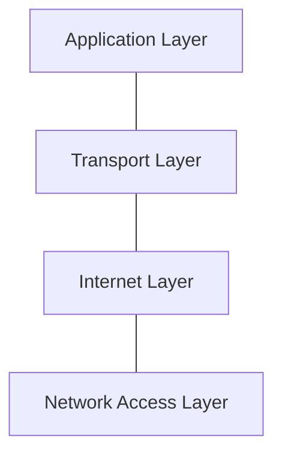
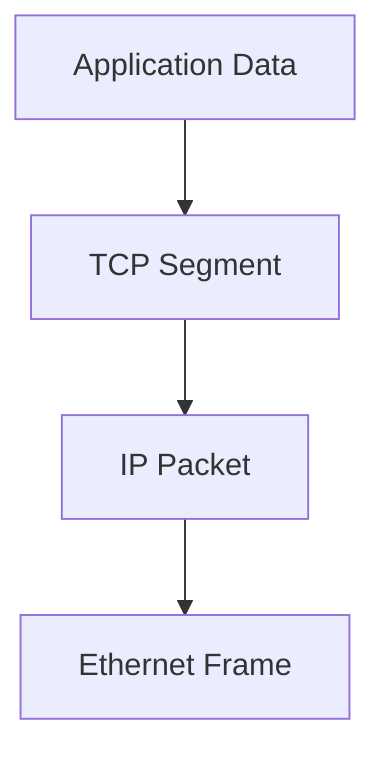

# 🛠️ The TCP/IP Model

## 📑 Table of Contents
1. [Why TCP/IP?](#the-practical-standard)
2. [The Four Layers of the Model](#four-layer-structure)
3. [Comparison with OSI](#tcp-ip-vs-osi)
4. [The Journey of a Packet](#data-flow-scenario)

---

While the OSI model provides the theory, **TCP/IP** provides the reality. The entire modern internet is built upon this practical model.

---

## 1. 🪜 The Four Layers of TCP/IP

The TCP/IP model is streamlined, combining several OSI layers to make implementation and troubleshooting more efficient.

| Layer | OSI Equivalent | Primary Protocols |
|:---|:---|:---|
| **Application** | 7, 6, 5 | HTTP, DNS, gRPC, SSH, FTP |
| **Transport** | 4 | TCP, UDP, QUIC |
| **Internet** | 3 | IP (v4/v6), ICMP, BGP |
| **Network Access** | 2, 1 | Ethernet, Wi-Fi, ARP |

---

## 2. 🔑 Core Principles

### 1. Reliability (TCP) vs. Speed (UDP)
- **TCP**: Ensures data arrives without errors and in the exact intended order. It relies on a "handshake" to synchronize connections.
- **UDP**: Sends data "as is." It is incredibly fast but allows for potential packet loss. Perfect for live video and gaming.

### 2. IP Addressing
Every device connected to the internet has a unique IP address which acts as its global identifier, allowing routers to deliver packets to the correct destination.

> [!NOTE]
> The **Internet Layer** is the heart of the model. It is what makes the internet an "inter-network" by bridging diverse physical technologies into one unified system.

---

## 3. 📦 Encapsulation in TCP/IP

- **Application Layer**: Contains your raw data (e.g., a JSON body or HTML page).
- **Transport Layer**: Bundles the data into a segment and adds a **Port Number** (e.g., 80 for HTTP).
- **Internet Layer**: Bundles the segment into a packet and adds the **Destination IP**.
- **Network Access Layer**: Packages the packet into a frame, adds the **MAC Address**, and transmits it as raw bits.

---

## 4. 🏆 Why Does TCP/IP Prevail?

1. **Simplicity**: Implementing a 4-layer stack in software is far simpler than managing a strict 7-layer hierarchy.
2. **Flexibility**: You can swap out the bottom layer (e.g., changing from Wi-Fi to 5G) without your browser (the top layer) ever knowing the difference.
3. **Open Standards**: The protocols are vendor-neutral and maintained by open bodies (IETF), ensuring global interoperability.

---

## 🎯 Key Takeaways

- **TCP/IP** is the functional language of the digital world.
- For most developers, the **Application** and **Internet** layers are the most critical to understand.
- Mastering ports and IP addresses is a fundamental requirement for building and deploying any backend service.
