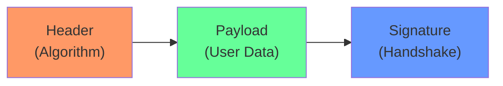
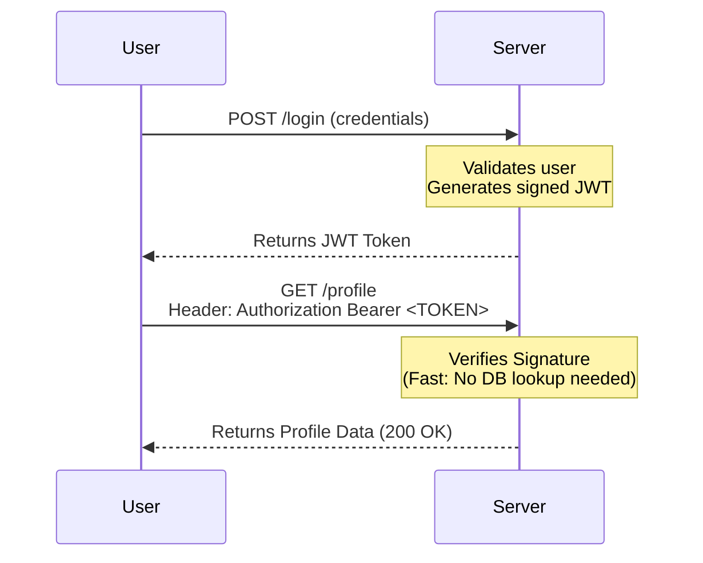

# 📄 JWT (JSON Web Tokens): The Passport for Your API

## 📑 Table of Contents
1. [What is a JWT?](#what-is-jwt)
2. [Token Anatomy (Header, Payload, Signature)](#token-anatomy)
3. [How It Works Under the Hood](#how-it-works)
4. [Implementation in Go](#go-implementation)
5. [Security and Storage Best Practices](#security-and-storage)

---

## ❓ What is a JWT?

**JWT (JSON Web Token)** is an open standard that defines a compact and self-contained way for securely transmitting information between parties as a JSON object. This information can be verified and trusted because it is digitally signed. 🛡️

JWTs are most commonly used for **Authorization**: once a user logs in, the server issues a JWT which the user then includes in every subsequent request to access protected resources.

### Why Use JWT?

**The Traditional Approach (Stateful Sessions):**
- The server stores session data in its own memory or a database.
- The client receives a "Session ID" stored in a cookie.
- Every single request requires the server to perform a database lookup to find the corresponding session.

**The JWT Approach (Stateless Auth):**
- The server stores nothing.
- All required user information is embedded directly within the token itself.
- This is faster, more efficient, and significantly easier to scale across multiple servers.

---

## 🦴 Token Anatomy

A JWT consists of three distinct parts separated by dots: `header.payload.signature`

### The Three Components:

1. **Header**: Specifies the type of token (JWT) and the signing algorithm being used (e.g., HS256 or RS256).
2. **Payload**: Contains the "Claims"—the actual pieces of data such as the User ID (`sub`), their roles, and the expiration timestamp (`exp`).
3. **Signature**: A cryptographic hash created by combining the encoded header, the encoded payload, and a secret key known only to the server. This ensures the data hasn't been tampered with.

---

## ⚙️ How It Works

Unlike sessions, JWT is a **Stateless** mechanism. The server verifies the token purely by checking its signature, without needing to verify it against a central database.

---

## 💻 Implementation in Go

### 1. Creating a JWT Token
Using the `github.com/golang-jwt/jwt/v5` library, you define a struct for your claims and sign them with a secret key.

> [!IMPORTANT]
> Always set an expiration time (`ExpiresAt`). A token without an expiration is a major security risk.

---

### 2. Validating a Token
To protect your endpoints, the server must parse the incoming token, verify the signing algorithm matches its expectations, and check the signature against its secret key.

---

### 3. Middleware for Protected Endpoints
In a real production app, you would use middleware to intercept requests, extract the "Bearer" token from the `Authorization` header, and halt the request if the token is invalid or expired.

---

## 🛡️ Security and Storage

### 🚨 Critical Threats:

#### 1. XSS (Cross-Site Scripting)
If you store a token in `localStorage`, it can be stolen by malicious JavaScript running on your page.
**Solution**: For web browsers, store tokens in an **HttpOnly Cookie**. This makes the token unreachable by JavaScript, providing a strong layer of defense.

#### 2. Secret Key Theft
If your server's secret key is leaked, an attacker can forge any token they want.
**Solution**: 
- Never check secrets into source control.
- Use environment variables.
- Consider using **RS256** (asymmetric signing) so that your internal services can verify tokens without needing to know the private key.

#### 3. Token Revocation
JWTs are valid until they expire. If a token is stolen, you cannot easily "log out" the attacker.
**Solution**:
- Keep Access Tokens very short (e.g., 15 minutes).
- Use a **Refresh Token** stored securely to request new access tokens.
- For high-security apps, maintain a "Blacklist" (in Redis) of revoked tokens.

---

## 💡 Summary Comparison

| Part | Description | Content Example |
|:---|:---|:---|
| **Header** | Protocol metadata | `{"alg": "HS256", "typ": "JWT"}` |
| **Payload** | Application data | `{"sub": "123", "role": "admin"}` |
| **Signature** | Integrity check | `HMACSHA256(header + payload, secret)` |

> [!CAUTION]
> Remember: The Payload is not encrypted, it is only Base64-encoded. Anyone can read the contents of your JWT. **Never store passwords, secrets, or sensitive private data inside a JWT payload.** 🗝️
