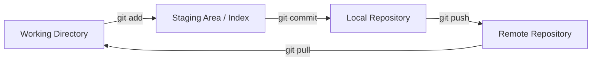

# 0. 🏁 Introduction to Git

**Git** is a Distributed Version Control System (DVCS) created by Linus Torvalds in 2005. Unlike older centralized systems (such as SVN), Git provides every single developer with a complete, independent copy of the entire project history.

---

## 1. 📂 Distributed vs. Centralized Systems

- **Centralized (SVN, Perforce)**: Relies on a single central server. If the server goes offline, developer collaboration stops. The full history exists only on that central server.
- **Distributed (Git, Mercurial)**: The repository on your local computer is a mirrored copy of the one on the server. You can commit code, view history, and create branches even without an internet connection.

---

## 2. 🎡 The Three Areas of Git

Understanding the physical locations of your files is the absolute foundation of mastering Git.

### 2.1. Working Directory
This represents the actual files you see and edit in your IDE. In this area, files are in one of two states:
- **Untracked**: New files that Git is not yet aware of.
- **Tracked**: Files that were already part of a previous commit or have been added to the index.

### 2.2. Staging Area / Index
This is a technical binary file located at `.git/index`. It acts as a "drafting area" for your next commit.
> [!TIP]
> The Staging Area allows for **Atomic Commits**. You might modify 10 different files, but you can choose to only "stage" 3 files that relate to a specific fix, keeping your history clean and logical.

### 2.3. Local Repository
This is where Git stores compressed snapshots of your data and the complete history of all changes. It is located within the hidden `.git` folder in your project's root directory.

---

## 🗺️ Course Navigation

1. [Git Internals: Objects and the DAG](1.Git_Internals.md)
2. [Commands: From Basic Usage to Reflog](2.Commands.md)
3. [Branches, Merges, and Dealing with Conflicts](3.Branches_and_Merges.md)
4. [Best Practices and Professional Conventions](4.Best_Practices.md)
