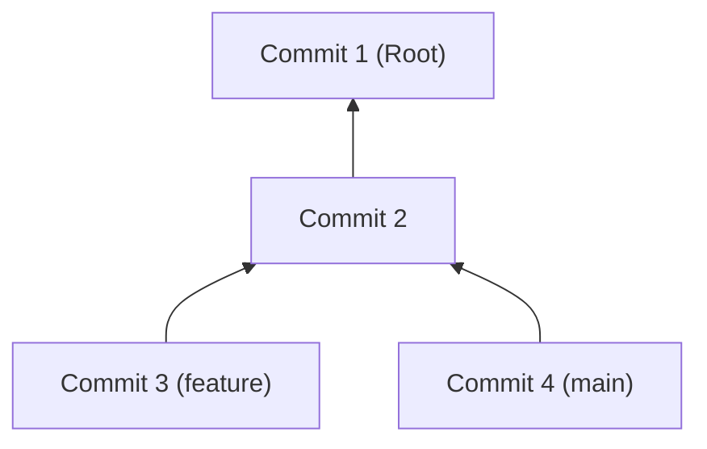

# 1. ⚙️ Git Internals: What's Under the Hood?

Many developers fear Git because they view it as a "black box" full of magical, cryptic commands. In reality, Git's design is elegantly simple: it is a **Content-Addressable Storage** system based on directed graphs.

---

## 1. 💎 The Git Object Model

All data representing the state of your project is stored within the `.git/objects` directory. There are only four types of objects in Git:

### 1.1. Blob (Binary Large Object)
A Blob stores only the **content** of a file.
- It does not store the filename or file permissions.
- The "name" of the file in Git's database is the SHA-1 hash of its contents.
- If you have 100 identical copies of a file (e.g., an image) under different filenames, Git will store only **one** Blob.

### 1.2. Tree
A Tree object is the equivalent of a directory in a filesystem.
- It contains a list of filenames and pointers (hashes) to their Blobs.
- It can also point to other Trees (subdirectories).
- This is where filenames and executable permissions (`chmod`) are stored.

### 1.3. Commit
The logic that connects history. A Commit contains:
- A pointer to the **Root Tree** (a snapshot of the entire project at that moment).
- A pointer to the **parent commit** (or multiple parents during a merge).
- Author information, timestamp, and the commit message.

### 1.4. Tag
A simple, permanent reference to a specific commit that does not change over time.

---

## 2. 🕸️ Directed Acyclic Graph (DAG)

Your Git history is not just a linear list; it is a **Graph**. Each commit points backward to its ancestor.

> [!IMPORTANT]
> **Branches are not folders.** A branch in Git is simply a **lightweight pointer**—a small file containing the hash of the latest commit. When you make a new commit, that pointer simply moves forward to the new hash.

---

## 3. 🔍 Anatomy of the .git Folder

| Component | Responsibility |
| :--- | :--- |
| `objects/` | The database containing all file snapshots (blobs, trees, commits). |
| `refs/heads/` | A list of local branches. Each file is named after a branch and contains a commit ID. |
| `HEAD` | A special file pointing to the branch you currently have checked out. |
| `index` | The Staging Area. A binary file listing all changes prepared for the next commit. |
| `config` | Repository-specific configuration (e.g., remote URLs, user settings). |

---

## 4. 🧱 The Principle of Immutability
Objects in Git are **immutable**. If you change even a single bit in a file, its hash changes, and Git creates an entirely **new** Blob. This is why you cannot truly "overwrite" history; you can only create a new path (which is what tools like `rebase` do).

---

[Next: Git Commands](2.Commands.md)
