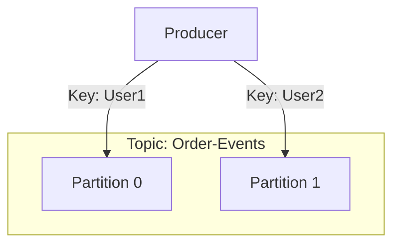
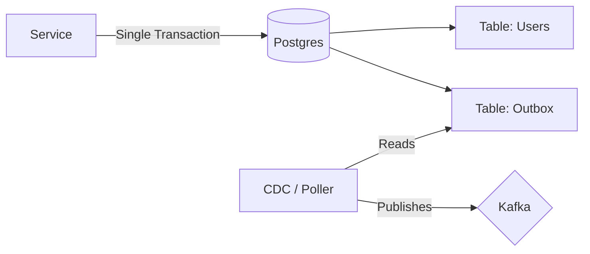

# 🐘 Apache Kafka

## 📑 Table of Contents
1. [What is it? (A Log, Not a Queue)](#1-what-is-it-a-log-not-a-queue)
2. [Core Terminology](#2-core-terminology)
3. [How it Works: Partitioning](#3-how-it-works-partitioning)
4. [Consumer Groups](#4-consumer-groups)
5. [Delivery Semantics](#5-delivery-semantics)
6. [Reliability Patterns](#6-reliability-patterns)
7. [The Transactional Outbox Pattern](#7-transactional-outbox)

---

## 1. 🤔 What is it? (A Log, Not a Queue)

A common misconception is that Kafka is just another message queue (like RabbitMQ). In reality, it is more accurate to view Kafka as a **Distributed Event Streaming Platform** or a **Distributed Commit Log**.

### 📜 The Ledger Analogy
*   **Message Queue (RabbitMQ)**: You send a letter, your friend reads it, and the letter is destroyed (poof!).
*   **Commit Log (Kafka)**: You write an entry in a notebook. Your friend reads it. The entry **remains** in the notebook. Another friend can also come along and read it later.

> [!NOTE]
> **Kafka persists data.** Depending on your configuration, messages can be stored for 3 days, a week, or even forever. Messages are **not deleted** once they are read.

---

## 2. 🧱 Core Terminology

*   **Topic**: A category or folder name where records are published.
*   **Producer**: The client that sends/writes data to the topics.
*   **Consumer**: The client that reads data from the topics (using a Pull model).
*   **Log**: An ordered sequence of records, which is the heart of a Kafka partition.

---

## 3. ⚙️ How it Works: Partitioning

A single topic is divided into smaller chunks called **Partitions**.
This is the key to Kafka's **Parallelism**. One partition can be read by exactly one consumer within a group at any given time.

> [!IMPORTANT]
> **Ordering Guarantees**: Kafka only guarantees the order of messages **within a single partition**.
> If messages A and B are in Partition 0, they will always be read as A -> B.
> If they are in different partitions (0 and 1), they might be processed by consumers as B -> A.

---

## 4. 👥 Consumer Groups

Multiple instances of a service join together in a group to read from a topic faster. Each partition in the topic is assigned to **exactly one** consumer in the group. This allows for horizontal scaling of message processing.

---

## 5. 🤝 Delivery Semantics

How do we ensure that messages are not lost and are processed correctly?

### 📨 Acknowledgement (acks)
When a Producer writes to Kafka, it can request different levels of "Acknowledge":
*   `acks=0`: "Fire and forget." Fast, but high risk of data loss.
*   `acks=1`: Wait for confirmation from the Partition Leader only.
*   `acks=all`: Wait for confirmation from the Leader and **all** synchronized replicas (ISR). This provides maximum durability.

### Guaranteed Delivery Levels
1.  **At-most-once**
    *   Messages may be lost but will never be duplicated.
    *   *Implementation*: Proactive offset committing **before** processing.
2.  **At-least-once** — *The Industry Standard*.
    *   Messages are guaranteed to be delivered, but duplicates may occur.
    *   *Implementation*: Committing the offset **after** successful processing.
    *   *Challenge*: If the consumer fails after processing but before committing, it will re-process the message upon restart.
3.  **Exactly-once**
    *   The "Holy Grail." 
    *   *System-wide*: Requires an **Idempotent Producer** (`enable.idempotence=true`) and Kafka transactions.
    *   *End-to-End*: Requires **idempotency** on the consumer side (database).

> [!IMPORTANT]
> **Idempotency** is the property of an operation that can be applied multiple times without changing the result beyond the initial application.
> - **Idempotent**: `UPDATE users SET status = 'active'`
> - **NOT Idempotent**: `users.balance += 100` (Running this twice gives different results).
> The best defense against duplicates is using unique idempotency keys in your database.

---

## 6. 🛡️ Reliability Patterns

### 💀 Dead Letter Queue (DLQ)
What happens if a message is "malformed" and causes a crash (e.g., invalid JSON)? If you simply retry, the consumer will enter an **Infinite Loop**.

**The DLQ Solution**:
1.  Attempt processing N times (Retries).
2.  If it still fails, move the message to a special "Graveyard" topic called the **DLQ**.
3.  Commit the offset in the main topic and continue to the next message.
4.  Developers/Admins monitor the DLQ, fix the root cause, and manually "Replay" the messages.

---

## 7. 📦 The Transactional Outbox Pattern

A classic Microservices problem: **The Dual Write**.
You need to:
1.  Save a `User` entity to Postgres.
2.  Publish a `UserCreated` event to Kafka.

If the DB save succeeds but the Kafka publish fails (network glitch), you have a **Data Inconsistency**. The user exists, but the "Welcome Email" service never knows.

**Solution: The Outbox Pattern**
In a single database transaction, you save both the `User` and the `Event` (into an `outbox` table).

*   **CDC (Change Data Capture)**: Advanced tools like **Debezium** read the database's binary logs (WAL) and automatically stream the events to Kafka. This is the most reliable way to integrate systems.