# ⚡ NATS

## 📑 Table of Contents
1. [What is it? (Speed and Simplicity)](#what-is-it)
2. [NATS Core (Fire and Forget)](#nats-core)
3. [NATS JetStream (Durability and Reliability)](#nats-jetstream)

---

## 1. 🏎️ What is it? (Speed and Simplicity)

**NATS** is a cloud-native messaging system built with Go, designed for extreme performance and scalability.
It is fundamentally divided into two distinct logical layers:
1. **Core NATS**: An ultra-fast, "fire and forget" publish/subscribe system (similar to a radio broadcast).
2. **JetStream**: A persistence layer built on top of Core NATS that provides durability and message storage (similar to Kafka).

---

## 2. 🔥 NATS Core (Fire and Forget)

- **Delivery Guarantee**: **At-Most-Once**.
- **Behavior**: If a subscriber is not listening at the exact moment a message is published, the message is lost for that subscriber. Core NATS does not store history.
- **Common Use Cases**: Service discovery, heartbeats, high-frequency metrics, and real-time commands where missing an update is acceptable.

---

## 3. ✈️ NATS JetStream (Durability)

JetStream introduces **Persistence** by allowing the server to save messages to disk or memory.

### 🛡️ Delivery Guarantees
JetStream supports all three common reliability levels, including a built-in implementation of **Exactly-Once** delivery.

#### 1. At-Least-Once
The consumer must provide an acknowledgement (`Ack`) to the server. If the server does not receive an Ack within a specified window (defaulting to 30 seconds), NATS will automatically re-deliver the message.

#### 2. Exactly-Once
Unlike Kafka (where exactly-once is powerful but complex to configure), NATS provides this "out of the box" using a **Deduplication Window**.

**How it works:**
1. The Publisher sends a message with a unique header: `Nats-Msg-Id: uuid-123`.
2. JetStream remembers this ID for a configurable window of time (e.g., 2 minutes).
3. If the Publisher (perhaps due to a network glitch) sends the exact same message again, JetStream recognizes the duplicate ID. It sends a success response to the publisher but **does not store** the duplicate or send it out to consumers.

```mermaid
graph LR
    Pub[Publisher] -->|"Msg-ID: A (1st attempt)"| JS{JetStream}
    Pub -->|"Msg-ID: A (Retry attempt)"| JS
    
    JS -->|"Save & Send"| Cons[Consumer]
    JS -.->|"Drop Duplicate"| Trash["🗑️"]
```

This simplicity makes NATS JetStream an excellent candidate for financial transactions or critical system events where duplicates are strictly forbidden.