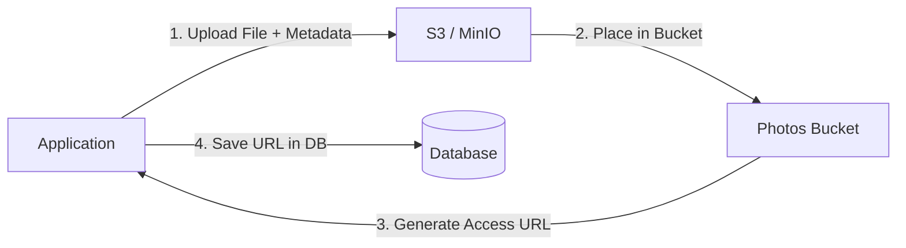

# 📦 Object Storage: S3 and MinIO

## 📑 Table of Contents
1. [What is Object Storage?](#what-is-object-storage)
2. [S3 (Simple Storage Service)](#s3-the-industry-standard)
3. [MinIO: The Cloud on Your Servers](#minio)
4. [Comparison: File Storage vs. Object Storage](#comparison)

---

## ❓ What is Object Storage?

**Object Storage** is a data storage architecture that manages data as "objects." Paradoxically, unlike a traditional file system with rigid hierarchies of folders and subfolders, Object Storage resides in a "flat" space known as a **Bucket**. 🧺

Instead of a file path (e.g., `/home/user/images/photo.jpg`), you use a unique identifier (Key/ID) to retrieve your data.

---

## ☁️ S3 (Simple Storage Service)

**AWS S3** is a foundational service from Amazon that defined the modern standard for object storage. Because of its success, nearly all modern storage providers support an **S3-Compatible API**.

### Core Advantages:
- **Scalability**: Capable of storing petabytes of data effortlessly.
- **Durability**: Data is automatically replicated across multiple data centers, providing "11 nines" (99.999999999%) of durability.
- **Cost**: It is significantly more economical than storing massive amounts of files directly on application servers or within a database. 💰

---

## 🐳 MinIO: The Self-Hosted Cloud

**MinIO** is a high-performance, open-source alternative to S3 that you can deploy yourself (e.g., via Docker).

- **Why use it?**: Ideal if you want to avoid vendor lock-in with Amazon or if your security requirements demand storage within a private, air-gapped network. 🔒
- **Full Compatibility**: An application written to interface with AWS S3 will typically work with MinIO without any code modifications.

---

## 📊 File Storage vs. Object Storage

| Feature | File Storage (HDD/SSD/NAS) | Object Storage (S3/MinIO) |
| :--- | :--- | :--- |
| **Structure** | Hierarchical (Folders) | Flat (Buckets) |
| **Scalability** | Limited by disk/hardware size | Virtually infinite ♾️ |
| **Metadata** | Basic (Date, Size) | Fully Customizable (Tags, Author, Bio) |
| **Access Speed** | Extremely fast (ms) | High (but with higher network latency) |
| **Updates** | Can modify file chunks | Requires overwriting the entire object |

---

## 🏗️ Technical Workflow

---

> [!TIP]
> **The Golden Rule of Backend Engineering**: Never store user-generated files (images, documents, logs) directly on the application's local disk or inside a database. Use an Object Storage solution. This allows your application servers to remain "stateless," making them much easier to scale horizontally. 🛡️🚀
