# 🖼️ Grafana: Data Visualization

## 📑 Table of Contents
1. [What is Grafana?](#what-is-grafana)
2. [Data Sources](#data-sources)
3. [Dashboards](#dashboards)
4. [Alerting](#alerting)
5. [Workflow: Prometheus + Grafana](#workflow)

---

## ❓ What is Grafana?

**Grafana** is an leading open-source platform for data visualization, monitoring, and analysis. 💹

If Prometheus is the "database" that stores your numbers, Grafana is the "beautiful screen" that draws the graphs based on those numbers. It does not store data itself; instead, it queries and displays data from various external sources.

---

## 🔌 Data Sources

Grafana is highly versatile and can pull data from almost any backend:
- **Prometheus**: For metrics.
- **Elasticsearch**: For log analysis.
- **PostgreSQL / MySQL**: For business intelligence and application data.
- **Jaeger**: For distributed tracing visualization.
- **CloudWatch / Azure Monitor**: For native cloud infrastructure monitoring.

---

## 📊 Dashboards

A **Dashboard** is a organized collection of panels (graphs, tables, gauges, heatmaps) arranged on a single screen to provide a comprehensive view of system health.

> [!TIP]
> **Principles of Effective Dashboard Design:**
> - **Hierarchy**: Place the most critical indicators (Uptime/Downtime, error rates) at the very top.
> - **Focused Panels**: Each panel should answer exactly one specific question.
> - **Visual Context**: Use thresholds. A graph shouldn't just show "80%"; it should automatically turn red if that value represents a critical level of resource saturation. 🔴

---

## 🔔 Alerting

Grafana can do more than just show graphs—it can act as an early warning system:
1. You define a logical condition (e.g., `CPU usage > 90% for more than 5 minutes`).
2. If the condition is met, Grafana triggers a notification to **Telegram, Slack, Email, or PagerDuty**. ✉️

---

## 🗺️ Operational Workflow

```mermaid
graph TD
    App[Application] -- "Exports Metrics" --> Prom[Prometheus]
    Prom -- "PromQL Queries" --> Grafana
    User((Admin/DevOps)) -- "Views Dashboard" --> Grafana
    Grafana -- "⚠️ Alert Triggered!" --> Alert[Telegram / Slack]
```

---

## 🌟 Why Use Grafana?

> [!IMPORTANT]
> - **The Single Pane of Glass**: You can combine graphs from Prometheus and raw logs from Elasticsearch on the same screen.
> - **Pre-built Templates**: There are thousands of community dashboards (e.g., for "Node Exporter") that you can import in seconds to start monitoring your servers instantly. 📦
> - **Dynamic Variables**: You can use variables to switch between different environments (Prod/Dev) or server clusters directly from the dashboard header.
