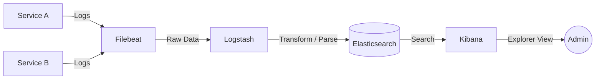

# 📝 Logging and the ELK Stack

## 📑 Table of Contents
1. [Why is Centralized Logging Critical?](#why-logging-is-important)
2. [Components of the ELK Stack (E, L, K)](#components)
3. [Beats: Lightweight Data Shippers](#beats)
4. [Data Pipeline Architecture](#workflow)
5. [Key Differences: Logs vs. Metrics](#logs-vs-metrics)

---

## ❓ Why is Centralized Logging Critical?

In a microservices architecture, you may have hundreds or thousands of containers running simultaneously. If a failure occurs, you cannot manually SSH into every server to read local log files. 🔎

**Centralized Logging** solves this by aggregating all textual output from all services into a single, searchable repository.

---

## 🧱 Components of the ELK Stack

The **ELK Stack** is an acronym for three powerful open-source tools maintained by Elastic:

1. **Elasticsearch (E)**: A distributed search and analytics engine. It stores your logs and allows for near real-time full-text searching (think Google, but for your logs).
2. **Logstash (L)**: The data processing "grinder." It ingests logs from multiple sources, filters them, parses them (e.g., transforming plain text into structured JSON), and sends the result to Elasticsearch.
3. **Kibana (K)**: The visualization layer. This is the web interface where you write queries, explore logs, and build operational dashboards.

---

## 🐝 Beats

The stack is often expanded with **Beats**, which are lightweight single-purpose data shippers installed directly on your application servers:
- **Filebeat**: Harvests and ships log files from the disk. 📄
- **Metricbeat**: Collects system-level metrics (CPU, RAM, usage).
- **Packetbeat**: Analyzes network traffic.

---

## 🗺️ Data Pipeline Architecture

---

## ⚖️ Logs vs. Metrics

> [!IMPORTANT]
> - **Metrics** (e.g., Prometheus): Inexpensive to store, fast to query, and kept for long durations. Perfect for **monitoring** ("I know something is broken!").
> - **Logs** (e.g., ELK): Resource-intensive (storage and compute), slower to query, but highly detailed. Perfect for **debugging** ("I know EXACTLY why it is broken.").

---

## 💡 Practical Recommendations

> [!TIP]
> 1. **Structured Logging**: Always output your logs in **JSON** format. This eliminates the need for complex Logstash parsing rules and makes your data immediately searchable by field.
> 2. **Logging Levels**: Strictly enforce the use of `DEBUG`, `INFO`, `WARN`, and `ERROR` levels. In Kibana, this allows you to filter out noise and focus purely on critical failures. 🔴
> 3. **PII and Secret Management**: Never allow passwords, API tokens, or personal user data (PII) to be leaked into your log streams. 🔐
