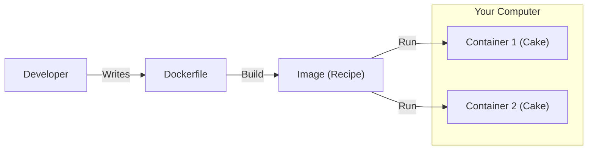

# 🐳 Docker

## 📑 Table of Contents
1. [What is Docker?](#what-is-docker)
2. [Core Concepts (The Cake Analogy)](#core-concepts)
3. [How it Works](#how-it-works)
4. [Dockerfile and Core Commands](#dockerfile-and-commands)

---

## 1. 🤔 What is Docker?

**Docker** is a platform designed to package your application and all of its dependencies (libraries, configurations, etc.) into a single, isolated "box" called a **Container**.

Regardless of where you open this box—whether on your local Mac, a Linux server, or in the cloud—the application will perform **exactly the same**.

> [!NOTE]
> This effectively eliminates the "it worked on my machine, but failed on the server" nightmare.

---

## 2. 🎂 Core Concepts (The Cake Analogy)

To truly understand Docker, imagine you are baking a cake.

### 📜 Image = The Recipe
*   An Image is a static, read-only file (an instruction set). It sits on your disk and does not "run."
*   It is **Immutable** (you cannot change a recipe once the cake is already in the oven).
*   **Examples**: `ubuntu:20.04`, `postgres:13`.

### 🧁 Container = The Cake
*   A Container is the live, executing instance of your application, created according to the "Recipe" (Image).
*   From one single Recipe (Image), you can bake 100 identical Cakes (Containers).
*   You can "eat" (stop/delete) the cake, but the recipe remains intact on your shelf.

### 🏭 Registry = The Cookbook
*   A centralized location where Recipes (Images) are stored and shared.
*   **Docker Hub** is the world's largest public cookbook.

---

## 3. ⚙️ How it Works

Unlike traditional Virtual Machines (VMs), Docker does not carry a full Operating System with it. It shares the kernel of your host system (Linux) while keeping processes isolated.

- **VM**: A separate house for every resident (expensive, heavy, slow).
- **Docker**: An apartment building. The utilities (OS Kernel) are shared, but individual apartments (Containers) are private and isolated.

---

## 4. 📝 Dockerfile and Core Commands

A **Dockerfile** is the actual piece of paper where you write down your recipe.

### Fundamental Commands:
| Command | Action | Analogy |
| :--- | :--- | :--- |
| `FROM` | Defines the base layer | The pizza crust |
| `RUN` | Executes a command **during the build** | Slicing the toppings |
| `COPY` | Moves files from your PC into the image | Putting toppings on the pizza |
| `CMD` | Defines the command **at startup** | Eating the pizza |

> [!IMPORTANT]
> **RUN vs. CMD**:
> - `RUN` is executed exactly once when you are creating the **Image** (building the recipe).
> - `CMD` is the default action executed every time you start a **Container** from that image.

### Docker Compose
When your application depends on multiple services (e.g., a Backend + Database + Redis), starting them individually is tedious.
A `docker-compose.yml` file allows you to define your entire environment in one place. With the single command `docker-compose up`, your entire stack is initialized and connected.