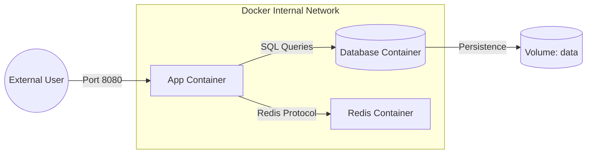

# 🐙 Docker Compose: Multi-Container Applications

## 📑 Table of Contents
1. [What is Docker Compose?](#what-is-docker-compose)
2. [Core Concepts](#concepts)
3. [The Structure of docker-compose.yml](#structure)
4. [Primary Commands](#commands)
5. [Interaction Visualization](#visualization)

---

## ❓ What is Docker Compose?

**Docker Compose** is a powerful tool designed for defining and orchestrating multi-container Docker applications. 🛠️

While standard Docker commands are used to manage individual containers, Compose allows you to describe your **entire infrastructure**—including the application, database, cache, and message brokers—in a single configuration file and launch the entire stack with a single command.

---

## 🧩 Core Concepts

1. **Services**: The individual containers that make up your application (e.g., `web`, `database`, `worker`). Each service configuration specifies which image to use, which ports to expose, and its runtime parameters.
2. **Networks**: Private, isolated communication channels that allow services to talk to one another. By default, Compose creates a single shared network for all services defined in the file. 🌐
3. **Volumes**: Persistent storage that exists outside the lifecycle of a container. This ensures that your database data is not lost when a container is restarted or deleted. 💾

---

## 📝 The Structure of docker-compose.yml

Your infrastructure is defined as a "recipe" using the human-readable YAML format:

```yaml
version: '3.8' # The format version

services:
  app: # Service Name
    build: . # Build the image from the current directory
    ports:
      - "8080:8080"
    depends_on:
      - db # Ensure the DB starts before the App
    environment:
      - DB_URL=postgres://db:5432/mydb

  db:
    image: postgres:15-alpine # Use a pre-built official image
    volumes:
      - postgres_data:/var/lib/postgresql/data
    environment:
      - POSTGRES_PASSWORD=secret

volumes:
  postgres_data: # Define the persistent volume
```

---

## 🚀 Primary Commands

| Command | Action |
|:---|:---|
| `docker-compose up` | Builds (if necessary), creates, and starts all containers defined in the file. |
| `docker-compose up -d` | Starts the stack in **detached mode** (runs in the background). |
| `docker-compose down` | Stops and **removes** all containers, networks, and images created by `up`. |
| `docker-compose ps` | Lists the current status of all managed services. |
| `docker-compose logs -f` | Displays tailing logs from all containers in real-time. |

---

## 📊 Interaction Visualization



---

## 🌟 Why Use It?

> [!TIP]
> **Key Benefits:**
> - **Convenience**: Instead of managing a dozen complex `docker run` commands, you handle everything with a single `docker-compose up`.
> - **Isolation**: Every project gets its own isolated network and dedicated versions of dependencies.
> - **Consistency**: Your local development environment is guaranteed to be identical to your colleagues' environments.

---

> [!IMPORTANT]
> Docker Compose is primarily intended for **development, testing, and CI/CD environments**. For large-scale production orchestration, industry-standard tools like Kubernetes are typically used. 🏗️
