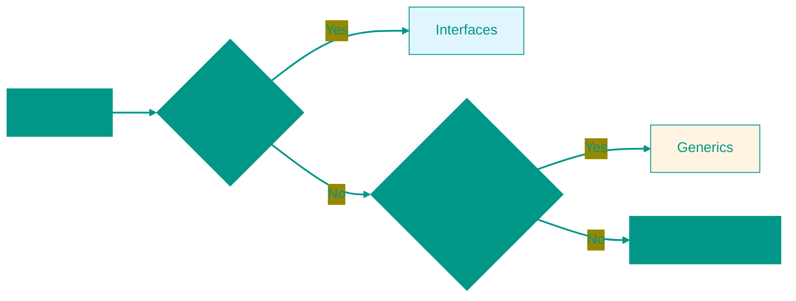

# 🧬 Generics in Go


## 📑 Contents
1. [What are Generics?](#what-are-generics)
2. [Basic Syntax](#basic-syntax)
3. [Generic Functions](#generic-functions)
4. [Generic Types](#generic-types)
5. [Constraints and Type Sets](#constraints-and-type-sets)
6. [Type Inference](#type-inference)
7. [Generics vs Interfaces](#generics-vs-interfaces)
8. [Internal Implementation](#internal-implementation)
9. [When NOT to Use Generics](#when-not-to-use-generics)

---


## ❓ What are Generics?

**Generics** (Generic Programming) allow you to write functions and data structures that work with different types while maintaining strong type safety.

Before Go 1.18, creating universal code required using `interface{}` (now `any`), which led to type assertions and performance overhead.

> [!IMPORTANT]
> Generics in Go provide the ability to write functions and types with **type parameters**.

---


## 🏗️ Basic Syntax

Type parameters are specified in square brackets `[]` after the function or type name.

```go
func Print[T any](s T) {
    fmt.Println(s)
}
```

In this example:
- `T` — the type parameter name (you can choose any, commonly `T`, `K`, `V`).
- `any` — the constraint, specifying which types `T` can accept.

---


## 🛠️ Generic Functions

Consider a classic example: a `Sum` function that works with both `int` and `float64`.

```go
func Sum[T int | float64](a, b T) T {
    return a + b
}

func main() {
    fmt.Println(Sum[int](5, 10))       // 15
    fmt.Println(Sum(5.5, 4.5))        // 10 (type inferred automatically)
}
```

---


## 📦 Generic Types

You can create structs, interfaces, and even maps with type parameters.

```go
type Stack[T any] struct {
    items []T
}

func (s *Stack[T]) Push(item T) {
    s.items = append(s.items, item)
}

func main() {
    intStack := Stack[int]{}
    intStack.Push(1)
    
    stringStack := Stack[string]{}
    stringStack.Push("Go")
}
```

---


## ⚖️ Constraints and Type Sets

Constraints define the set of types that can replace a type parameter.


### 1. Built-in Constraints
- `any`: any type (alias for `interface{}`).
- `comparable`: types that can be compared using `==` and `!=` (numbers, strings, pointers, structs of comparable types).


### 2. Custom Constraints
Constraints are just interfaces.

```go
type Number interface {
    int | int64 | float64
}

func Multiply[T Number](a, b T) T {
    return a * b
}
```


### 3. Approximation `~`
If we want a constraint to accept not just the type itself but also its derivatives (e.g., `type MyInt int`), we use the tilde:

```go
type Signed interface {
    ~int | ~int64
}
```

---


## 🧠 Type Inference

The Go compiler often understands which type you are using, so specifying it in `[]` when calling a function is optional.

```go
// You can do this:
List[int]{1, 2, 3}

// But if the compiler sees the arguments, you can do this:
func Process[T any](val T) { ... }
Process(42) // T automatically stays int
```

---


## 🆚 Generics vs Interfaces

When to use which?



- **Interfaces**: when **methods** and behavior are key.
- **Generics**: when data **structure** and efficiency (no boxing) are key.

---


## 🛠️ Internal Implementation

Go uses a hybrid approach to implement generics: **GCShape Stenciling** with dictionaries.

1.  **Monomorphization** (like Rust/C++): a separate copy of the function is created for each unique type. Fast but increases binary size.
2.  **Dictionaries**: an invisible argument with the type specification is passed. Slower but more compact.

Go picks the middle ground: types with the same memory "shape" (e.g., all pointers) share the same binary code but use different dictionaries.

---


## 🚫 When NOT to Use Generics

> [!CAUTION]
> Don't overcomplicate your code without necessity!

1.  If you're simply calling a method on an argument — use an interface.
2.  If the implementation is the same for all types and doesn't require type knowledge — use `any` or interfaces.
3.  If you're only using generics in one place — they might not be needed there.

**Bad usage example:**
```go
// BAD: Redundant
func Read[T io.Reader](r T) { ... }

// GOOD: Simpler
func Read(r io.Reader) { ... }

<!-- QUIZ_START 

[
    {
        "question": "What do square brackets [] signify when placed after a function name in Go?",
        "options": [
            "A slice argument",
            "Type parameters for generics",
            "An array declaration",
            "A map key"
        ],
        "correctIndex": 1
    },
    {
        "question": "What types are included in the 'comparable' built-in constraint?",
        "options": [
            "All types",
            "Only integers",
            "Types that support the == and != operators",
            "Only strings"
        ],
        "correctIndex": 2
    },
    {
        "question": "What does the tilde symbol (~) mean in a generic constraint (e.g., ~int)?",
        "options": [
            "The type must be exactly int",
            "The constraint includes the type itself and any user-defined types derived from it (e.g., type MyInt int)",
            "The type must be approximate",
            "It's a bitwise NOT operator"
        ],
        "correctIndex": 1
    }
]

QUIZ_END -->

```
