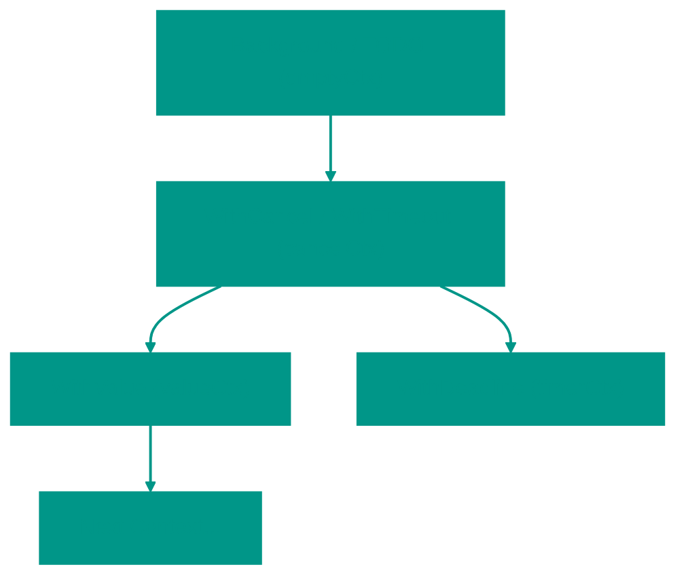
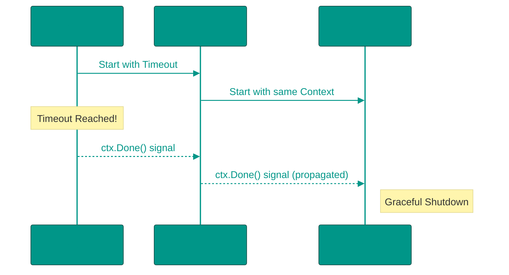

# 🧠 What is Context in Go?

**Context** is a standard mechanism in Go for passing cancellation signals, deadlines, and parameters (key-value pairs) through a call tree of goroutines.

The primary goal of context is to manage the lifecycle of operations. This helps avoid goroutine leaks and wasted work if a client disconnects or an operation takes too long.

---


### 🪆 The "Matryoshka" Principle (Hierarchy)

Context in Go is built on the principle of a hierarchical tree. You always start with an "empty" parent context and build on it, creating child contexts that add new properties.



> [!IMPORTANT]
> **Context is Immutable**. Each `With...` function call returns a **copy** of the parent context with new capabilities. The parent knows nothing about its children, but children store a reference to their parent.

---


### 🛠️ Core Ways to Create Context

Always start with one of these two methods:
1. `context.Background()` — used in `main()`, tests, or at the very beginning of processing an incoming request.
2. `context.TODO()` — use this if you haven't decided which context to use yet or plan to add it later.

---


### 🔌 Lifecycle Management (Cancellation)


#### 1. `context.WithCancel(parent)`
Creates a context that can be manually canceled. Returns the context and a `cancel()` function.

```go
ctx, cancel := context.WithCancel(context.Background())
defer cancel() // Always call cancel to release resources!

go func() {
    // Doing work...
    if errorOccurred {
        cancel() // Signal cancellation
    }
}()

<-ctx.Done() // Wait for the cancellation signal
```


#### 2. `context.WithCancelCause(parent)` (Go 1.20+)
Similar to `WithCancel`, but allows you to pass a **reason** (error) for the cancellation. This reason can be retrieved using `context.Cause(ctx)`.

```go
ctx, cancel := context.WithCancelCause(parent)
cancel(fmt.Errorf("database is unreachable"))

// Elsewhere:
err := context.Cause(ctx) // Returns "database is unreachable"
```


#### 3. `context.WithTimeout(parent, duration)`
Automatically cancels the context after a set period. Ideal for network requests.

```go
ctx, cancel := context.WithTimeout(context.Background(), 2*time.Second)
defer cancel()

req, _ := http.NewRequestWithContext(ctx, "GET", "https://api.example.com", nil)
```


#### 4. `context.WithDeadline(parent, time)`
Similar to `WithTimeout`, but takes a specific point in time (`time.Time`) rather than a duration.

---


### 📦 Passing Data: `context.WithValue()`

Allows passing metadata (Request ID, user tokens) through application layers.

**Rules for use:**
- Use **custom types** for keys to avoid collisions between different libraries.
- Do not pass optional function arguments through context — it makes code less readable.

```go
type key string
const requestIDKey key = "requestId"

ctx := context.WithValue(context.Background(), requestIDKey, "abc-123")

// Retrieval:
val := ctx.Value(requestIDKey).(string)
```

---


### ⏳ Go 1.21 Feature: `context.AfterFunc`

Allows registering a function that will execute **immediately after** the context is canceled (or times out).

```go
stop := context.AfterFunc(ctx, func() {
    fmt.Println("Context canceled, cleaning up resources...")
})
// stop() can be called to prevent AfterFunc from running if it hasn't started yet
```

---


### 🚫 Cancellation Propagation

This is a critical concept. The cancellation signal always propagates **from top to bottom**.

- If you cancel a parent — **all** children are canceled automatically.
- If you cancel a child — the parent continues to run.



---


### 🔍 Internal Mechanics: How Value Search Works

Value searching in context goes **from bottom to top** (recursively to parents). If the current context node doesn't have the key, it asks its parent, which asks its parent — until the root (`Background`) is reached.

The search complexity is **O(N)**, where N is the depth of the tree. Avoid creating excessively deep context chains.

---


### 💡 Golden Rules of Context

1. **First Argument**: `ctx` should always be the first argument: `func Save(ctx context.Context, data Data)`.
2. **Do Not Store in Structs**: Context should be passed explicitly. Exceptions include built-in types like `http.Request`.
3. **Always Call Cancel**: Even if a context is set to time out, calling `cancel()` manually ensures internal timer resources are released faster.
4. **Context.Background()** is the root. Do not use it inside business logic; pass the `ctx` down from the caller.

---


### 📋 Function Summary Table

| Function | When to Use | Specifics |
| :--- | :--- | :--- |
| `WithCancel` | Manual operation stop | Returns `cancel()` |
| `WithCancelCause` | Need to know *why* it was canceled | Go 1.20+, `context.Cause(ctx)` |
| `WithTimeout` | Time limit (e.g., 2s) | Internally uses `WithDeadline` |
| `WithDeadline` | Limit until (e.g., 15:00) | For strict time windows |
| `WithValue` | Metadata (Trace ID) | O(N) search, risk of collisions |
| `AfterFunc` | Post-cancel callback | Go 1.21+, great for Cleanup |

<!-- QUIZ_START 

[
    {
        "question": "Which function introduced in Go 1.21 allows you to register a callback that runs when a context is canceled?",
        "options": [
            "WithCancelCause",
            "AfterFunc",
            "OnCancel",
            "DeferCancel"
        ],
        "correctIndex": 1
    },
    {
        "question": "What happens to child contexts if their parent context is manually canceled?",
        "options": [
            "They continue running until they finish",
            "They are canceled automatically",
            "They wait for the next heartbeat signal",
            "They will be canceled only if they utilize 'WithValue'"
        ],
        "correctIndex": 1
    },
    {
        "question": "In which direction does 'ctx.Value(key)' search for a value in the context tree?",
        "options": [
            "From parent to children (top-down)",
            "From current context to the root (bottom-up)",
            "Horizontally among all active contexts",
            "It only checks the global state"
        ],
        "correctIndex": 1
    }
]

QUIZ_END -->
