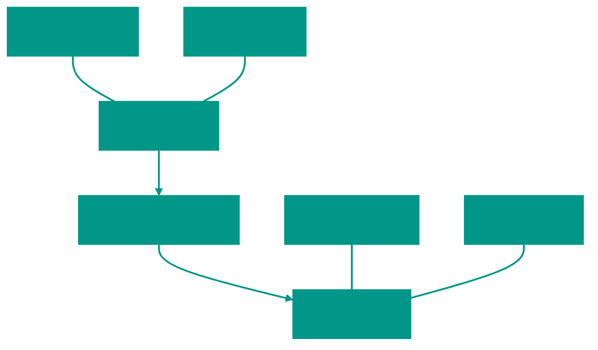

# 🗼 Testing Pyramid

The testing pyramid is a conceptual model that helps balance the number of tests at different levels to create an effective testing strategy.

# 1. 📐 Pyramid Concept

The main idea is that tests that run faster and cost less should be more numerous than slow and expensive ones.

### Pyramid Levels:

1.  **Unit Tests (Base)**:
    *   **Quantity**: Most of your tests (70-80%).
    *   **What they verify**: Individual functions, methods, small blocks of logic.
    *   **Pros**: Very fast, easy to find the cause of an error, run locally on every save.
2.  **Integration Tests (Middle)**:
    *   **Quantity**: Average (15-20%).
    *   **What they verify**: Interaction between modules or components (e.g., API + DB).
    *   **Pros**: Find errors in connections that unit tests don't see.
3.  **E2E (End-to-End) Tests (Top)**:
    *   **Quantity**: Minimum (5-10%).
    *   **What they verify**: The user's path through the entire application.
    *   **Pros**: Provide maximum confidence in system operability.

# 2. ⚖️ Balance and Trade-offs

When choosing a test type, always consider three factors:

| Characteristic | Unit | Integration | E2E |
| :--- | :--- | :--- | :--- |
| **Speed** | Milliseconds | Seconds | Minutes |
| **Cost** | Cheap | More expensive | Very expensive |
| **Bug Isolation** | High (shows exactly where the error is) | Medium | Low (difficult to debug) |
| **Confidence** | Low (only verifies a detail) | Medium | High (verifies everything) |

### Why not write only E2E tests?

Although E2E tests provide the most confidence, they have serious drawbacks:
1.  **Flakiness**: Depend on the network, DB state, and other external factors. Often fail without real bugs in the code.
2.  **Slow Feedback**: If tests take an hour, developers won't run them often.
3.  **Maintenance Complexity**: Any change in UI or infrastructure breaks many tests.

> [!IMPORTANT]
> The goal of the pyramid is not strict adherence to percentages, but creating a reliable system where bugs are detected as early as possible. Start with Unit tests and add higher levels only where truly necessary.

<!-- QUIZ_START 

[
    {
        "question": "Which level of the testing pyramid should represent the majority (70-80%) of your tests?",
        "options": [
            "E2E Tests",
            "Integration Tests",
            "Unit Tests",
            "Manual Tests"
        ],
        "correctIndex": 2
    },
    {
        "question": "What is a major advantage of Unit Tests compared to E2E tests?",
        "options": [
            "They provide more confidence in the whole system",
            "They are much faster and provide high bug isolation",
            "They verify the user path",
            "They depend on the network"
        ],
        "correctIndex": 1
    },
    {
        "question": "What do Integration Tests typically verify?",
        "options": [
            "Small blocks of internal logic",
            "The interaction between several modules or components (e.g., Service + Database)",
            "The color of buttons in the UI",
            "Compiler optimizations"
        ],
        "correctIndex": 1
    }
]

QUIZ_END -->

