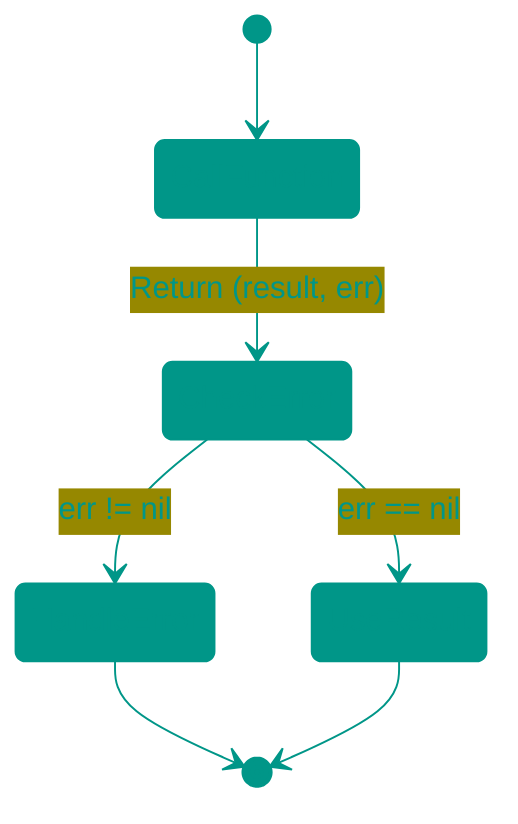
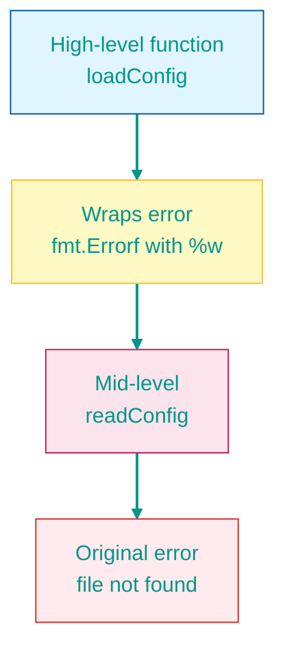
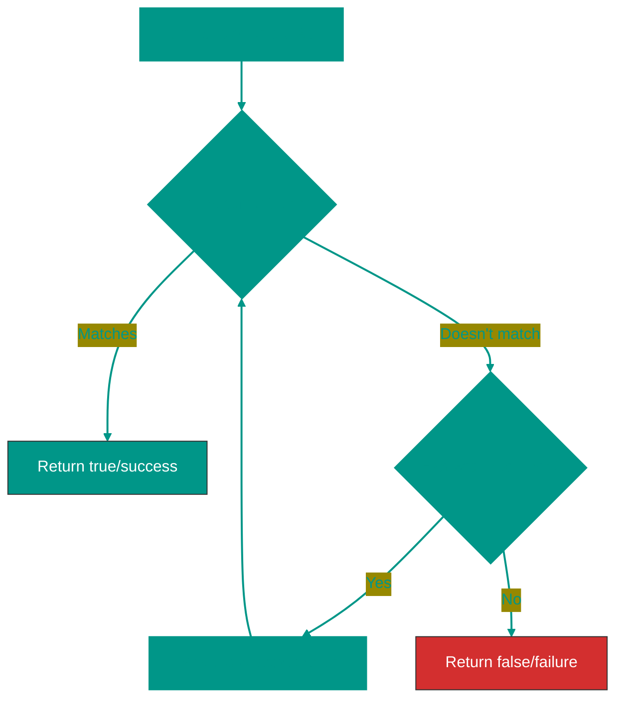

# 🚨 Error Handling in Go


## 📖 Table of Contents
1. [What are errors in Go](#what-are-errors-in-go)
2. [The error interface](#the-error-interface)
3. [Checking errors](#checking-errors)
4. [Why second return parameter](#why-second-return-parameter)
5. [Error handling vs throw/catch](#error-handling-vs-throwcatch)
6. [Creating custom errors](#creating-custom-errors)
7. [Error wrapping](#error-wrapping)
8. [errors.Is() and errors.As()](#errorsis-and-errorsas)
9. [Best practices](#best-practices)

---


## What are errors in Go

In Go, **errors are values**, not exceptions. This is a fundamental difference from many other programming languages.


### 🔑 Key features:
- ❌ **No exceptions** like in Java, Python, JavaScript
- ✅ **Errors are returned as regular values**
- ✅ **Explicit handling** — you see where errors can occur
- ✅ **Simplicity** — no hidden control flow


---


## The error interface

In Go, `error` is a built-in **interface**:

```go
type error interface {
    Error() string
}
```


### 💡 This means:
- Any type with an `Error() string` method implements the `error` interface
- You can create custom error types
- `nil` means no error

---


## Checking errors


### ✅ Correct approach

```go
package main

import (
    "fmt"
    "os"
)

func main() {
    // Open a file
    // Открытие файла
    file, err := os.Open("config.txt")
    if err != nil {
        // Error occurred - handle it
        // Ошибка произошла - обработать её
        fmt.Println("Error:", err)
        return
    }
    defer file.Close()
    
    // File opened successfully - work with it
    // Файл успешно открыт - работаем с ним
    fmt.Println("File opened successfully")
}
```


### ❌ Ignoring errors (bad practice)

```go
package main

import "os"

func main() {
    // BAD: ignoring error with _
    // ПЛОХО: игнорируем ошибку с помощью _
    file, _ := os.Open("config.txt")
    // If file didn't open, file == nil → panic when using!
    // Если файл не открылся, file == nil → паника при использовании!
    defer file.Close() // PANIC!
}
```

---


## Why second return parameter


### 🎯 Reasons for this approach:

1. **Explicitness**: Immediately clear that a function can return an error
2. **Cannot ignore**: Compiler warns about unused values
3. **Readability**: Linear code flow, no jumps


### Approach comparison

```go
// ✅ GO: Error as a value
// GO: Ошибка как значение
result, err := DoSomething()
if err != nil {
    // Handle error
    // Обработка ошибки
    return err
}
// Use result
// Используем result

// ❌ Other languages: Exceptions (pseudocode)
// Другие языки: Исключения (псевдокод)
/*
try {
    result = DoSomething()
    // Use result
} catch (error) {
    // Handle error
}
*/
```


### 📊 Flow visualization



---


## Error handling vs throw/catch


### ⚠️ Go does NOT use exceptions!

| Language | Approach | Control flow |
|----------|----------|--------------|
| **Go** | Errors as values | Explicit, linear |
| **Java/Python/JS** | try/catch/throw | Implicit, with jumps |


### Examples

```go
package main

import (
    "errors"
    "fmt"
)

// Go approach: explicit error handling
// Go подход: явная обработка ошибок
func divide(a, b float64) (float64, error) {
    if b == 0 {
        // Return error as a value
        // Возвращаем ошибку как значение
        return 0, errors.New("division by zero")
    }
    return a / b, nil
}

func main() {
    result, err := divide(10, 0)
    if err != nil {
        fmt.Println("Error:", err)
        return
    }
    fmt.Println("Result:", result)
}

/* 
In other languages (pseudocode):
В других языках (псевдокод):

function divide(a, b) {
    if (b === 0) {
        throw new Error("division by zero") // Throw exception
    }
    return a / b
}

try {
    result = divide(10, 0)
    console.log("Result:", result)
} catch (error) {
    console.log("Error:", error)
}
*/
```

---


## Creating custom errors


### 1️⃣ Simple errors: `errors.New()`

```go
package main

import (
    "errors"
    "fmt"
)

func validateAge(age int) error {
    if age < 0 {
        // Create a simple error
        // Создание простой ошибки
        return errors.New("age cannot be negative")
    }
    if age > 150 {
        return errors.New("age is too high")
    }
    return nil
}

func main() {
    err := validateAge(-5)
    if err != nil {
        fmt.Println(err) // age cannot be negative
    }
}
```


### 2️⃣ Formatted errors: `fmt.Errorf()`

```go
package main

import (
    "fmt"
)

func processUser(userID int) error {
    if userID < 0 {
        // Formatted error with value substitution
        // Форматированная ошибка с подстановкой значений
        return fmt.Errorf("invalid user ID: %d", userID)
    }
    return nil
}

func main() {
    err := processUser(-42)
    if err != nil {
        fmt.Println(err) // invalid user ID: -42
    }
}
```


### 3️⃣ Custom error types

```go
package main

import (
    "fmt"
)

// Define a custom error type
// Определяем собственный тип ошибки
type ValidationError struct {
    Field   string
    Value   interface{}
    Message string
}

// Implement the error interface
// Реализуем интерфейс error
func (e *ValidationError) Error() string {
    return fmt.Sprintf("validation failed for %s (value: %v): %s", 
        e.Field, e.Value, e.Message)
}

func validateUsername(username string) error {
    if len(username) < 3 {
        return &ValidationError{
            Field:   "username",
            Value:   username,
            Message: "must be at least 3 characters",
        }
    }
    return nil
}

func main() {
    err := validateUsername("ab")
    if err != nil {
        fmt.Println(err)
        // Output: validation failed for username (value: ab): must be at least 3 characters
    }
}
```

---


## Error wrapping

Error wrapping allows adding context while preserving the original error.


### 📦 Using `%w`

```go
package main

import (
    "errors"
    "fmt"
)

func readConfig() error {
    // Imagine this is a low-level error
    // Представим, что это низкоуровневая ошибка
    return errors.New("file not found")
}

func loadConfig() error {
    err := readConfig()
    if err != nil {
        // Wrap the error, adding context
        // Оборачиваем ошибку, добавляя контекст
        return fmt.Errorf("failed to load config: %w", err)
    }
    return nil
}

func main() {
    err := loadConfig()
    if err != nil {
        fmt.Println(err)
        // Output: failed to load config: file not found
    }
}
```


### 🔗 Error chain



---


## errors.Is() and errors.As()


### 🔍 `errors.Is()` - Check error type

Recursively checks if an error (or any wrapped error in the chain) is of a specific type.

```go
package main

import (
    "errors"
    "fmt"
    "os"
)

var ErrNotFound = errors.New("resource not found")

func findUser(id int) error {
    // Wrap a predefined error
    // Оборачиваем предопределённую ошибку
    return fmt.Errorf("user %d: %w", id, ErrNotFound)
}

func main() {
    err := findUser(123)
    
    // errors.Is recursively searches for ErrNotFound in the chain
    // errors.Is рекурсивно ищет ErrNotFound в цепочке
    if errors.Is(err, ErrNotFound) {
        fmt.Println("User not found!")
        // Output: User not found!
    }
    
    // Also works with system errors
    // Также работает с системными ошибками
    _, err = os.Open("missing.txt")
    if errors.Is(err, os.ErrNotExist) {
        fmt.Println("File does not exist")
    }
}
```


### 🎯 `errors.As()` - Extract specific type

Recursively searches for an error of a specific type and assigns its value.

```go
package main

import (
    "errors"
    "fmt"
)

type DatabaseError struct {
    Code    int
    Message string
}

func (e *DatabaseError) Error() string {
    return fmt.Sprintf("DB Error [%d]: %s", e.Code, e.Message)
}

func queryDatabase() error {
    dbErr := &DatabaseError{Code: 500, Message: "connection timeout"}
    // Wrap a custom error
    // Оборачиваем кастомную ошибку
    return fmt.Errorf("query failed: %w", dbErr)
}

func main() {
    err := queryDatabase()
    
    var dbErr *DatabaseError
    
    // errors.As finds DatabaseError in the chain and assigns to dbErr
    // errors.As находит DatabaseError в цепочке и присваивает dbErr
    if errors.As(err, &dbErr) {
        fmt.Printf("Database error code: %d\n", dbErr.Code)
        fmt.Printf("Message: %s\n", dbErr.Message)
        // Output:
        // Database error code: 500
        // Message: connection timeout
    }
}
```


### 🔄 How recursive checking works




### Recursive chain example

```go
package main

import (
    "errors"
    "fmt"
)

var ErrPermissionDenied = errors.New("permission denied")

func level1() error {
    return ErrPermissionDenied
}

func level2() error {
    err := level1()
    return fmt.Errorf("level2 failed: %w", err)
}

func level3() error {
    err := level2()
    return fmt.Errorf("level3 failed: %w", err)
}

func main() {
    err := level3()
    
    // Despite 3 levels of wrapping, errors.Is finds the error!
    // Несмотря на 3 уровня оборачивания, errors.Is находит ошибку!
    if errors.Is(err, ErrPermissionDenied) {
        fmt.Println("✅ Found error deep in the chain!")
        fmt.Println("Full message:", err)
        // Output: level3 failed: level2 failed: permission denied
    }
}
```

---


## Best practices


### ✅ DO: Do this

1. **Always check errors**
```go
result, err := someFunc()
if err != nil {
    // Handle
    return err
}
```

2. **Add context when wrapping**
```go
if err != nil {
    return fmt.Errorf("failed to process user %d: %w", userID, err)
}
```

3. **Use predefined errors for comparison**
```go
var ErrNotFound = errors.New("not found")

// In code:
if errors.Is(err, ErrNotFound) {
    // Specific handling
}
```

4. **Create custom types for complex errors**
```go
type APIError struct {
    StatusCode int
    Message    string
}

func (e *APIError) Error() string {
    return fmt.Sprintf("API error %d: %s", e.StatusCode, e.Message)
}
```


### ❌ DON'T: Don't do this

1. **Don't ignore errors**
```go
// BAD
result, _ := someFunc()
```

2. **Don't panic for regular errors**
```go
// BAD
if err != nil {
    panic(err)
}
```

3. **Don't lose the original error**
```go
// BAD: use %w instead of %v
return fmt.Errorf("operation failed: %v", err)
```

---


## 📚 Summary

| Concept | Description |
|---------|-------------|
| `error` | Interface with `Error() string` method |
| `errors.New()` | Create a simple error |
| `fmt.Errorf()` | Create a formatted error |
| `%w` | Wrap error (preserves original) |
| `errors.Is()` | Recursive error type check |
| `errors.As()` | Recursive extraction of specific type |
| Second argument | Convention: `(result, error)` |

> [!IMPORTANT]
> In Go, errors are **values**, not exceptions. Check them explicitly after each function call!

> [!TIP]
> Use `%w` when wrapping errors to preserve the ability to use `errors.Is()` and `errors.As()`

<!-- QUIZ_START 

[
    {
        "question": "What is the fundamental philosophy of error handling in Go?",
        "options": [
            "Errors are exceptions that pop up",
            "Errors are just regular values that must be handled explicitly",
            "Go does not have errors",
            "Errors are only for system failures"
        ],
        "correctIndex": 1
    },
    {
        "question": "Which interface must a type implement to be considered an 'error' in Go?",
        "options": [
            "type error interface { String() string }",
            "type error interface { Error() string }",
            "type error interface { GetMessage() string }",
            "type error interface { IsError() bool }"
        ],
        "correctIndex": 1
    },
    {
        "question": "How do you 'wrap' an existing error with additional context while preserving the original error?",
        "options": [
            "fmt.Sprintf(\"error: %v\", err)",
            "fmt.Errorf(\"failed to load: %w\", err)",
            "errors.New(err.Error())",
            "panic(err)"
        ],
        "correctIndex": 1
    }
]

QUIZ_END -->

