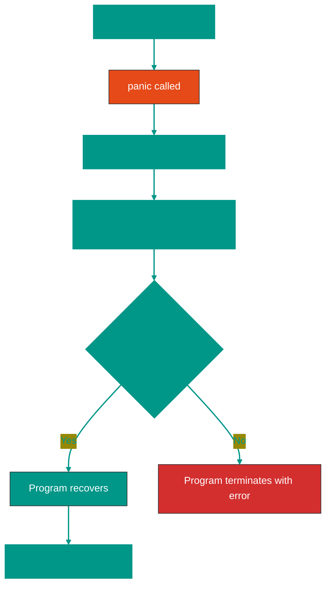
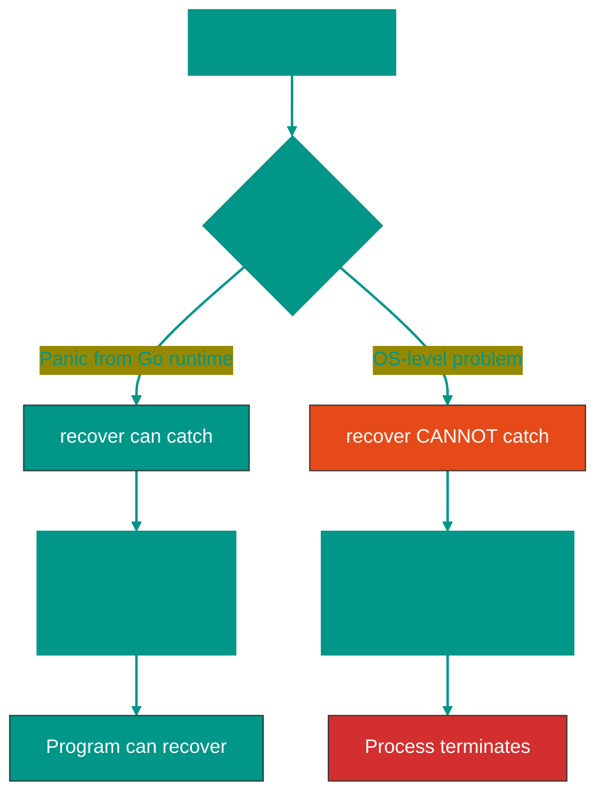

# ⚠️ Panic and Recover in Go


## 📖 Table of Contents
1. [What is panic](#what-is-panic)
2. [What is recover](#what-is-recover)
3. [When to use panic](#when-to-use-panic)
4. [How recover works](#how-recover-works)
5. [What can and cannot be caught](#what-can-and-cannot-be-caught)
6. [Usage examples](#usage-examples)
7. [Best practices](#best-practices)

---


## What is panic

`panic` is a built-in function that **stops normal execution** of the program.


### 🔥 When panic occurs:

1. **Explicit call** to `panic()`
2. **Automatically** on critical errors:
   - Division by zero
   - Array/slice out of bounds access
   - Writing to a closed channel
   - Nil pointer dereference
   - Type assertion on incorrect type

```go
package main

import "fmt"

func main() {
    // Explicit panic
    // Явный panic
    panic("Something went wrong!")
    
    // This line will never execute
    // Эта строка никогда не выполнится
    fmt.Println("This won't print")
}
// Output:
// panic: Something went wrong!
// goroutine 1 [running]: ...
```


### 📊 Execution flow during panic



---


## What is recover

`recover` is a built-in function for **catching panic** and restoring normal execution.


### 🛡️ Key rules:

1. ✅ `recover()` **only works inside `defer`**
2. ✅ Returns the value passed to `panic()`, or `nil`
3. ❌ Outside `defer` always returns `nil`

```go
package main

import "fmt"

func safeDivide(a, b int) {
    defer func() {
        // recover catches the panic
        // recover перехватывает panic
        if r := recover(); r != nil {
            fmt.Println("Caught panic:", r)
        }
    }()
    
    // This will cause a panic (division by zero)
    // Это вызовет панику (деление на ноль)
    result := a / b
    fmt.Println("Result:", result)
}

func main() {
    safeDivide(10, 0)
    fmt.Println("Program continues")
}

// Output:
// Caught panic: runtime error: integer divide by zero
// Program continues
```

---


## When to use panic


### ✅ Acceptable panic use cases:

1. **Unrecoverable errors during initialization**
   ```go
   func init() {
       if !criticalResourcesAvailable() {
           panic("critical resources unavailable")
       }
   }
   ```

2. **Programming bugs**
   ```go
   func process(value string) {
       if value == "" {
           // This shouldn't happen with correct logic
           panic("unexpected empty value")
       }
   }
   ```

3. **Libraries: Must-functions**
   ```go
   // regexp.MustCompile panics if regex is invalid
   // regexp.MustCompile паникует, если регулярное выражение некорректно
   pattern := regexp.MustCompile(`[a-z]+`)
   ```


### ❌ Do NOT use panic for:

1. **Regular errors** (use `error` instead)
   ```go
   // BAD
   func openFile(path string) {
       file, err := os.Open(path)
       if err != nil {
           panic(err) // ❌
       }
   }
   
   // GOOD
   func openFile(path string) (*os.File, error) {
       return os.Open(path) // ✅
   }
   ```

2. **Control flow**
3. **User input validation**

---


## How recover works


### 🔧 Mechanism

```go
package main

import "fmt"

func riskyOperation() {
    defer func() {
        if r := recover(); r != nil {
            fmt.Printf("Recovered from panic: %v\n", r)
        }
    }()
    
    fmt.Println("Starting operation")
    panic("critical error!")
    fmt.Println("This won't execute")
}

func main() {
    riskyOperation()
    fmt.Println("main continues")
}

// Output:
// Starting operation
// Recovered from panic: critical error!
// main continues
```


### 📝 Important details:

```go
package main

import "fmt"

func incorrectRecover() {
    // ❌ WRONG: recover outside defer doesn't work
    // НЕПРАВИЛЬНО: recover вне defer не работает
    if r := recover(); r != nil {
        fmt.Println("This will never execute")
    }
    panic("error!")
}

func correctRecover() {
    // ✅ CORRECT: recover inside defer
    // ПРАВИЛЬНО: recover внутри defer
    defer func() {
        if r := recover(); r != nil {
            fmt.Println("Panic caught:", r)
        }
    }()
    panic("error!")
}

func main() {
    correctRecover()
    fmt.Println("Program running")
}
```

---


## What can and cannot be caught


### ✅ What CAN be caught with recover:

| Panic type | Can catch? | Example |
|------------|------------|---------|
| Explicit `panic()` | ✅ Yes | `panic("error")` |
| Out of bounds | ✅ Yes | `arr[999]` |
| Nil pointer dereference | ✅ Yes | `var p *int; *p = 5` |
| Type assertion | ✅ Yes | `var x interface{} = 5; _ = x.(string)` |
| Writing to closed channel | ✅ Yes | `close(ch); ch <- 1` |
| Division by zero | ✅ Yes | `x := 5 / 0` |


### ❌ What CANNOT be caught:

| Problem | Why not | Consequences |
|---------|---------|--------------|
| **Out of Memory (OOM)** | Operating system kills the process | Program terminates instantly |
| **Stack Overflow** | Stack exhausted (infinite recursion) | Runtime terminates the program |
| **SIGKILL** | System signal for forced termination | OS kills process immediately |
| **All goroutines deadlocked** | Runtime detects deadlock | Program terminates with fatal error |


### 🧪 Examples

```go
package main

import "fmt"

// ✅ Can catch: out of bounds
// Можно поймать: выход за границы слайса
func catchOutOfBounds() {
    defer func() {
        if r := recover(); r != nil {
            fmt.Println("Caught panic:", r)
        }
    }()
    
    arr := []int{1, 2, 3}
    _ = arr[999] // panic: index out of range
}

// ✅ Can catch: nil pointer
// Можно поймать: nil pointer
func catchNilPointer() {
    defer func() {
        if r := recover(); r != nil {
            fmt.Println("Caught panic:", r)
        }
    }()
    
    var p *int
    *p = 42 // panic: nil pointer dereference
}

// ❌ CANNOT catch: stack overflow
// НЕЛЬЗЯ поймать: stack overflow
func causeStackOverflow() {
    // defer + recover will NOT help
    // defer + recover НЕ помогут
    defer func() {
        if r := recover(); r != nil {
            fmt.Println("This won't execute")
        }
    }()
    
    causeStackOverflow() // Infinite recursion
}

func main() {
    catchOutOfBounds()
    catchNilPointer()
    
    // DON'T call causeStackOverflow() - program will crash!
    // НЕ вызывайте causeStackOverflow() - программа упадет!
}
```


### 🔬 Why OOM and Stack Overflow cannot be caught?



> [!CAUTION]
> **OOM (Out of Memory)** and **Stack Overflow** occur at the operating system or Go runtime level, not within your code. `recover` cannot catch them because the process is already killed by the OS or runtime.

---


## Usage examples


### 1️⃣ Web server: recover from panic in handler

```go
package main

import (
    "fmt"
    "net/http"
)

// Middleware to recover from panics
// Middleware для восстановления после паники
func recoverMiddleware(next http.HandlerFunc) http.HandlerFunc {
    return func(w http.ResponseWriter, r *http.Request) {
        defer func() {
            if r := recover(); r != nil {
                fmt.Printf("Panic in handler: %v\n", r)
                http.Error(w, "Internal Server Error", http.StatusInternalServerError)
            }
        }()
        next(w, r)
    }
}

func riskyHandler(w http.ResponseWriter, r *http.Request) {
    // Simulating a panic
    // Имитация паники
    panic("something went wrong!")
}

func main() {
    http.HandleFunc("/", recoverMiddleware(riskyHandler))
    http.ListenAndServe(":8080", nil)
}
```


### 2️⃣ Worker pool: isolate panic in goroutine

```go
package main

import (
    "fmt"
    "time"
)

func worker(id int, jobs <-chan int) {
    // Each goroutine is protected from panics
    // Каждая goroutine защищена от паники
    defer func() {
        if r := recover(); r != nil {
            fmt.Printf("Worker %d: panic caught: %v\n", id, r)
        }
    }()
    
    for job := range jobs {
        if job == 13 {
            // Simulating a panic
            panic(fmt.Sprintf("worker %d doesn't like number 13", id))
        }
        fmt.Printf("Worker %d processed job %d\n", id, job)
    }
}

func main() {
    jobs := make(chan int, 10)
    
    // Start 3 workers
    for i := 1; i <= 3; i++ {
        go worker(i, jobs)
    }
    
    // Send jobs
    for j := 1; j <= 20; j++ {
        jobs <- j
    }
    close(jobs)
    
    time.Sleep(2 * time.Second)
}

// Output:
// Worker 1 processed job 1
// Worker 2 processed job 2
// ...
// Worker 1: panic caught: worker 1 doesn't like number 13
// Worker 2 processed job 14
// ...
```


### 3️⃣ Must-function (panics on error)

```go
package main

import (
    "fmt"
    "os"
)

// Must-function for mandatory file opening
// Must-функция для обязательного открытия файла
func MustOpenFile(path string) *os.File {
    file, err := os.Open(path)
    if err != nil {
        // Panic if file is critical
        // Паникуем, если файл критически важен
        panic(fmt.Sprintf("failed to open critical file %s: %v", path, err))
    }
    return file
}

func main() {
    defer func() {
        if r := recover(); r != nil {
            fmt.Println("Application cannot start:", r)
        }
    }()
    
    // If config.yaml doesn't exist, app can't run
    // Если config.yaml не существует, программа не может работать
    config := MustOpenFile("config.yaml")
    defer config.Close()
    
    fmt.Println("Application started")
}
```

---


## Best practices


### ✅ DO: Do this

1. **Use recover only for truly critical situations**
   ```go
   // Web server shouldn't crash due to one handler
   defer func() {
       if r := recover(); r != nil {
           log.Printf("Handler panic: %v", r)
       }
   }()
   ```

2. **Log recovered panics**
   ```go
   if r := recover(); r != nil {
       log.Printf("Recovered panic: %v\nStack trace: %s", r, debug.Stack())
   }
   ```

3. **Prefer errors instead of panic**
   ```go
   // ✅ GOOD
   func divide(a, b int) (int, error) {
       if b == 0 {
           return 0, errors.New("division by zero")
       }
       return a / b, nil
   }
   ```


### ❌ DON'T: Don't do this

1. **Don't use panic for regular control flow**
   ```go
   // ❌ BAD
   func validateInput(input string) {
       if input == "" {
           panic("input is empty")
       }
   }
   ```

2. **Don't silently swallow recovered panics**
   ```go
   // ❌ BAD: silent swallowing
   defer func() {
       recover() // Without logging and handling
   }()
   ```

3. **Don't rely on recover for system problems**
   ```go
   // ❌ USELESS: recover won't help
   defer func() {
       if r := recover(); r != nil {
           // This won't help with OOM or Stack Overflow
       }
   }()
   causeMemoryExhaustion()
   ```

---


## 📚 Summary

| Concept | Description |
|---------|-------------|
| `panic()` | Stops normal program execution |
| `recover()` | Catches panic, works only in `defer` |
| Can catch | Panic from Go code (out of bounds, nil pointer, etc.) |
| Cannot catch | OOM, Stack Overflow, SIGKILL, deadlock |
| Use for | Critical initialization errors, Must-functions |
| Don't use for | Regular errors, validation, control flow |

> [!IMPORTANT]
> **Panic is not exceptions!** Use panic only for truly exceptional situations. For regular errors, use the `error` type.

> [!CAUTION]
> `recover()` works **only inside `defer`**. Calling `recover()` in regular code always returns `nil`.

> [!WARNING]
> Not all critical situations can be caught. **OOM, Stack Overflow, and system signals** lead to immediate process termination.

<!-- QUIZ_START 

[
    {
        "question": "What happens to a program's execution when 'panic' is called?",
        "options": [
            "It continues normally with a log message",
            "It stops normal execution and starts running deferred functions in reverse order",
            "It reboots the computer",
            "It deletes the executable file"
        ],
        "correctIndex": 1
    },
    {
        "question": "Where is the only place the 'recover()' function effectively catches a panic?",
        "options": [
            "Directly in the main() function",
            "Inside a 'defer' function",
            "In an 'if err != nil' block",
            "At the very beginning of the function"
        ],
        "correctIndex": 1
    },
    {
        "question": "What is the recommended use case for 'panic' in Go?",
        "options": [
            "For regular user input validation",
            "For unrecoverable critical errors during initialization or clear programming bugs",
            "To return values from a function",
            "For network timeouts"
        ],
        "correctIndex": 1
    }
]

QUIZ_END -->

