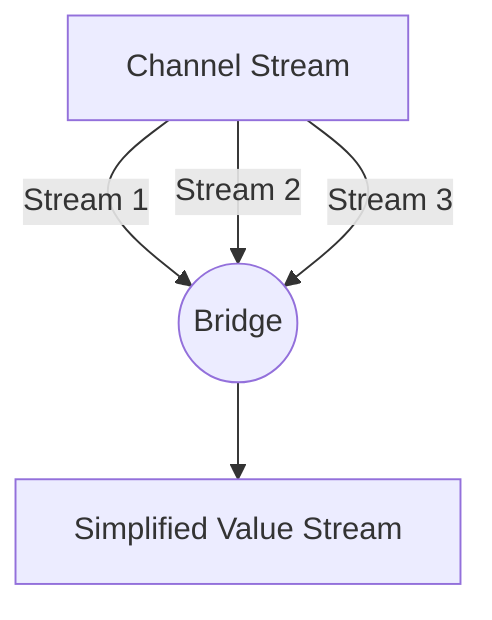

### 🌉 Bridge-Channel Pattern

**Bridge-channel** is a pattern that "flattens" a stream of channels into a single stream of values. It is used when you have a channel from which other channels arrive (`<-chan <-chan interface{}`), and you want to read data from them sequentially, as if it were a single regular channel.

---

### 🧠 Concept

Imagine a transfer at an airport. Passengers arrive on different flights (input channels), but they all must pass through a single narrow corridor of passport control (resulting stream) to get into the city.



---

### 💻 Implementation

Implementing the Bridge pattern requires careful handling of channel closing and cancellation signals to prevent goroutine leaks.

```go
package main

import "fmt"

// bridge flattens a stream of channels into a single value stream
// bridge объединяет поток каналов в один поток значений
func bridge(done <-chan interface{}, chanStream <-chan (<-chan interface{})) <-chan interface{} {
	valStream := make(chan interface{})
	go func() {
		defer close(valStream)
		for {
			var stream <-chan interface{}
			select {
			case maybeStream, ok := <-chanStream:
				if !ok {
					return
				}
				stream = maybeStream
			case <-done:
				return
			}

			// Reading values from the currently received channel
			// Читаем значения из текущего полученного канала
			for val := range stream {
				select {
				case valStream <- val:
				case <-done:
					return
				}
			}
		}
	}()
	return valStream
}

func main() {
	done := make(chan interface{})
	defer close(done)

	// Creating a "channel of channels"
	// Создаем "канал каналов"
	chanStream := make(chan (<-chan interface{}))

	go func() {
		defer close(chanStream)
		for i := 0; i < 3; i++ {
			stream := make(chan interface{})
			go func(v int) {
				defer close(stream)
				stream <- fmt.Sprintf("Data from channel %d", v)
			}(i)
			chanStream <- stream
		}
	}()

	fmt.Println("Reading through the bridge...")
	// Чтение через мост...

	for val := range bridge(done, chanStream) {
		fmt.Printf("Received: %v\n", val)
	}
}
```

---

### 💡 Key Points

1. **Sequentiality**: Even though channels in a stream might be created in parallel, `bridge` reads from them one by one, preserving the order in which the channels appeared.
2. **Simplification**: The calling code doesn't need to know about the complex channel hierarchy; it works with a simple data stream.
3. **Safety**: All goroutines correctly terminate when the `done` signal is received.

> [!NOTE]
> This pattern is often used in conjunction with other patterns, such as Pipeline, when one of the stages generates new sub-tasks in the form of channels.
