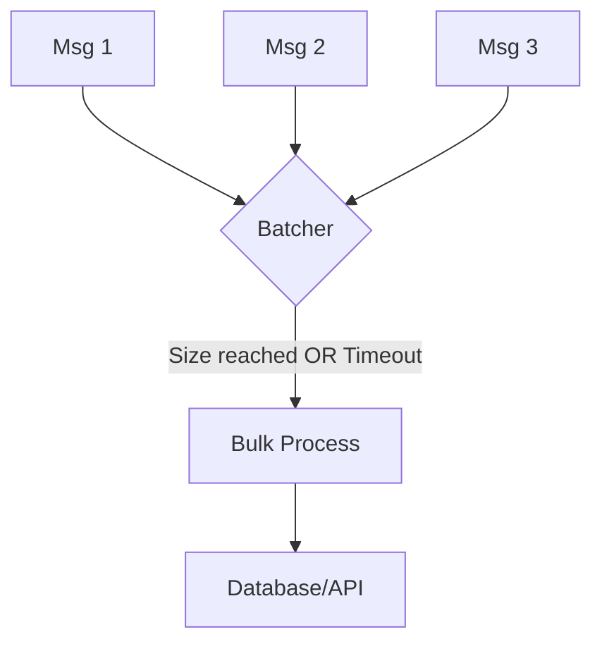

### 📦 Batcher Pattern

**Batcher** is a pattern that combines several small operations into a single group (batch) for joint processing. This is critically important for performance optimization when working with databases, message queues, or network APIs, as a single group operation is usually much more efficient than a hundred individual ones.

---

### 🧠 Concept

Imagine a garbage truck. It doesn't come to your house every time you throw away a single candy wrapper. Instead, you accumulate garbage in a bin (batch), and the truck picks it all up at once either on a schedule or when the bin is full.



---

### 💻 Implementation

An efficient batcher should trigger based on two conditions: either the required number of elements has accumulated, or a certain amount of time has passed (timeout).

```go
package main

import (
	"fmt"
	"sync"
	"time"
)

// Batcher collects messages and processes them in batches
// Batcher собирает сообщения и обрабатывает их пачками
type Batcher struct {
	mu       sync.Mutex
	batch    []string
	limit    int
	interval time.Duration
}

func NewBatcher(limit int, interval time.Duration) *Batcher {
	b := &Batcher{
		limit:    limit,
		interval: interval,
	}
	// Starting background flush process by time
	// Запускаем фоновый процесс сброса по времени
	go b.autoFlush()
	return b
}

func (b *Batcher) Add(msg string) {
	b.mu.Lock()
	b.batch = append(b.batch, msg)
	
	if len(b.batch) >= b.limit {
		b.flushLocked()
	}
	b.mu.Unlock()
}

func (b *Batcher) autoFlush() {
	ticker := time.NewTicker(b.interval)
	for range ticker.C {
		b.mu.Lock()
		b.flushLocked()
		b.mu.Unlock()
	}
}

func (b *Batcher) flushLocked() {
	if len(b.batch) == 0 {
		return
	}
	fmt.Printf(">>> Sending batch of %d items: %v\n", len(b.batch), b.batch)
	b.batch = nil // Clear the batch
}

func main() {
	// Batch every 5 items or every 2 seconds
	// Батч каждые 5 элементов или каждые 2 секунды
	batcher := NewBatcher(5, 2*time.Second)

	fmt.Println("Adding messages...")
	// Добавление сообщений...

	// 1. Triggers by limit (5 messages)
	// Сработает по лимиту (5 сообщений)
	for i := 1; i <= 5; i++ {
		batcher.Add(fmt.Sprintf("msg-%d", i))
	}

	// 2. Triggers by timeout (2 messages stay pending)
	// Сработает по таймауту (2 сообщения зависнут)
	batcher.Add("msg-6")
	batcher.Add("msg-7")

	time.Sleep(3 * time.Second)
	fmt.Println("Work completed.")
}
```

---

### 💡 Key Points

1. **Throughput**: Dramatically increases transactions per second (TPS) by reducing overhead for creating connections or transactions.
2. **Latency**: The downside is a slight delay, as the first messages in the batch wait for others or a timeout.
3. **Safety**: It's important to provide a flush for any remaining messages when shutting down the application to avoid data loss.

> [!IMPORTANT]
> Batching is the most effective way to speed up writes to SQL/NoSQL databases or sending logs to monitoring systems.
