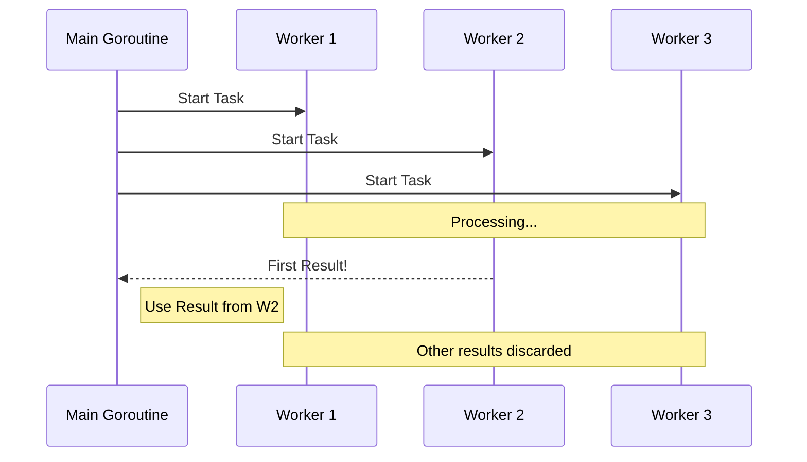

### 🏁 Competition Pattern (Racing)

**Competition** (or *Racing*) is a concurrency pattern where multiple goroutines perform the same task, and we use the result from the one that finishes **first**. All other results are ignored.

This approach is ideal for high-availability systems where we can send a request to multiple replica servers and take the response from the fastest one.

---

### 🧠 Concept

Imagine you call a taxi using three different apps. The car that arrives first takes you, and you simply cancel the other orders. In Go, this is implemented using channels and the `select` statement.



---

### 💻 Implementation

Below is an implementation example of the pattern, where we simulate requests to multiple data sources.

```go
package main

import (
    "fmt"
    "math/rand"
    "time"
)

// simulateSearch simulates data search with a delay
// simulateSearch имитирует поиск данных с задержкой
func simulateSearch(id int) <-chan string {
    res := make(chan string)
    go func() {
        // Random delay up to 3 seconds
        // Рандомная задержка до 3 секунд
        delay := time.Duration(rand.Intn(3000)) * time.Millisecond
        time.Sleep(delay)
        res <- fmt.Sprintf("Result from server %d (took %v)", id, delay)
    }()
    return res
}

func main() {
    rand.Seed(time.Now().UnixNano())

    fmt.Println("Search started on 3 servers...")
    // Поиск запущен на 3-х серверах...

    // Starting 3 concurrent tasks
    // Запускаем 3 конкурентные задачи
    c1 := simulateSearch(1)
    c2 := simulateSearch(2)
    c3 := simulateSearch(3)

    // Competition pattern: taking whichever result comes first
    // Паттерн Competition: берем то, что пришло первым
    select {
    case res := <-c1:
        fmt.Println("WINNER:", res)
    case res := <-c2:
        fmt.Println("WINNER:", res)
    case res := <-c3:
        fmt.Println("WINNER:", res)
    case <-time.After(2 * time.Second):
        // Timeout if no one finished within 2 seconds
        // Таймаут, если никто не успел за 2 секунды
        fmt.Println("ERROR: Request timed out")
    }
}
```

---

### 💡 Key Points

1. **Speed**: The total execution time is equal to the execution time of the fastest node.
2. **Load**: The downside is redundant resource consumption, as we launch $N$ tasks to get a single response.
3. **Cancellation**: In production projects, it's recommended to use `context.Context` to cancel the "losing" goroutines so they don't continue wasting resources after a winner is determined.

> [!TIP]
> Use this pattern when latency is more critical than the cost of computing resources.
