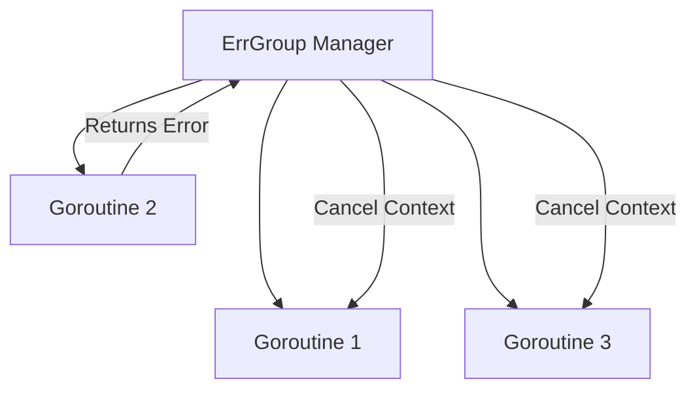

### ❌ ErrGroup Pattern

**ErrGroup** is an extended version of `sync.WaitGroup` that not only waits for a group of goroutines to complete but also captures the first error that occurs. If one of the goroutines returns an error, `ErrGroup` can automatically cancel the context for all other goroutines in the group.

---

### 🧠 Concept

It's like teamwork on a project. If even one specialist (goroutine) discovers a critical problem (error), they report it to the manager (ErrGroup), who immediately commands everyone else to stop working since the project can no longer be completed successfully.



---

### 💻 Implementation

To use `ErrGroup`, you need to import the `golang.org/x/sync/errgroup` package.

```go
package main

import (
	"context"
	"fmt"
	"time"

	"golang.org/x/sync/errgroup"
)

func main() {
	// Creating ErrGroup and a context that cancels on the first error
	// Создаем ErrGroup и контекст, который отменится при первой ошибке
	g, ctx := errgroup.WithContext(context.Background())

	urls := []string{"site1.com", "site2.com", "error-site.com", "site3.com"}

	for _, url := range urls {
		url := url // capturing variable for closure
		g.Go(func() error {
			// Simulating a request
			// Имитация запроса
			select {
			case <-time.After(500 * time.Millisecond):
				if url == "error-site.com" {
					return fmt.Errorf("error during request to %s", url)
				}
				fmt.Printf("Successful request to %s\n", url)
				return nil
			case <-ctx.Done():
				// Aborting if another goroutine returned an error
				// Прерываем работу, если другая горутина вернула ошибку
				return ctx.Err()
			}
		})
	}

	// Waiting for completion or the first error
	// Ждем завершения или первой ошибки
	if err := g.Wait(); err != nil {
		fmt.Printf("Group finished with error: %v\n", err)
	} else {
		fmt.Println("All requests completed successfully!")
	}
}
```

---

### 💡 Key Points

1. **Confidentiality**: Only the very first error that occurred is returned. Others are masked.
2. **Limit Management**: Using the `SetLimit(n)` method, you can limit the number of simultaneously running goroutines.
3. **Automation**: You no longer need to manually handle channels to collect errors from different goroutines.

> [!IMPORTANT]
> `ErrGroup` is ideal for parallel execution of independent tasks, where the result must be successful for all participants.
