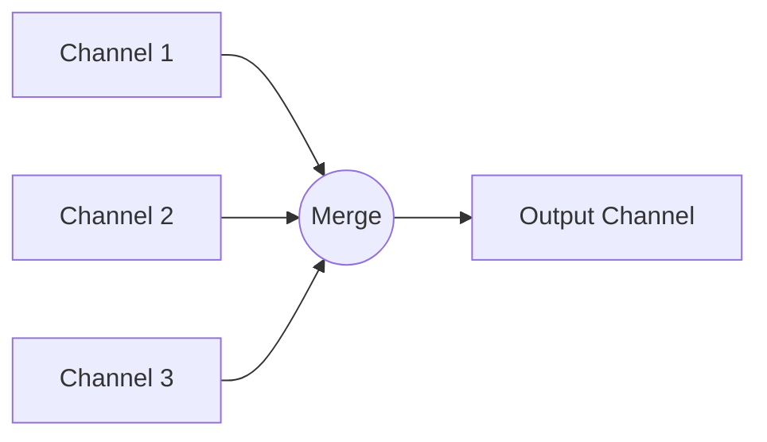

### 🌪️ Fan-In Pattern

**Fan-In** is a pattern that multiplexes data from multiple input channels into a single output channel. This allows collecting results of parallel computations or data from various sources into one place for centralized processing.

---

### 🧠 Concept

Imagine several rivers flowing into one sea. Each river (input channel) carries its waters (data), and they all mix in the sea (output channel).



---

### 💻 Implementation

In this example, we create a `MergeChannels` function that combines any number of channels into one.

```go
package main

import (
	"fmt"
	"sync"
	"time"
)

// MergeChannels multiplexes multiple input channels into a single output channel
// MergeChannels объединяет несколько входящих каналов в один выходной канал
func MergeChannels(channels ...<-chan int) <-chan int {
	res := make(chan int)
	wg := sync.WaitGroup{}

	// Add the number of channels to the counter
	// Добавляем в счетчик количество каналов
	wg.Add(len(channels))

	// Launch a goroutine for each input channel
	// Запускаем горутину для каждого входного канала
	for _, channel := range channels {
		go func(c <-chan int) {
			defer wg.Done()
			for value := range c {
				res <- value
			}
		}(channel)
	}

	// Goroutine to close the resulting channel
	// Горутина для закрытия результирующего канала
	go func() {
		wg.Wait()
		close(res)
	}()

	return res
}

func main() {
	// Create three channels for demonstration
	// Создаем три канала для демонстрации
	ch1 := make(chan int)
	ch2 := make(chan int)
	ch3 := make(chan int)

	go func() {
		defer func() {
			close(ch1)
			close(ch2)
			close(ch3)
		}()

		for i := 0; i < 9; i += 3 {
			ch1 <- i
			ch2 <- i + 1
			ch3 <- i + 2
			time.Sleep(100 * time.Millisecond)
		}
	}()

	fmt.Println("Collecting data from multiple channels...")
	// Сбор данных из нескольких каналов...

	for value := range MergeChannels(ch1, ch2, ch3) {
		fmt.Printf("Received value: %d\n", value)
	}
	fmt.Println("All data collected.")
}
```

---

### 💡 Key Points

1. **Scalability**: You can merge as many channels as needed.
2. **Synchronization**: Using `sync.WaitGroup` ensures the output channel closes only when all senders have finished.
3. **Safety**: The function returns a read-only channel (`<-chan`), protecting it from accidental external writes.

> [!IMPORTANT]
> Always ensure input channels are eventually closed, otherwise `MergeChannels` may cause a goroutine leak (due to eternal waiting in `wg.Wait()`).
