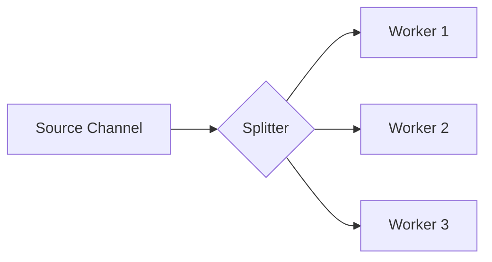

### 📣 Fan-Out Pattern

**Fan-Out** is a pattern where data from a single channel is distributed among multiple handler goroutines (workers). This allows heavy tasks to be performed in parallel, significantly speeding up the processing of large data streams.

---

### 🧠 Concept

Imagine a conveyor belt in a factory where parts come off. Instead of one worker doing everything alone, the parts are distributed among several craftsmen, each working independently.



---

### 💻 Implementation

In this example, one goroutine generates tasks, and three workers process them in parallel.

```go
package main

import (
	"fmt"
	"sync"
	"time"
)

// worker processes tasks from the input channel
// worker обрабатывает задачи из входного канала
func worker(id int, input <-chan int, wg *sync.WaitGroup) {
	defer wg.Done()
	for num := range input {
		// Simulating heavy processing
		// Имитация тяжелой обработки
		fmt.Printf("Worker %d took task %d\n", id, num)
		time.Sleep(500 * time.Millisecond)
		fmt.Printf("Worker %d finished task %d. Result: %d\n", id, num, num*2)
	}
}

func main() {
	const numWorkers = 3
	tasks := []int{1, 2, 3, 4, 5, 6, 7, 8}

	// Create channels for workers
	// Создаем каналы для воркеров
	inputs := make([]chan int, numWorkers)
	var wg sync.WaitGroup

	// Initialize and start workers
	// Инициализируем и запускаем воркеры
	for i := 0; i < numWorkers; i++ {
		inputs[i] = make(chan int)
		wg.Add(1)
		go worker(i+1, inputs[i], &wg)
	}

	// Dispatcher
	// Распределение задач (Dispatcher)
	go func() {
		for i, task := range tasks {
			// Distribute tasks in a round-robin fashion
			// Распределяем задачи по кругу (round-robin)
			inputs[i%numWorkers] <- task
		}

		// Close all channels after distribution
		// Закрываем все каналы после распределения
		for _, in := range inputs {
			close(in)
		}
	}()

	fmt.Println("Task distribution started...")
	// Запущено распределение задач по воркерам...

	wg.Wait()
	fmt.Println("All tasks successfully processed.")
}
```

---

### 💡 Key Points

1. **Parallelism**: Allows effective use of all CPU cores for data processing.
2. **Balancing**: With a proper implementation (e.g., using a single shared channel for all workers), tasks are distributed evenly.
3. **Round-Robin**: The example above uses cyclic distribution, but in Go, it's more common for all workers to read from the **same** channel concurrently, which provides automatic load balancing (whoever is free takes the task).

> [!TIP]
> For a simpler implementation, use a shared queue (one channel) that multiple goroutines read from. This avoids the need to create an array of channels and write dispatcher logic.
