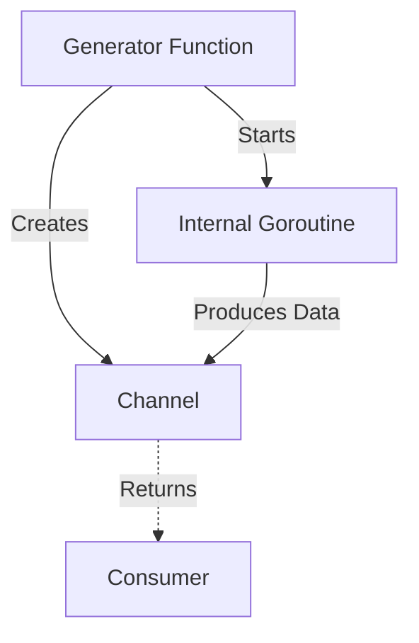

### 🏗️ Generator Pattern

**Generator** is a pattern that encapsulates the data generation process within a function that returns a channel for reading that data. This allows the caller to receive a stream of data as it becomes ready, without worrying about how exactly it is produced.

---

### 🧠 Concept

Imagine an endless water tap. You don't need to know where the water comes from; you just open the tap (call the generator function) and place a glass (read from the channel).



---

### 💻 Implementation

In this example, the generator function merges data from two internal goroutines and provides them through a single channel.

```go
package main

import (
	"fmt"
	"sync"
)

// writer is a generator that creates a channel and returns it
// writer — это генератор, который создает канал и возвращает его
func writer() <-chan int {
	ch := make(chan int)
	wg := &sync.WaitGroup{}

	// Add 2 goroutines that will "produce" data
	// Добавляем 2 горутины, которые будут "производить" данные
	wg.Add(2)

	// First goroutine: numbers 1-5
	// Первая горутина: числа 1-5
	go func() {
		defer wg.Done()
		for i := 1; i <= 5; i++ {
			ch <- i
		}
	}()

	// Second goroutine: numbers 11-15
	// Вторая горутина: числа 11-15
	go func() {
		defer wg.Done()
		for i := 11; i <= 15; i++ {
			ch <- i
		}
	}()

	// Goroutine to close the channel after all producers finish
	// Горутина для закрытия канала после завершения всех производителей
	go func() {
		wg.Wait()
		close(ch)
	}()

	// Returns a read-only channel
	return ch
}

func main() {
	fmt.Println("Generator started...")
	// Генератор запущен...

	// Receiving data stream from the generator
	// Получаем поток данных от генератора
	dataStream := writer()

	for v := range dataStream {
		fmt.Printf("Received value: %d\n", v)
	}
	fmt.Println("Generation completed.")
}
```

---

### 💡 Micro-pattern: Time Limiting

Generators are often used with timeouts. If a generator takes too long to produce results, we can abort the wait.

```go
// Example of waiting with a timeout
// Пример ожидания с таймаутом
select {
case v := <-ch:
    fmt.Println("Received:", v)
case <-time.After(3 * time.Second):
    fmt.Println("Error: Request timed out")
}
```

---

### 💡 Key Points

1. **Encapsulation**: All the logic for creating the goroutine and managing the channel is hidden inside the function.
2. **Lazy Evaluation**: Data can be generated "on the fly" only when needed by the consumer.
3. **Type Safety**: Using `<-chan` explicitly indicates that the channel is read-only.

> [!TIP]
> A generator can be made infinite by not closing the channel and generating values in a `for { ... }` loop.
