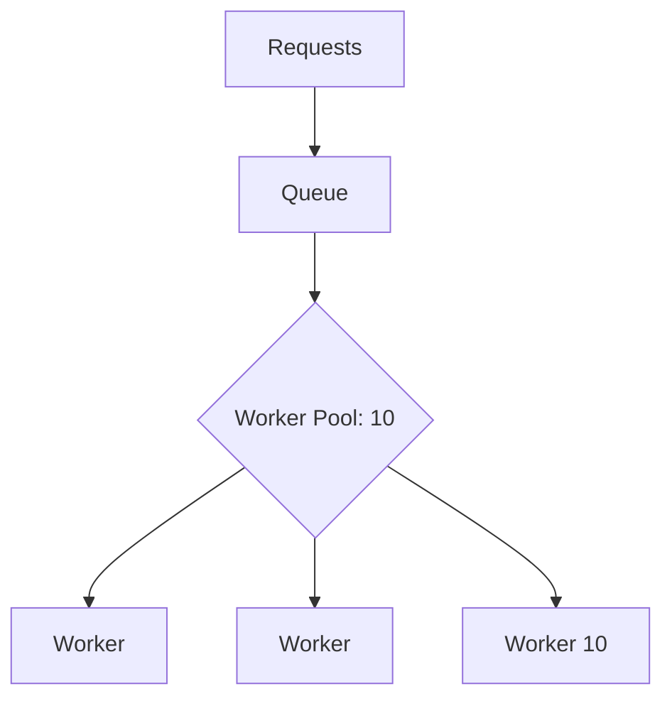

### 🛡️ Limiter: Max Connections

**Max Connections Limiter** is a variation of the resource limiting pattern that focuses on controlling the number of active network connections or workers. This ensures that your system does not open more sockets or deploy more computing resources than the infrastructure can withstand.

---

### 🧠 Concept

It's like a call center with only 10 operators. Even if 100 people call simultaneously, only 10 will be able to talk; the rest will wait in a queue until a line becomes available.



---

### 💻 Implementation

In this implementation, we limit the number of simultaneously running processing goroutines (workers) that read from a shared task channel.

```go
package main

import (
	"fmt"
	"sync"
	"time"
)

func main() {
	const maxConnections = 3 // Connection limit
	const totalRequests = 10

	taskCh := make(chan int, totalRequests)
	var wg sync.WaitGroup

	fmt.Printf("Starting system with a limit of %d connections...\n", maxConnections)
	// Запуск системы с лимитом 3 соединений...

	// Creating a worker pool that acts as our limiter
	// Создаем пул воркеров, который и является нашим лимитером
	for i := 1; i <= maxConnections; i++ {
		wg.Add(1)
		go func(workerID int) {
			defer wg.Done()
			for taskID := range taskCh {
				fmt.Printf("Worker %d processing request %d\n", workerID, taskID)
				time.Sleep(500 * time.Millisecond) // Simulating network work
			}
		}(i)
	}

	// Sending requests
	// Отправляем запросы
	for i := 1; i <= totalRequests; i++ {
		taskCh <- i
	}
	close(taskCh)

	wg.Wait()
	fmt.Println("All requests processed.")
}
```

---

### 💡 Key Points

1. **Stability**: Prevents service failure due to a lack of file descriptors or memory.
2. **Predictability**: You have clear control over the system's throughput.
3. **Queuing**: Incoming requests are not rejected; they are placed in a queue (channel buffer).

> [!NOTE]
> This approach is often called a "Worker Pool," and it is the most reliable way to implement hard limits in Go.
