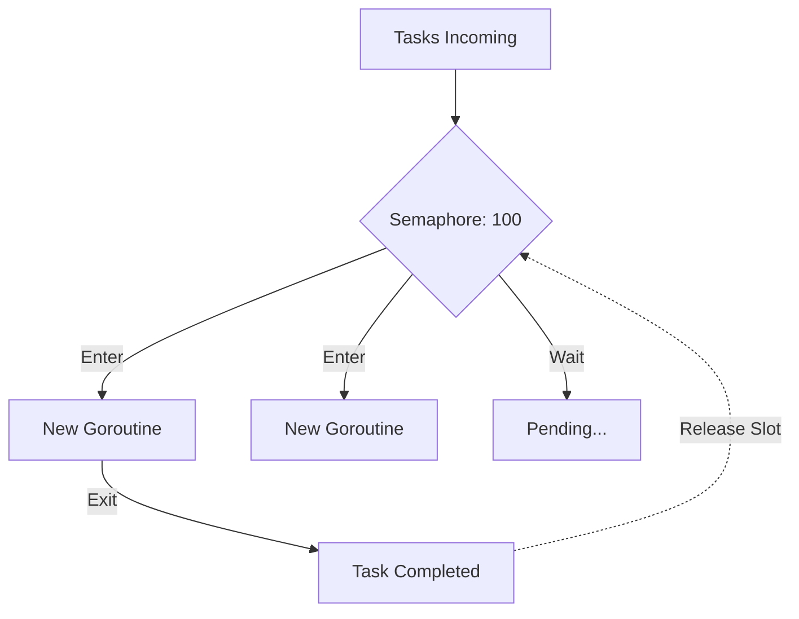

### 🧵 Limiter: Max Goroutines

**Max Goroutines Limiter** is a pattern that limits the total number of simultaneously running goroutines in a specific section of code. Unlike a worker pool, where goroutines live permanently, here goroutines are created for each task, but their total number is strictly controlled by a semaphore.

---

### 🧠 Concept

Imagine a nightclub with face control. A security guard (semaphore) allows only 100 people inside. As soon as one person leaves, the next one can enter. Inside, everyone is doing their own thing (a goroutine per task), but the total number of people in the room is always within the limit.



---

### 💻 Implementation

The most efficient way to implement this pattern is by using a semaphore based on a buffered channel.

```go
package main

import (
	"fmt"
	"sync"
	"time"
)

func main() {
	const maxGoroutines = 5 // Goroutine limit
	const totalTasks = 15

	// Semaphore: the limiter
	// Семафор: ограничитель
	sem := make(chan struct{}, maxGoroutines)
	var wg sync.WaitGroup

	fmt.Printf("Processing %d tasks with a limit of %d goroutines...\n", totalTasks, maxGoroutines)
	// Обработка 15 задач с лимитом в 5 горутин...

	for i := 1; i <= totalTasks; i++ {
		wg.Add(1)

		// Occupy a slot BEFORE starting the goroutine
		// Занимаем слот ПЕРЕД запуском горутины
		sem <- struct{}{}

		go func(taskID int) {
			defer wg.Done()
			// Release the slot ON COMPLETION of the goroutine
			// Освобождаем слот ПРИ ЗАВЕРШЕНИИ горутины
			defer func() { <-sem }()

			fmt.Printf("Goroutine started for task %d\n", taskID)
			time.Sleep(time.Duration(200) * time.Millisecond) // Simulating work
		}(i)
	}

	wg.Wait()
	fmt.Println("All tasks successfully completed.")
}
```

---

### 💡 Key Points

1. **Dynamicity**: Goroutines are created and destroyed on demand, which can be more efficient if tasks arrive infrequently.
2. **Ease of Integration**: You can easily wrap an existing goroutine launch loop in this pattern.
3. **Safety**: Protects the application from crashing due to stack overflow (`out of memory`) when creating millions of goroutines.

> [!CAUTION]
> Always occupy a slot in the semaphore **outside** the goroutine; otherwise, you will first launch a million goroutines, and only then will they start trying to occupy slots, which makes the pattern pointless.
