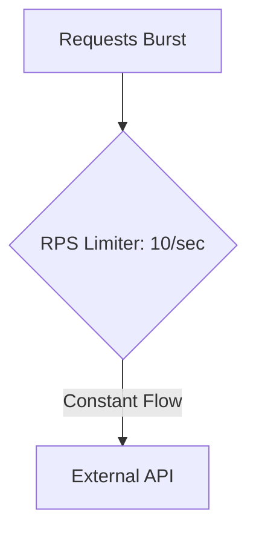

### ⏱️ Limiter: RPS (Rate Per Second)

**RPS Limiter** is a pattern that manages the intensity of operations performed over time. Unlike other limiters, it aims not at limiting resource consumption within the system, but at complying with external requirements (for example, API limits — "no more than 100 requests per second").

---

### 🧠 Concept

Imagine an hourglass or a dispenser. Even if you have a ton of sand, it passes through the narrow neck at a constant fixed speed. This ensures that no overload occurs on the receiving side (the API).



---

### 💻 Implementation

In Go, this pattern is easiest to implement using `time.Ticker`, which sets the pace of execution.

```go
package main

import (
	"fmt"
	"time"
)

func main() {
	const rps = 5 // Limit: 5 requests per second
	const totalTasks = 15

	// Creating a ticker that "ticks" every 1/rps seconds
	// Создаем тикер, который "тикает" каждые 1/rps секунды
	ticker := time.NewTicker(time.Second / rps)
	defer ticker.Stop()

	fmt.Printf("Starting processing of %d tasks at a rate of %d RPS...\n", totalTasks, rps)
	// Запуск обработки 15 задач с темпом 5 RPS...

	start := time.Now()

	for i := 1; i <= totalTasks; i++ {
		// Waiting for the next tick
		// Ждем следующего "тика"
		<-ticker.C
		
		fmt.Printf("[%v] Processing task %d\n", time.Since(start).Truncate(time.Millisecond), i)
	}

	fmt.Printf("Done! Total time: %v\n", time.Since(start))
}
```

---

### 💡 Key Points

1. **Uniformity**: Operations are distributed evenly over time.
2. **Accuracy**: Allows for strict adherence to third-party service limits (SLA).
3. **Bursty Traffic**: If you need to allow short-term bursts of load (for example, 10 RPS on average, but up to 5 simultaneously), consider using the `golang.org/x/time/rate` library.

> [!TIP]
> Always use `defer ticker.Stop()` to avoid leaking timer resources after the loop completes.
