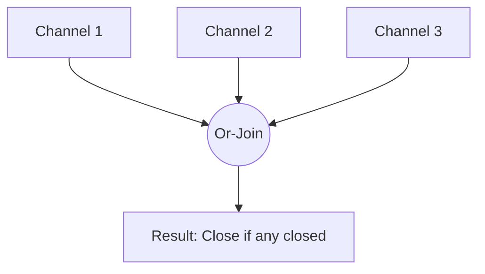

### 🚦 Or-Channel Pattern

**Or-Channel** is a pattern that combines multiple channels into a single resulting channel. This resulting channel closes as soon as **any** of the input channels close. This is useful for combining multiple cancellation signals or waiting for the completion of the first task among a group of asynchronous tasks.

---

### 🧠 Concept

Imagine several emergency buttons in different parts of a building. As soon as **any** of them is pressed, a general alarm is triggered.



---

### 💻 Implementation

In Go, this pattern is often implemented recursively, which allows combining an unlimited number of channels very concisely.

```go
package main

import (
	"fmt"
	"time"
)

// or recursively combines channels into one
// or рекурсивно объединяет каналы в один
func or(channels ...<-chan interface{}) <-chan interface{} {
	// Base cases for stopping recursion
	switch len(channels) {
	case 0:
		return nil
	case 1:
		return channels[0]
	}

	orDone := make(chan interface{})

	go func() {
		defer close(orDone)

		switch len(channels) {
		case 2:
			// Waiting for either one
			select {
			case <-channels[0]:
			case <-channels[1]:
			}
		default:
			// Recursive waiting for any of the others
			select {
			case <-channels[0]:
			case <-channels[1]:
			case <-channels[2]:
			case <-or(append(channels[3:], orDone)...):
			}
		}
	}()

	return orDone
}

func main() {
	// sig creates a channel that will close after the specified duration
	// sig создает канал, который закроется через указанное время
	sig := func(after time.Duration) <-chan interface{} {
		c := make(chan interface{})
		go func() {
			defer close(c)
			time.Sleep(after)
		}()
		return c
	}

	start := time.Now()

	fmt.Println("Waiting for the fastest channel to close...")
	// Ожидание завершения самого быстрого канала...

	// Waiting for any of these channels to close
	<-or(
		sig(2*time.Hour),
		sig(5*time.Minute),
		sig(1*time.Second), // This one closes first
		sig(1*time.Hour),
	)

	fmt.Printf("Done in %v\n", time.Since(start))
}
```

---

### 💡 Key Points

1. **Recursion**: Allows for elegant handling of a variable number of channels.
2. **Composition**: The result of an `or` call is the same type of channel, which can be passed back into `or`.
3. **Performance**: With a very large number of channels, recursion can create a deep stack of goroutines, but for typical tasks, this is not critical.

> [!TIP]
> This pattern is the basis for implementing complex task cancellation systems where you need to respond to signals from different sources.
