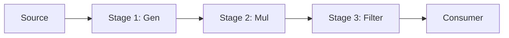

### ⛓️ Pipeline Pattern

**Pipeline** is a pattern that breaks down a complex task into a sequence of individual stages. Each stage is represented by a goroutine that reads data from an input channel, processes it, and sends the result to an output channel for the next stage.

---

### 🧠 Concept

It's like an assembly line in a factory: one machine makes the frame, the second installs the wheels, and the third paints the body. Data "flows" through a series of filters and transformers.



---

### 💻 Implementation

In this example, we create a two-stage pipeline: the first stage generates numbers, and the second squares them.

```go
package main

import "fmt"

// gen is the first stage: generates numbers from a slice
// gen — первая стадия: генерирует числа из слайса
func gen(numbers ...int) <-chan int {
	out := make(chan int)
	go func() {
		defer close(out)
		for _, number := range numbers {
			out <- number
		}
	}()
	return out
}

// mul is the second stage: squares each number
// mul — вторая стадия: возводит каждое число в квадрат
func mul(in <-chan int) <-chan int {
	out := make(chan int)
	go func() {
		defer close(out)
		for number := range in {
			out <- number * number
		}
	}()
	return out
}

func main() {
	fmt.Println("Pipeline started...")
	// Конвейер запущен...

	// Creating the chain: gen -> mul
	// Создаем цепочку: gen -> mul
	source := gen(1, 2, 3, 4, 5) // Numbers 1-5
	pipeline := mul(source)      // Squaring

	// Reading the final result
	// Читаем финальный результат
	for value := range pipeline {
		fmt.Printf("Result: %d\n", value)
	}
	fmt.Println("Processing completed.")
}
```

---

### 💡 Key Points

1. **Composition**: You can easily add new stages to the middle of the pipeline without changing existing code.
2. **Parallelism**: Each stage runs in its own goroutine, allowing stages to execute simultaneously for different data portions.
3. **Memory Efficiency**: Data is processed in a stream, allowing you to work with data volumes that exceed RAM.

> [!TIP]
> Use Pipeline when you need to apply a series of independent transformations to a data stream.
