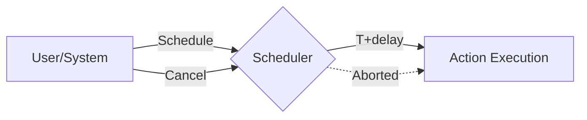

### ⏰ Scheduler Pattern

**Scheduler** is a pattern designed to manage the execution of tasks in the future. It allows you to schedule a function to run after a specific time interval and provides the ability to cancel the scheduled task if it is no longer relevant.

---

### 🧠 Concept

It's like an alarm clock on your phone. You set it for a specific time (delay). When the time comes, the alarm rings (the function is executed). If you wake up earlier, you can turn off the alarm before it goes off (timer cancellation).



---

### 💻 Implementation

In Go, a scheduler is often built around `time.Timer` or `time.AfterFunc`, wrapped in a structure with a mutex for thread safety.

```go
package main

import (
	"fmt"
	"sync"
	"time"
)

// Scheduler manages deferred execution
// Scheduler управляет отложенным выполнением
type Scheduler struct {
	sync.Mutex
	timers map[string]*time.Timer
}

func NewScheduler() *Scheduler {
	return &Scheduler{
		timers: make(map[string]*time.Timer),
	}
}

// Schedule schedules function execution
// Schedule планирует выполнение функции
func (s *Scheduler) Schedule(id string, delay time.Duration, action func()) {
	s.Lock()
	defer s.Unlock()

	// If a task with this ID already exists, cancel the old one
	// Если задача с таким ID уже есть, отменяем старую
	if t, ok := s.timers[id]; ok {
		t.Stop()
	}

	// Creating a new timer
	// Создаем новый таймер
	s.timers[id] = time.AfterFunc(delay, func() {
		action()
		s.Lock()
		delete(s.timers, id)
		s.Unlock()
	})
}

// Cancel abors a task
// Cancel отменяет задачу
func (s *Scheduler) Cancel(id string) {
	s.Lock()
	defer s.Unlock()
	if t, ok := s.timers[id]; ok {
		t.Stop()
		delete(s.timers, id)
		fmt.Printf("Task %s cancelled\n", id)
	}
}

func main() {
	s := NewScheduler()

	fmt.Println("Scheduling tasks...")
	// Планирование задач...

	s.Schedule("clean-cache", 2*time.Second, func() {
		fmt.Println("--- Cache successfully cleared! ---")
	})

	s.Schedule("send-email", 1*time.Second, func() {
		fmt.Println("--- Email sent! ---")
	})

	// Cancel one of the tasks
	// Отменяем одну из задач
	time.Sleep(500 * time.Millisecond)
	s.Cancel("clean-cache")

	time.Sleep(2 * time.Second)
	fmt.Println("Scheduler work completed.")
}
```

---

### 💡 Key Points

1. **Flexibility**: Allows for dynamic management of the lifecycle of deferred tasks.
2. **Thread Safety**: Using `sync.Mutex` ensures correct operation when accessed from different goroutines.
3. **Real-time**: `time.AfterFunc` runs in a separate goroutine, not blocking the main execution thread.

> [!WARNING]
> If you create thousands of timers, remember to clear or cancel them so as not to inflate memory consumption.
