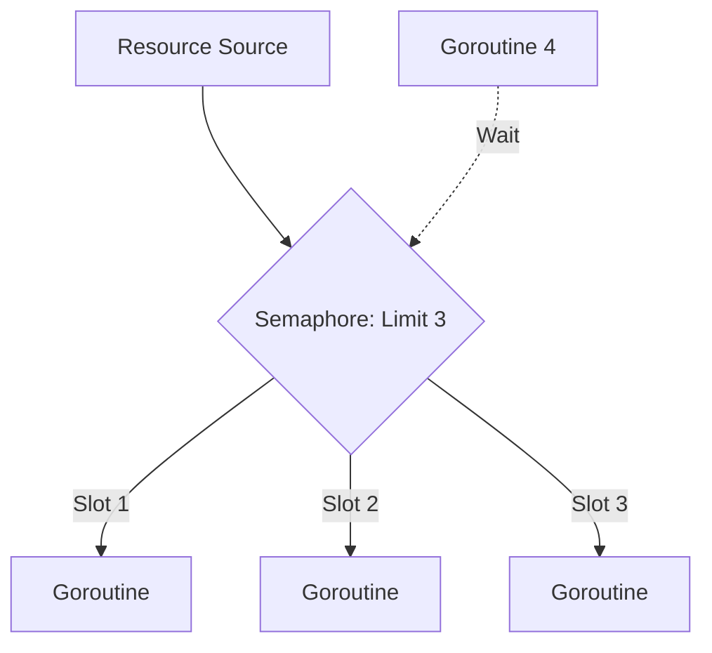

### 🚦 Semaphore Pattern

**Semaphore** is a pattern used to limit the number of simultaneously performing operations or access to a limited resource. In Go, a semaphore is most often implemented using a buffered channel, where the buffer size determines the maximum number of "slots" (permissions).

---

### 🧠 Concept

Imagine a parking lot with 3 spaces. When a car enters, it occupies one space (sends data to the channel). If there are no spaces, the next car waits at the barrier. When a car leaves, a space is freed up (reading from the channel), and the next car can enter.



---

### 💻 Implementation

The classic implementation of a semaphore in Go is via an empty `struct{}` in a buffered channel.

```go
package main

import (
	"fmt"
	"sync"
	"time"
)

func main() {
	const goroutineLimit = 3
	tasks := []int{1, 2, 3, 4, 5, 6, 7}

	wg := sync.WaitGroup{}
	// Semaphore: buffered channel with 3 slots
	// Семафор: буферизованный канал на 3 элемента
	sem := make(chan struct{}, goroutineLimit)

	for _, task := range tasks {
		wg.Add(1)
		
		// Occupy a slot: blocks if the channel is full
		// Занимаем слот: если канал полон, блокируемся
		sem <- struct{}{}

		go func(id int) {
			defer wg.Done()
			// Release the slot on completion
			// Освобождаем слот при завершении
			defer func() { <-sem }()

			fmt.Printf("Worker %d started work...\n", id)
			time.Sleep(1 * time.Second) // Simulating work
			fmt.Printf("Worker %d finished.\n", id)
		}(task)
	}

	wg.Wait()
	fmt.Println("All tasks completed.")
}
```

---

### 💡 Key Points

1. **Flexibility**: You can dynamically change the limit if you use a variable for the buffer size during creation.
2. **Simplicity**: Does not require complex external libraries; the built-in language capabilities are sufficient.
3. **Weights (Weighted Semaphores)**: If tasks require different "weights" (for example, one task occupies 2 slots), it's better to use the `golang.org/x/sync/semaphore` package.

> [!TIP]
> Use a Semaphore when you need to limit the load on an external system (for example, no more than 5 simultaneous database queries).
