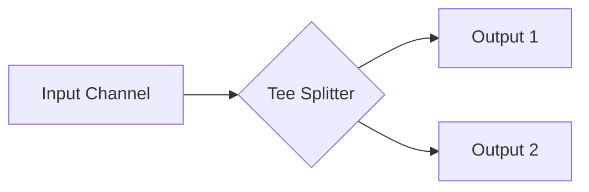

### 🍴 Tee-Channel Pattern

**Tee-channel** is a pattern that splits a single input channel into two (or more) independent output channels. It's like a plumbing "T" fitting: the data stream is duplicated, allowing different parts of the program to receive the same information simultaneously.

---

### 🧠 Concept

Imagine a live news report. A single camera (input channel) transmits the video feed, which simultaneously goes both to a live TV broadcast and is recorded to an archive on a disk (output channels).



---

### 💻 Implementation

An important feature of the implementation is that we must ensure data delivery to **all** output channels without blocking the main stream for long.

```go
package main

import (
	"fmt"
)

// tee splits one input channel into two output channels
// tee разделяет один входящий канал на два выходящих
func tee(done <-chan interface{}, in <-chan interface{}) (<-chan interface{}, <-chan interface{}) {
	out1 := make(chan interface{})
	out2 := make(chan interface{})

	go func() {
		defer close(out1)
		defer close(out2)

		for val := range in {
			// Using local copies for safe select
			// Используем локальные копии для безопасного select
			var out1, out2 = out1, out2
			
			// We need to send the value to BOTH channels
			// Нам нужно отправить значение в ОБА канала
			for i := 0; i < 2; i++ {
				select {
				case <-done:
					return
				case out1 <- val:
					out1 = nil // Don't send here again in this iteration
				case out2 <- val:
					out2 = nil // Don't send here again in this iteration
				}
			}
		}
	}()

	return out1, out2
}

func main() {
	done := make(chan interface{})
	defer close(done)

	in := make(chan interface{})

	// Data generator
	// Генератор данных
	go func() {
		defer close(in)
		for i := 1; i <= 3; i++ {
			in <- i
		}
	}()

	// Splitting the stream
	// Разделяем поток
	out1, out2 := tee(done, in)

	fmt.Println("Reading from two independent streams...")
	// Чтение из двух независимых потоков...

	for val1 := range out1 {
		fmt.Printf("Stream 1: %v | ", val1)
		fmt.Printf("Stream 2: %v\n", <-out2)
	}
}
```

---

### 💡 Key Points

1. **Duplication**: Every consumer receives a full copy of all data from the source.
2. **Parallelism**: Reading from output channels must be balanced. If one consumer stops reading, it will block the `tee`, and the second consumer will also stop receiving data.
3. **Select-lock**: Using a loop of two `select` calls ensures that the value is delivered to both channels, regardless of which one is ready first.

> [!WARNING]
> If one of the output channels is not being read from, it will cause the entire pipeline to hang. Use buffered channels or ensure all consumers are active.
