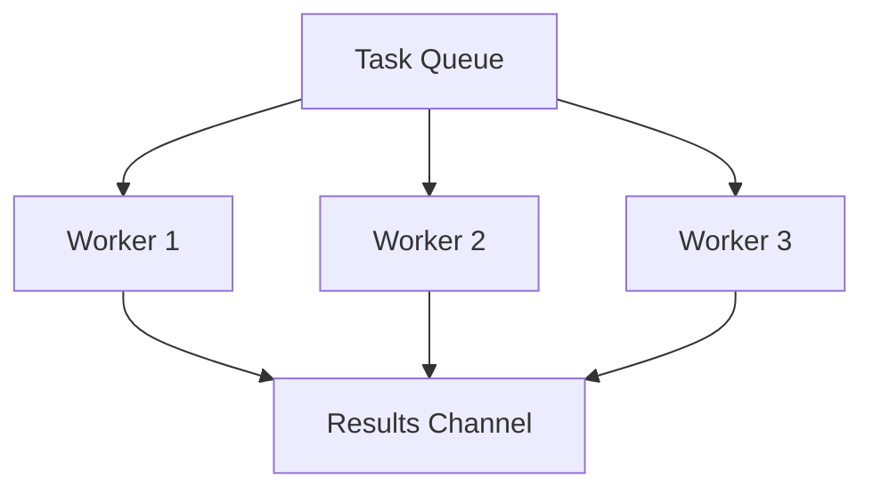

### 👷 Worker Pool Pattern

**Worker Pool** is a pattern that limits the number of simultaneously running goroutines for processing a task queue. This allows for efficient use of CPU and memory resources, preventing them from being overloaded when there is a large number of incoming tasks.

---

### 🧠 Concept

Imagine a workshop with three craftsmen (workers). On the table lies a stack of orders (task channel). The craftsmen take turns taking orders, executing them, and placing finished products in a box (results channel).



---

### 💻 Implementation

In this example, we create a pool of several workers to simulate file processing.

```go
package main

import (
	"fmt"
	"sync"
	"time"
)

// Task represents a task for processing
// Task представляет задачу для обработки
type Task struct {
	ID       int
	Filename string
}

// Worker reads tasks from the channel and processes them
// Worker читает задачи из канала и обрабатывает их
func Worker(id int, taskCh <-chan Task, resCh chan<- string, wg *sync.WaitGroup) {
	defer wg.Done()
	for task := range taskCh {
		// Simulating processing (1 second)
		// Имитация обработки (1 секунда)
		fmt.Printf("Worker %d started processing %s\n", id, task.Filename)
		time.Sleep(time.Second) 
		resCh <- fmt.Sprintf("Worker %d finished %s", id, task.Filename)
	}
}

func main() {
	const numWorkers = 3
	const numTasks = 5

	taskCh := make(chan Task, numTasks)
	resCh := make(chan string, numTasks)
	var wg sync.WaitGroup

	// Starting the worker pool
	// Запускаем пул воркеров
	for i := 1; i <= numWorkers; i++ {
		wg.Add(1)
		go Worker(i, taskCh, resCh, &wg)
	}

	// Sending tasks to the pool
	// Отправляем задачи в пул
	go func() {
		for i := 1; i <= numTasks; i++ {
			taskCh <- Task{ID: i, Filename: fmt.Sprintf("image_%d.jpg", i)}
		}
		close(taskCh) // Close the task channel when done
	}()

	// Waiting for workers and closing the results channel
	// Ждем завершения воркеров и закрываем канал результатов
	go func() {
		wg.Wait()
		close(resCh)
	}()

	fmt.Println("Worker pool started...")
	// Пул воркеров запущен...

	// Reading results
	// Читаем результаты
	for res := range resCh {
		fmt.Println(res)
	}
	fmt.Println("All tasks completed.")
}
```

---

### 💡 Key Points

1. **Resource Control**: You know exactly how much memory and CPU time the application consumes, as the number of goroutines is fixed.
2. **Queuing**: Using buffered channels allows for smoothing out peak loads.
3. **Safety**: Tasks are not lost; they wait for their worker in the queue.

> [!IMPORTANT]
> Always close the task channel (`taskCh`) so that workers can exit the `range` loop and complete their work.
