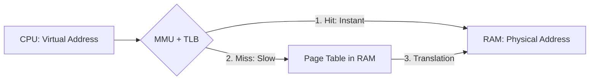
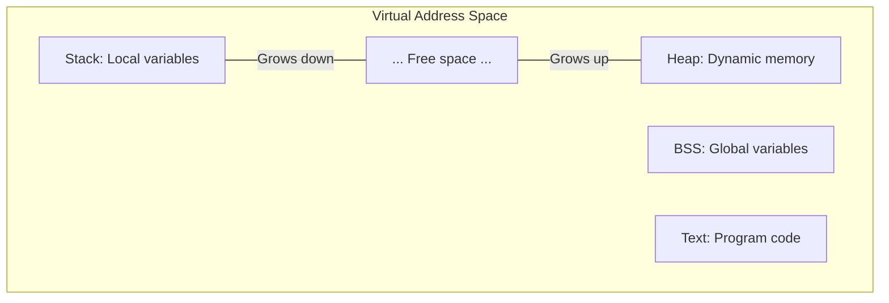
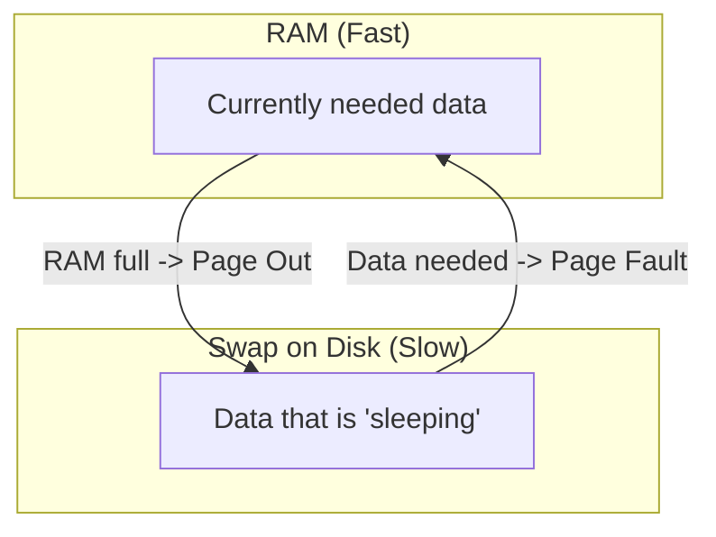

# 🧠 Memory in Operating Systems

## 💻 Virtual Memory, Physical Memory, MMU, Page Fault, Swapping

---

## 0. ❓ Why a Complex Memory System is Needed at All

If programs worked directly with physical memory:

- One process could read and corrupt another's memory.
- A program crash could bring down the entire system.
- RAM could not be used efficiently.
- It would be impossible to run many programs simultaneously.

The solution is **Virtual Memory**.

---

## 1. ⚡ Physical Memory (RAM)

**Physical Memory** (RAM) — these are the actual RAM chips in the computer.

- Limited capacity (e.g., 16 GB).
- Very high access speed.
- Addressed linearly through physical addresses.

> [!CAUTION]
> **Direct access is dangerous**: If a process is given direct access to RAM, it could read passwords from browser memory or accidentally overwrite system kernel code. Therefore, a process **never sees** real physical addresses. It lives in its own "sandbox."

---

## 2. 🗺️ Virtual Memory and Translation Mechanism

**Virtual Memory** is an abstraction that creates the illusion of a continuous and isolated address space for a process.

### 2.1 Main Diagram: From Address to Data

For the processor to read data, a virtual address must be converted into a physical one. Three key players are involved in this:

### 2.2 MMU (Memory Management Unit)
The **MMU** is a hardware unit inside the CPU. It is the "heart" of memory management.
- **What it does**: Translates virtual addresses to physical ones on the fly.
- **When it works**: On **every** memory access (reading an instruction, writing a variable).
- **Who manages it**: Configured exclusively by the OS kernel.

### 2.3 Page Table
This is the "dictionary" of translations stored in random access memory (RAM).
- Since the MMU cannot physically hold translations for terabytes of memory, it stores them in RAM.
- **Access flags**: The table records not only "where to go," but also "what is allowed":
    - **Present**: Is the page in RAM?
    - **Read/Write**: Can the data be changed?
    - **NX (No Execute)**: Can code be run (protection against viruses).

### 2.4 TLB (Translation Lookaside Buffer)
Accessing RAM for the page table is slow (hundreds of CPU cycles). To avoid slowing down, the **TLB** is used.
- **What it is**: An ultra-fast cache inside the CPU that stores the last 64-512 translations.
- **Effect**: In 99% of cases, the translation is taken from the TLB in fractions of a nanosecond. If the address is not in the TLB (TLB Miss), the MMU goes to slow RAM for the page table.

---

## 3. 📄 Memory Pages

Managing memory by bytes is impossible (too many entries in the tables). Therefore, it is divided into **pages**.

- **Standard size**: 4 KB (4096 bytes).
- **Virtual page**: A chunk of virtual space.
- **Physical frame**: A real chunk of RAM.
- **Connection**: The OS links a virtual page to a physical frame through the Page Table.

---

## 4. 🏗️ Process Anatomy in Memory (Segments)

A process's virtual memory is divided into logical segments:

- **Text Segment (Code)**: Compiled code. Usually Read-Only.
- **Data / BSS**: Global and static variables.
- **Heap**: Dynamic data (`new`, `make`). Grows "up."
- **Stack**: Local variables of functions. Grows "down."

---

## 5. ⚠️ Page Fault

Many think "fault" means an error, but it is a **standard mechanism**.

> [!IMPORTANT]
> A **Page Fault** is a situation when the MMU sees the flag `Present = 0` in the page table. This means that the data at this address is assigned to the process, but physically it is not in RAM right now.

### 5.1 How it works:
1. The MMU throws an exception (signal).
2. The CPU stops the program and calls the **OS Kernel**.
3. The OS checks: "Why is the page missing?".
    - If it is in **Swap** (on disk), it loads it into RAM.
    - If it is **Demand Paging** (first access), it allocates clean memory.
4. The OS updates the Page Table and tells the program: "Try again."

---

## 6. 🔄 Swap and Memory Eviction

**Swap** is when part of a process's data is temporarily "evicted" to the disk to free up space in expensive RAM.

- **Major Page Fault**: When data must be fetched from the slow disk. This is why a computer starts to "lag" when too many tabs are open.
- **LRU (Least Recently Used)**: The algorithm by which the OS chooses whom to evict. Those who haven't been used for a long time are evicted.

---

## 7. 🚀 Advanced Optimizations

### 7.1 Copy-On-Write (COW)
When creating a copy of a process (`fork`), memory is not physically copied.
- Both processes look at the same pages (Read-Only).
- As soon as the parent or child wants to **write** something, the OS makes a copy of the page only for them. This saves gigabytes of memory.

### 7.2 Memory-mapped files (mmap)
Allows "mapping" a file to virtual memory. Reading from a file becomes a simple memory read. This is much faster than standard `read/write`.

---

## 8. 🎯 Summary: Who is responsible for what

| Component | Role |
| :--- | :--- |
| **MMU** | Hardware translator. |
| **TLB** | Its personal "cache notebook" for speed. |
| **Page Table** | Map in RAM written by the OS for the MMU. |
| **OS (Kernel)** | Conductor: configures MMU, loads pages from disk. |
| **Swap** | Backup storage on disk. |

---

## 💡 Main Thought

A process never sees real memory. It lives in an illusion created by the **OS** with the support of the **MMU**. This allows us to run hundreds of applications simultaneously, isolate them from each other, and use more memory than we actually have.
