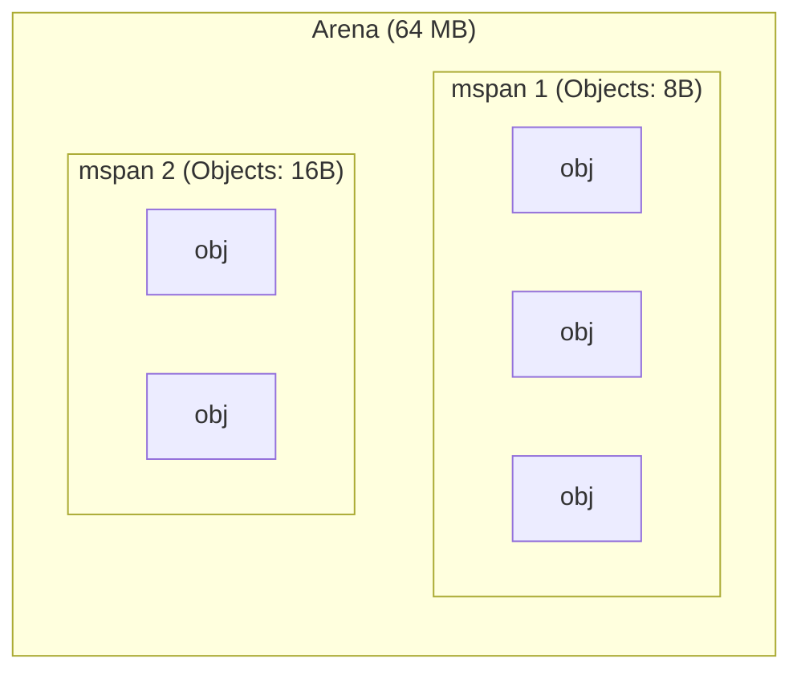
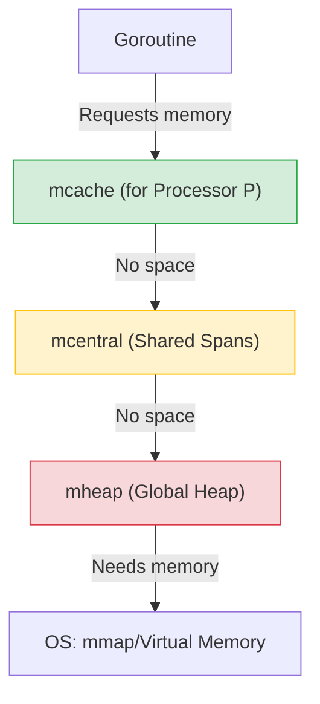

# ⚙️ Memory Allocator in Go
## 🏗️ How Go Manages the Heap: Diagrams, Structures, and Optimizations

---

## 0. 🏁 Introduction

To understand how Go allocates memory, you need to remember the basics from [OS Memory Base](./allocator.md): the operating system gives a process **virtual memory** divided into pages.

Go does not ask the OS for memory for every variable (this would be too slow due to system calls). Instead, Go takes huge chunks of memory (**Arenas**) from the OS and cuts them into small pieces itself.

> [!IMPORTANT]
> The design of the Go allocator is based on **TCMalloc** (Thread-Caching Allocator). The main idea: minimize locks by giving each thread (in Go — each processor P) its own local supply of memory.

---

## 1. 📂 Physical Structure: Memory Matryoshka

The Go allocator sees memory as a hierarchy of structures.

### 1.1 Page
As in the OS, the minimum unit here is a page. In Go, one page is usually **8 KB**.

### 1.2 mspan
This is the basic building block of the allocator. 
An **mspan** is a continuous set of one or more pages (for example, one span can contain 3 pages of 8 KB = 24 KB).

Spans are cut into objects of the same size. For example:
- Span A: cut into 8-byte objects.
- Span B: cut into 16-byte objects.

### 1.3 Arena
These are huge chunks of virtual memory (64 MB each in 64-bit Linux) that Go requests from the OS. The entire Heap in Go consists of a set of such arenas.

---

## 2. 📏 Size Classes: Fighting Fragmentation

If we allocated exactly as many bytes as the user asks (for example, 13 bytes, then 7, then 21), "holes" — **fragmentation** — would form in memory.

To avoid this, Go uses **Size Classes**.
There are about 67 of them. If you ask for 13 bytes, Go will allocate you an object from the "16 bytes" class. Yes, 3 bytes will be wasted (**internal fragmentation**), but memory will remain clean and structured.

> [!TIP]
> Size classes allow the allocator to find free space quickly: it simply looks for the nearest suitable span of the desired class.

---

## 3. 🪜 Logical Hierarchy: Three Caching Levels

To work fast under load, Go uses a three-level system.

### 3.1 mcache (Local Cache)
Each processor **P** (from the GMP model) has its own `mcache`.
- **Why**: To allocate memory **without locks**. A goroutine on P simply takes memory from its `mcache`.
- **What's inside**: A set of spans of different size classes.

### 3.2 mcentral (Shared Span Warehouse)
If `mcache` runs out of free objects of the desired class, it goes to `mcentral`.
- **Why**: Shared storage for all Ps.
- **Peculiarity**: There is a lock (`mutex`) here, but it is **granular** — only for a specific size class.

### 3.3 mheap (Global Heap)
If `mcentral` is also empty, control passes to `mheap`.
- **Why**: Stores all arenas and manages large objects.
- **Peculiarity**: The "heaviest" lock for the entire allocator.

**Hierarchy Diagram:**

---

## 4. 🚀 How Memory is Allocated: Three Paths

Go divides objects into three categories depending on their size:

### 4.1 Tiny Objects (< 16 bytes)
These are very small objects (e.g., small strings or numbers).
- **Path**: `mcache` -> **Tiny Allocator**.
- **Optimization**: To avoid wasting a whole block on every tiny object, Go packs several of them into one 16-byte block.

### 4.2 Small Objects (from 16 bytes to 32 KB)
The most common case.
- **Path**: `mcache` -> `mcentral` -> `mheap`.
- **Algorithm**: A free slot in the `mcache` of the desired Size Class is searched. If none, a new span is requested from `mcentral`.

### 4.3 Large Objects (> 32 KB)
Very large structures or slices.
- **Path**: **Directly in `mheap`**.
- **Peculiarity**: Such objects are too large for local caches. They are allocated directly in the global heap, bypassing `mcache` and `mcentral`.

---

## 5. 📍 Where Data Goes: Stack or Heap?

Beginners often ask: "Will this variable be on the stack or in the heap?". In Go, the compiler handles this using **Escape Analysis**.

### 5.1 Stack
- **What's there**: Local variables that "don't leave" the function.
- **Pros**: Incredibly fast. Memory is freed automatically upon function exit (the stack pointer is simply moved).
- **Cons**: Fixed size (in Go, a goroutine's stack starts at 2 KB and can grow, but is still limited).

### 5.2 Heap
- **What's there**: Data referenced from other parts of the program, or very large objects.
- **Pros**: Live long, unlimited size.
- **Cons**: Slower memory allocation, and most importantly — it must be cleaned by the **Garbage Collector (GC)**, which consumes CPU.

> [!TIP]
> **Golden Rule**: The more data stays on the stack, the less work for the Garbage Collector and the faster your program.

---

## 6. 🎯 Summary: How It All Works Together

Imagine the process as buying coffee:
1.  **mcache**: This is your pocket. If there are coins (free slots), you pay instantly.
2.  **mcentral**: This is an ATM in the mall. If your pocket is empty, you go there (needs a small queue-lock).
3.  **mheap**: This is a bank branch. If the ATM is broken or you need a huge amount (Large Object), you go to the bank (the longest procedure).

### Summary Table

| Level | Owner | Speed | Locks | Purpose |
| :--- | :--- | :--- | :--- | :--- |
| **mcache** | Processor P | Lightning | None (Lock-free) | Small and frequent allocations |
| **mcentral** | Global (per class) | Fast | Mutex (only for one Size Class) | Supplying mcache with spans |
| **mheap** | Global | Slow | Global Mutex | Managing arenas and large objects |

> [!NOTE]
> This architecture makes Go one of the fastest languages in terms of memory handling among languages with a Garbage Collector.
