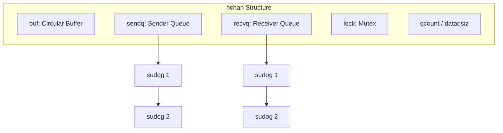
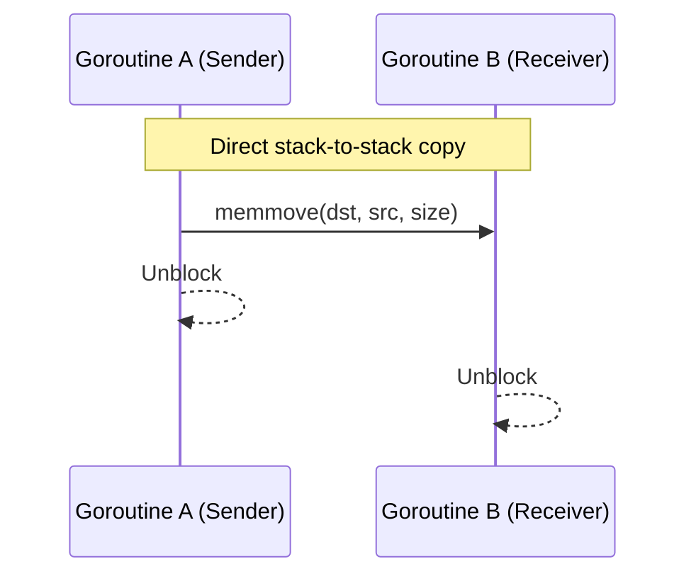
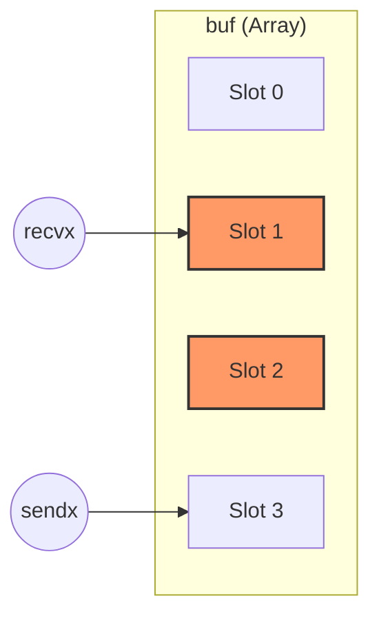
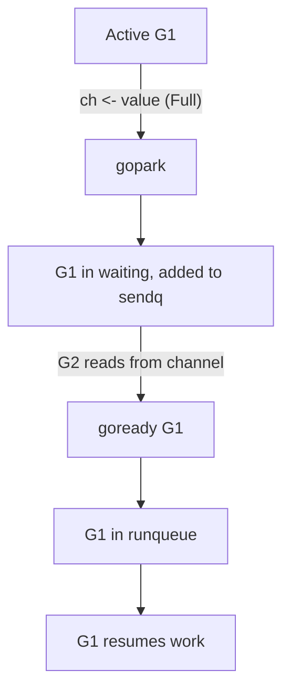

### 📬 What are Channels in Go?

Channels are one of the key mechanisms in Go for synchronization and data exchange between goroutines. They implement the concept of CSP (Communicating Sequential Processes), where goroutines communicate directly through channels rather than through shared memory. The main principle: "Do not communicate by sharing memory; instead, share memory by communicating."

Channels are created using the built-in `make` function and have the type `chan T`, where `T` is the type of data that will be passed through the channel.

Example of creating a channel:

```Go
ch := make(chan int) // channel for passing integers
```

---

### ⚙️ How Channels Work Under the Hood?

Internally, a channel in Go is represented by the **hchan** structure (in the source code `runtime/chan.go`). It manages goroutine queues and data storage.

```go
type hchan struct {
    qcount   uint           // Total data in the queue
    dataqsiz uint           // Size of circular buffer
    buf      unsafe.Pointer // Points to an array of dataqsiz elements
    elemsize uint16
    closed   uint32
    elemtype *_type         // Element type
    sendx    uint           // Send index
    recvx    uint           // Receive index
    recvq    waitq          // List of recv waiters
    sendq    waitq          // List of send waiters
    lock     mutex          // Lock protects all fields in hchan
}
```

**hchan Structure Diagram:**


> [!IMPORTANT]
> A channel is always a pointer (`*hchan`). When you pass a channel to a function, you are copying the address of the structure, so both functions work with the same queues and buffer.

#### What is the `lock`?
Any operation with a channel (writing, reading, closing) starts with acquiring the **lock**. This ensures that only one goroutine can modify the channel's state at any given moment. This is why channels are thread-safe.

---

### 📂 Channel Types

Now let's look at the three main types of channels: unbuffered, buffered, and nil channels.

#### 1. ⚡ Unbuffered Channels

- **Creation**: `ch := make(chan int)` (without specifying a buffer size).

- **Peculiarity**: The buffer size is 0 (`dataqsiz = 0`), meaning there is no place in the channel to store data.

- **How it works**:
  - A write operation (`ch <- value`) blocks the sender goroutine until another goroutine performs a read operation (`<-ch`).
  - A read operation (`<-ch`) blocks the receiver goroutine until another goroutine performs a write operation.
  - Data transfer occurs directly between goroutines (without intermediate storage), this is called **synchronous behavior**.

- **Under the hood**:
  - If a sender attempts to write to the channel (`ch <- value`) and there is no receiver, it is added to the **sendq** queue and "parked."
  - If a receiver attempts to read (`<-ch`) and there is no sender, it is added to the **recvq** queue and also parked.
  - **Direct Copy**: When a receiver finds a sender (or vice versa), data is copied **directly from stack to stack** of the goroutine, bypassing any intermediate buffer. This is one of Go's primary optimizations.

**Direct Copy Diagram (Synchronous Transfer):**


Example:

```Go
func main() {
    ch := make(chan int)
    go func() {
        ch <- 42 // write blocks until there is a read
    }()
    fmt.Println(<-ch) // read unblocks the sender
}
```

- **Why use it**: Unbuffered channels are ideal for synchronization when you need to guarantee that one goroutine has finished its work before another starts.

---

#### 2. 📦 Buffered Channels

- **Creation**: `ch := make(chan int, 3)` (specifying a buffer size, here 3).

- **Peculiarity**: The channel has a fixed-size buffer (`dataqsiz > 0`) that stores data in FIFO (first-in, first-out) order.

- **How it works**:
  - A write operation (`ch <- value`) is non-blocking if there is room in the buffer. If the buffer is full, the sender blocks until space is freed.
  - A read operation (`<-ch`) is non-blocking if there is data in the buffer. If the buffer is empty, the receiver blocks until data appears.
  - This is **asynchronous behavior** as long as the buffer is not full or empty.

- **Under the hood**:
  - The buffer is implemented as a **circular array** (**buf**), where **sendx** points to the position for writing and **recvx** for reading.
  - When writing, data is copied into the buffer, and **sendx** increases. If the buffer is full, the sender is added to **sendq** and blocked.
  - When reading, data is retrieved from the buffer, and **recvx** increases. If the buffer is empty, the receiver is added to **recvq** and blocked.
  - The mutex (**lock**) protects access to the buffer from data races.

**Circular Buffer Diagram:**


Example:

```Go
func main() {
    ch := make(chan int, 2)
    ch <- 1 // buffer: [1]
    ch <- 2 // buffer: [1, 2]
    // ch <- 3 // here it will block because the buffer is full (size 2)
    fmt.Println(<-ch) // buffer: [2]
    fmt.Println(<-ch) // buffer: empty
}
```

- **Why use it**: Buffered channels are useful when you need to temporarily store data or avoid blocking to improve performance.

---

#### 3. 🚫 Nil Channels

- **Creation**: `var ch chan int` (by default, a channel is `nil` if not initialized via `make`).

- **Peculiarity**: This is just the zero value of type `chan T`. You cannot write to or read from a `nil` channel.

- **How it works**:
  - A write operation (`ch <- value`) blocks forever.
  - A read operation (`<-ch`) blocks forever.
  - Usage in `select`:
    - If a `select` statement has a branch with a `nil` channel, it will never be selected (ignored).

- **Under the hood**:
  - A `nil` channel is simply a `nil` pointer instead of an `hchan` structure. The runtime checks for this and immediately puts the goroutine into a waiting state without further action.

Example:

```Go
func main() {
    var ch chan int // ch == nil
    go func() {
        ch <- 42 // blocks forever
    }()
    fmt.Println(<-ch) // blocks forever
}
```

- **Why use it**: Nil channels are often used in `select` patterns to dynamically enable or disable channels. For example:

```Go
func main() {
    ch1 := make(chan int)
    var ch2 chan int // nil
    select {
    case <-ch1:
        fmt.Println("ch1")
    case <-ch2: // this branch is ignored because ch2 == nil
        fmt.Println("ch2")
    }
}
```

---

#### 🏁 Closing Channels

- Channels can be closed using `close(ch)`.

- **Peculiarities**:
  - Writing to a channel after it has been closed causes a panic.
  - Reading from a closed channel returns the zero value of the data type (e.g., 0 for `int`) and `ok == false` in the case of `value, ok := <-ch`.
  - Closing a `nil` channel causes a panic.

- **Under the hood**: When `close` is called, the runtime sets a flag in the `hchan` structure and wakes up all goroutines in `recvq` and `sendq`, notifying them of the closure.

Example:

```Go
func main() {
    ch := make(chan int, 1)
    ch <- 42
    close(ch)
    v, ok := <-ch
    fmt.Println(v, ok) // 42 true
    v, ok = <-ch
    fmt.Println(v, ok) // 0 false
}
```

---

## 🅿️ Goroutine Parking (Gopark and Goready)

When a goroutine cannot continue its work (for example, writing to a full channel), it must be "parked" (releasing the thread). This process is called **parking**.

### Wait Queues (sendq and recvq)
These are doubly linked lists whose elements are **sudog** structures.
- **sudog** — this is a wrapper over a goroutine (**G**) that contains information about which element it wants to send or receive.

### Blocking Algorithm (gopark):
1. The goroutine creates a **sudog** structure.
2. Places it in the channel's **sendq** (for sender) or **recvq** (for receiver).
3. Calls the `gopark` function.
4. The Go scheduler takes the goroutine off execution (the thread **M** is freed and can take another goroutine).
5. The goroutine's state changes to `waiting`.

### Wake-up Algorithm (goready):
1. Another goroutine performs an operation that unblocks the first one (for example, clearing the buffer).
2. It finds the **sudog** in the channel's queue.
3. Extracts **G** from the **sudog**.
4. Calls the `goready` function.
5. The scheduler translates the goroutine to the `runnable` state, and it enters the execution queue (LRQ/GRQ).

> [!TIP]
> **Important**: Goroutines do not "wake up" by themselves. They will always be woken by someone else (the goroutine that performed the read or write that unblocked the queue).

**Parking and Wake-up Diagram:**


---

### 🎯 Summary

1. **Unbuffered Channels**: Synchronous, work via direct stack-to-stack copying.
2. **Buffered Channels**: Asynchronous until the buffer is full, use a circular buffer and copying into/out of it.
3. **Nil Channels**: Always block the goroutine forever (call `gopark` with no chance of `goready`).
4. **Closing**: Sets the `closed` flag and wakes up all waiters (they receive zero values).
5. **Sudog**: The key link between the scheduler and channels.
