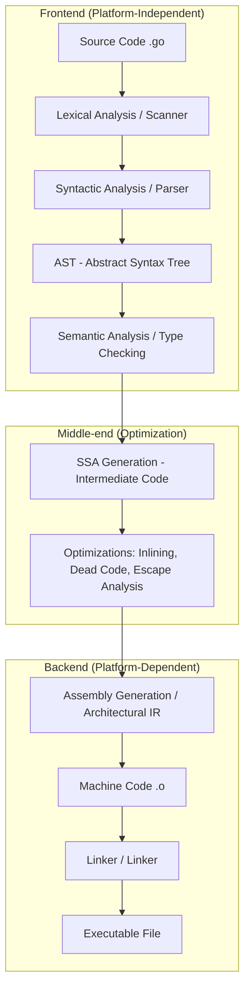
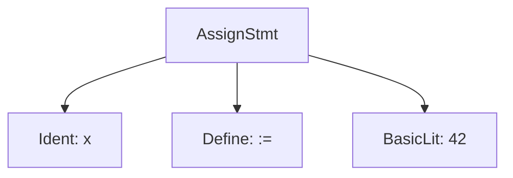

## 🏗️ Compilation Stages

The compilation process in Go can be divided into three large stages: **Frontend**, **Middle-end**, and **Backend**.



---

## ⚙️ Detailed Breakdown of Stages

### 1. 🔍 Lexical Analysis (Tokenization)

- **What happens**: The source code is broken down into **tokens** — the smallest syntactic units (keywords, identifiers, operators, numbers).
- **Example**: The code `x := 42` is broken into tokens: `x`, `:=`, `42`.
- **In Go**: The lexical analyzer (scanner) in the `go/scanner` package converts the code into a stream of tokens, ignoring whitespaces and comments.

**Go Code Example**:

```go
package main

func main() {
	x := 42
}
```

**Tokens**:

```
package, main, func, main, (, ), {, x, :=, 42, }
```

### 2. 🌲 Syntactic Analysis (Building AST)

- **What happens**: Tokens are analyzed to check the syntax and build the **AST** (**Abstract Syntax Tree**). This tree reflects the structure of the program.
- **In Go**: The parser (`go/parser`) builds the AST, checking for syntactic correctness.

**AST Visualization for `x := 42`**:


### 3. 🧪 Semantic Analysis

- **What happens**: Semantic correctness is checked:
  - Variable types (e.g., `x` is compatible with `int`).
  - Declarations (functions, variables).
  - Access to variables/functions.
- **Example**: Verifying that `x := 42` is correct (type `int` for `42`, `x` is not redefined).
- **In Go**: The compiler checks types, scopes, and dependencies.

**Error Example**:

```go
x := "string"
x = 42 // Error: incompatible types
```

### 4. 🧬 Intermediate Code Generation (SSA)

- **What happens**: The AST is converted into **SSA** (**Static Single Assignment**) — an intermediate representation where each variable is assigned a value exactly once.
- **In Go**: Go uses **SSA** for deep optimizations. This allows the compiler to easily track variable usage.

> [!NOTE]
> **SSA** makes the code platform-independent. At this stage, the compiler doesn't "know" yet which processor it's targeting (x86 or ARM).

### 5. ⚡ Optimization

- **What happens**: The intermediate code is optimized:
  - **Inlining**: Replacing small function calls with their bodies.
  - **Escape Analysis**: Deciding where to allocate memory — on the **stack** (fast) or in the **heap** (slow, requires GC).
  - **Dead Code Elimination**: Removing code that will never be executed.

### 6. 💻 Machine Code Generation

- **What happens**: The IR is converted into **machine code** (processor instructions, e.g., x86, ARM).
- **Example**: For `x := 42`, instructions are generated for memory allocation and value assignment.
- **In Go**: The compiler (gc) generates assembly code specific to the target architecture.

**Assembly Example (x86, simplified)**:

```
MOVQ $42, AX
MOVQ AX, [SP-8]
```

### 7. 🔗 Linking

- **What happens**: The **linker** combines object files (generated machine code) and libraries into a single executable file. It resolves references to external functions/variables.
- **Example**: If a program calls `fmt.Println`, the linker connects the `fmt` library.
- **In Go**: The linker (`go tool link`) creates the binary file (e.g., `a.out` or `myprogram`).

**Command Example**:

```bash
go build main.go
```

- Creates an executable file that includes the code and its dependencies.

---

## 🔄 The Role of a Transpiler (Frontend to Backend)

In Go, the compiler (`gc`) is often called a transpiler in a broad sense because it converts Go code first into architecture-independent **SSA**, and then into platform-dependent **assembly**.

> [!TIP]
> **Why intermediate assembly?**
> This allows Go to be highly portable. To support a new architecture (e.g., a new Apple M1/M2 chip), Go developers only need to implement the "backend" of the compiler that converts **SSA** into specific machine instructions.

---

## 🔗 The Role of the Linker

### What does the linker do?

- **Combines object files**: Assembles compiled modules (.o) into an executable.
- **Resolves references**: Links function/variable calls with their implementations (e.g., connects `fmt`).
- **Manages memory**: Allocates addresses for code, data, and the stack.
- **Adds metadata**: Includes information for the OS (e.g., ELF format for Linux).

### How does it work in Go?

- The linker (`go tool link`) takes object files created by the compiler and:
  - Links them with the Go standard library (`runtime`, `fmt`, etc.).
  - Creates an executable file in a format suitable for the OS (ELF, PE, Mach-O).
  - Defines entry points (e.g., `main`).
- Example: For a program with `fmt.Println`, the linker includes code from `fmt`.

**Command Example**:

```bash
go tool link -o myprogram main.o
```

### Linker Operation Example

Program:

```go
package main

import "fmt"

func main() {
	fmt.Println("Hello, World!")
}
```

- **Object file** (`main.o`): Contains machine code for `main`, but references `fmt.Println`.
- **Linker**:
  - Finds the implementation of `fmt.Println` in the `fmt` library.
  - Creates the executable file (`myprogram`), ready to run.

---

## 🖥️ Machine Code

### What is machine code?

- **Machine code** refers to the low-level instructions that the processor executes directly (in binary format, e.g., `0xB8 0x2A 0x00`).
- In Go, machine code is generated for the target architecture (x86, ARM, etc.) and OS (Linux, Windows).

### Machine Code Example

For `x := 42` on x86:

```
B8 2A 00 00 00  ; MOV AX, 42
89 44 24 F8     ; MOV [SP-8], AX
```

- **MOV**: Moves a value to a register or memory.
- **AX**: A processor register.
- **SP-8**: The address in the stack for the variable `x`.

### How does Go generate machine code?

- The compiler converts IR into assembly.
- The assembler translates it into machine code.
- The linker packages it into an executable file.

---

## 📋 Order of Compilation Stages in Go

1. **Tokenization**:
   - Source code → tokens (`x`, `:=`, `42`).

2. **Syntactic Analysis**:
   - Tokens → AST (a tree with nodes for variables, functions).

3. **Semantic Analysis**:
   - Type checking, scope validation.

4. **IR Generation**:
   - AST → SSA (intermediate code).

5. **Optimization**:
   - Inlining, dead code removal.

6. **Assembly Generation**:
   - IR → assembly code (transpilation).

7. **Assembling**:
   - Assembly → machine code (.o).

8. **Linking**:
   - Object files + libraries → executable file.

---

## 🚀 Full Process Example

**Source Code**:

```go
package main

import "fmt"

func main() {
	x := 42
	fmt.Println(x)
}
```

### 1. Tokenization

Tokens: `package`, `main`, `import`, `"fmt"`, `func`, `main`, `(`, `)`, `{`, `x`, `:=`, `42`, `fmt`, `.`, `Println`, `(`, `x`, `)`, `}`.

### 2. Syntactic Analysis

AST (simplified):

```
Program
  └─ PackageDecl: "main"
  └─ ImportDecl: "fmt"
  └─ FuncDecl: "main"
       └─ BlockStmt
            ├─ AssignStmt
            │    ├─ Var: "x"
            │    ├─ Operator: ":="
            │    └─ Literal: 42
            └─ CallStmt
                 ├─ Func: "fmt.Println"
                 └─ Arg: "x"
```

### 3. Semantic Analysis

- Verified: `x` is `int`, `fmt.Println` exists, `x` is accessible.

### 4. IR Generation

SSA (simplified):

```
v1 = const 42 : int
x = v1
call fmt.Println(x)
```

### 5. Optimization

- For example, inlining `fmt.Println` (if possible).

### 6. Assembly Generation

Assembly (x86, simplified):

```
TEXT main.main(SB), NOSPLIT, $16-0
    MOVQ $42, AX
    MOVQ AX, main.x-8(SP)
    LEAQ main.x-8(SP), AX
    CALL fmt.Println(SB)
    RET
```

### 7. Assembling

- Assembly → object file (`main.o`).

### 8. Linking

- `main.o` + `fmt` library → `a.out`.

**Result**:

```bash
go build main.go
./main
# Output: 42
```

---

## 🛠️ Quick Overview of the Process (Tools and Tips)

### Key Stages

- **Tokens → AST**: Code is broken down and structured.
- **Semantics**: Logic is checked (types, scopes).
- **IR → Assembly**: Code is transformed into a low-level format.
- **Machine Code → Linking**: The executable file is created.

### Go Tools

- **View tokens**:
  ```bash
  go vet main.go
  ```
- **View AST**:
  ```go
  import "go/parser"
  // Parse code
  ```
- **View assembly**:
  ```bash
  go tool compile -S main.go
  ```
- **View object file**:
  ```bash
  go tool objdump main.o
  ```

### Tips

- **Learn assembly**: Helps you understand machine code.
- **Use `go build -gcflags=-S`**: Shows assembly output.
- **Experiment**: Compile simple programs and analyze the stages.

---

## Recommendations

### When to go deeper?

- **Lexical/Syntactic analysis**: If you are writing a parser or compiler.
- **AST**: For code analysis tools (linters, refactoring).
- **IR/Optimization**: For performance optimization.
- **Linking/Machine code**: For low-level programming or debugging.

### Typical Scenarios

- **Development**: Use `go build` for simple compilation.
- **Debugging**: Use `go tool compile -S` for assembly analysis.
- **Optimization**: Use escape analysis (`-gcflags=-m`).

### Useful Commands

- **Compilation**:
  ```bash
  go build main.go
  ```
- **Assembly**:
  ```bash
  go tool compile -S main.go
  ```
- **Object file**:
  ```bash
  go tool objdump main.o
  ```
- **Linking**:
  ```bash
  go tool link -o myprogram main.o
  ```

---

## Notes

- **Code**: The example shows a simple compilation process. For complex programs, dependencies and optimizations are added.
- **Go**: The Go compiler simplifies the process but follows the standard stages.
- **Machine Code**: Depends on the architecture (x86, ARM), but the concepts are universal.
