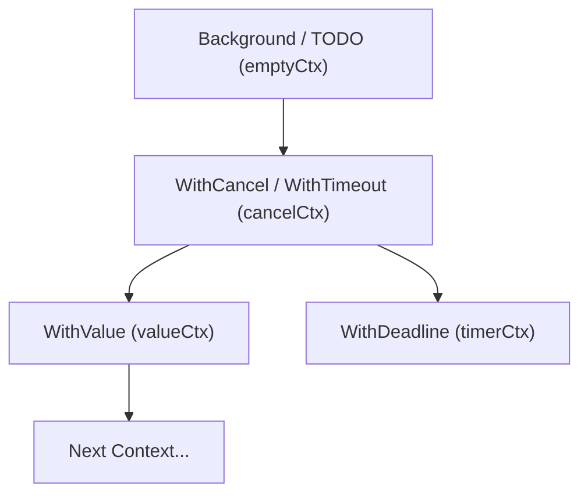
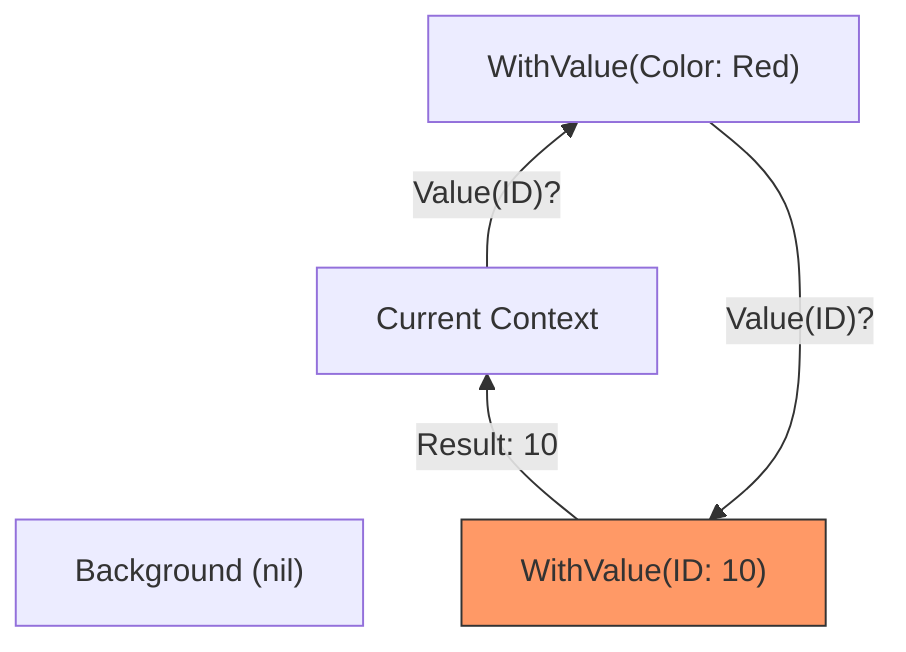

### 🧠 What is Context in Go?

**Context** is a standard mechanism in Go for passing cancellation signals, deadlines, and parameters (key-value pairs) through a call tree.

The main task of context is to manage the lifecycle of operations, especially those that can take a long time or are performed in separate goroutines (for example, HTTP requests, database queries).

---

### 🪆 The "Matryoshka" Principle (Hierarchy)

Context in Go is built on the principle of a hierarchical tree. You always start with an "empty" parent context and build on it, creating child contexts.



> [!IMPORTANT]
> **This is an immutable structure**. Each time you call a `With...` function, you are not changing the old context; you are creating a new one that stores a link to its parent.

---

### 🚫 Cancellation Propagation

This is the most important function of context. The cancellation signal always propagates **from top to bottom**.

- If you cancel a parent context, all its child contexts (and their children) are also canceled.
- If you cancel a child context, it **does not affect** the parent.

**Why is this convenient?**
Imagine an HTTP handler. If the client closes the connection, we cancel the main request context. This automatically signals the database and all background tasks that work can be stopped and resources released.

---

### 🔍 How does WithValue() work?

`context.WithValue` allows you to attach data to a context. But it's important to understand how the value search happens:

1. You request a value by key using `ctx.Value(key)`.
2. If the current context contains this key, it returns it.
3. If not, it **recursively** go to its parent and asks it.
4. The process continues to the root (`Background`) until the key is found or the end of the tree is reached.



> [!WARNING]
> Searching in `WithValue` has a complexity of **O(N)** relative to the depth of the tree. Do not use context to pass hundreds of parameters — it's slow. Use it only for metadata (request ID, user login, trace token).

---

### 🛠️ Main Internal Context Types

In the Go source code (`context.go`), context is an interface:
```go
type Context interface {
    Deadline() (deadline time.Time, ok bool)
    Done() <-chan struct{}
    Err() error
    Value(key any) any
}
```

**Implementations:**
1. **emptyCtx**: The `Background()` or `TODO()` itself. Just an empty shell.
2. **cancelCtx**: Adds the ability to cancel (the `Done()` method).
3. **timerCtx**: Adds a deadline or timeout. Internally, it contains a `cancelCtx` and a timer.
4. **valueCtx**: Stores a single key-value pair and a link to the parent.

---

### 💡 Good Practices

1. **First Argument**: Context should always be the first argument of a function: `func DoWork(ctx context.Context, ...)`.
2. **Variable Name**: The accepted name is `ctx`.
3. **Do Not Store in Structs**: Context should only live for the duration of a function execution. Do not put it into structure fields.
4. **Context.Background()**: Use for the main entry point (main, start of a request).
5. **Context.TODO()**: Use if you are not yet sure which context is needed.

---

### 📋 Summary

- **Context** is a tree.
- **Cancellation** goes down (parent -> children).
- **Value search** goes up (child -> parent) recursively.
- Used for **synchronization and resource management**.
