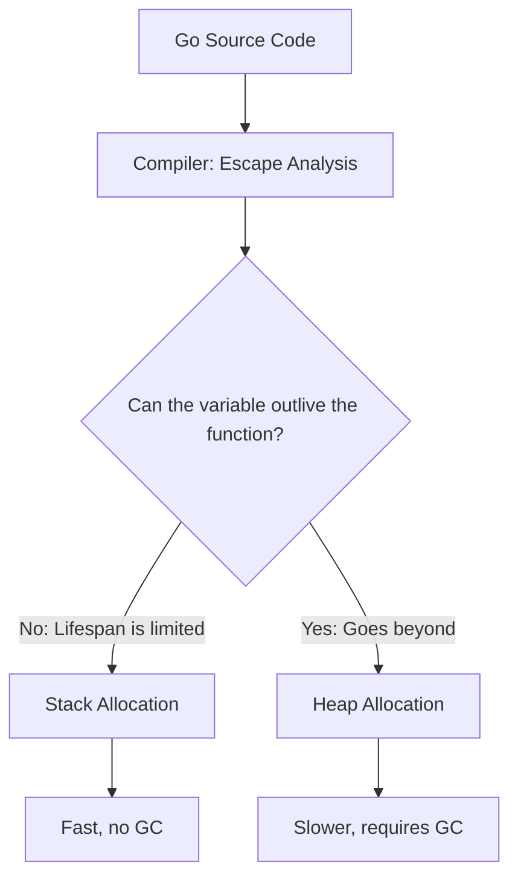
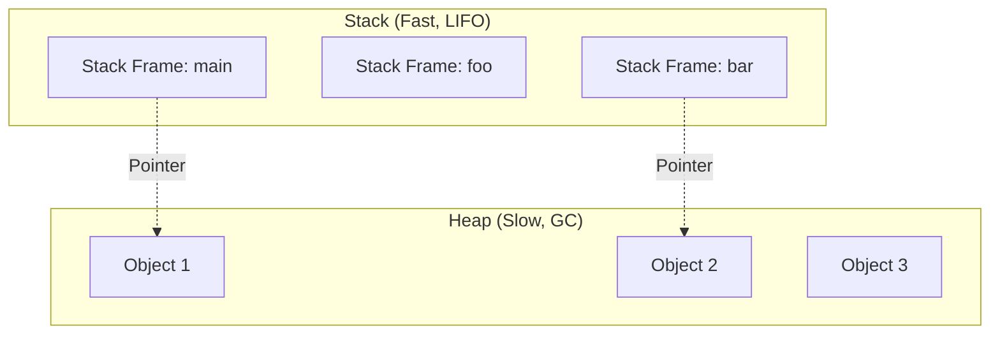
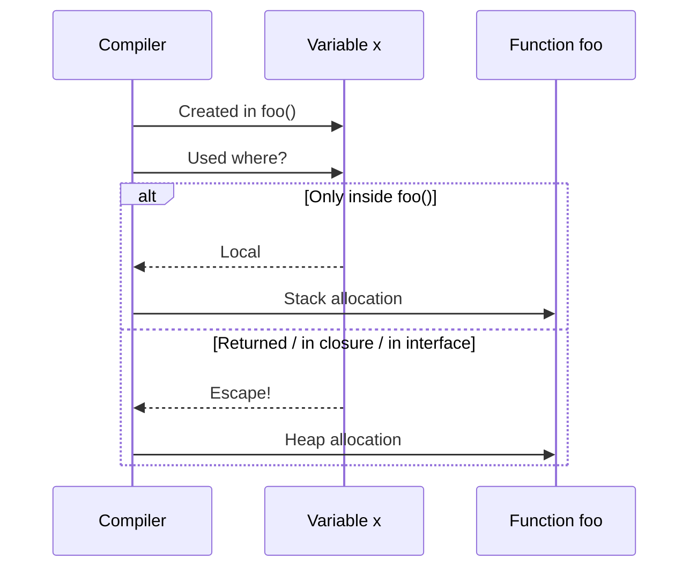
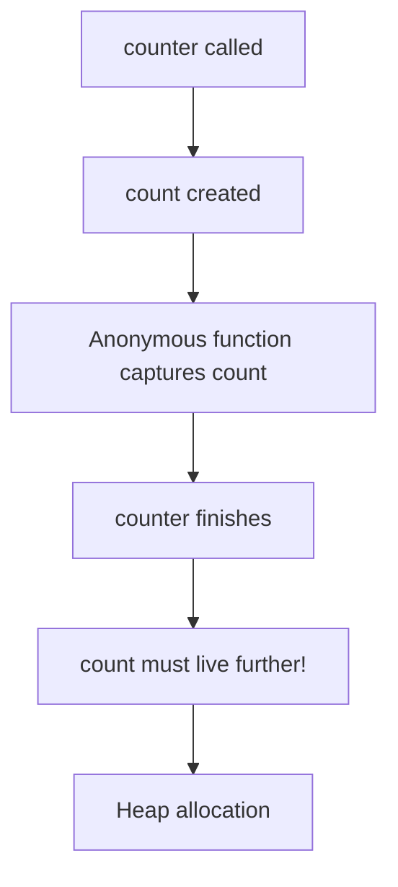
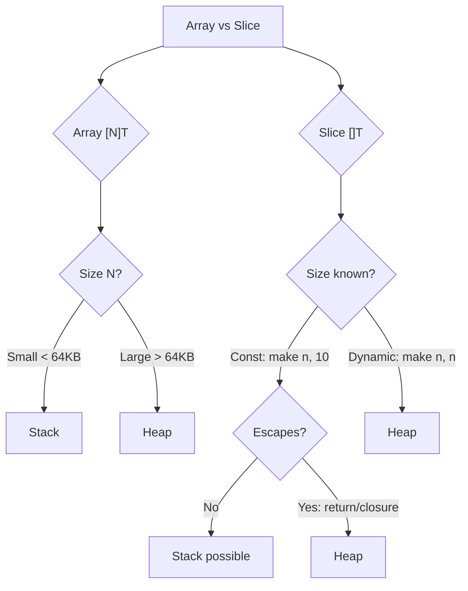

# 🏃 Escape Analysis in Go

## 📑 Table of Contents
1. [What is Escape Analysis](#what-is-escape-analysis)
2. [Stack vs Heap: Fundamental Concepts](#stack-vs-heap-fundamental-concepts)
3. [Why Escape Analysis is Needed](#why-escape-analysis-is-needed)
4. [How Escape Analysis Works](#how-escape-analysis-works)
5. [When a Variable "Escapes" to the Heap](#when-a-variable-escapes-to-the-heap)
6. [When a Variable Stays on the Stack](#when-a-variable-stays-on-the-stack)
7. [Arrays and Slices: The Role of Size](#arrays-and-slices-the-role-of-size)
8. [Diagnostic Tools](#diagnostic-tools)
9. [Pitfalls](#pitfalls)
10. [Best Practices](#best-practices)

---

## ❓ What is Escape Analysis

**Escape Analysis** is an analysis process performed by the Go compiler during the compilation stage. Its main task is to determine where it is safer and more efficient to allocate memory for a variable: on the **stack** or in the **heap**.

> [!NOTE]
> **Escape Analysis** is not a runtime mechanism. The decision on where to place a variable is made **before the program executes**, during compilation.

> [!WARNING]
> **Important Nuance**: Escape Analysis is a set of heuristics that change from version to version of Go. What "escaped" to the heap in Go 1.10 might stay on the stack in Go 1.24. It is impossible to predict the compiler's behavior with 100% certainty without using diagnostic flags (`-gcflags="-m"`). Even if the code seems obvious, complex optimizations (e.g., inlining) can suddenly change the result.

**Workflow Diagram:**


---

## 🥞 Stack vs Heap: Fundamental Concepts

### Stack

The **Stack** is a memory area that works on the LIFO (Last In, First Out) principle. Each function gets its own **stack frame**, where the following are stored:
- Local variables
- Function parameters
- Return address

**Characteristics:**
- ✅ **Very fast** allocation and deallocation (simple pointer shift)
- ✅ **Automatic** memory management (exiting a function = cleanup)
- ✅ **Does not require GC** (Garbage Collector)
- ❌ **Limited size** (usually 1-8 MB per goroutine)
- ❌ **Lifespan** is limited to the function execution time

### Heap

The **Heap** is a global memory area shared by all goroutines.

**Characteristics:**
- ✅ **Unlimited size** (within available system memory)
- ✅ **Long-lived** data can exist after the function completes
- ❌ **Slower** allocation (the allocator must find a free block)
- ❌ **Requires GC** to free memory
- ❌ Memory **fragmentation**

**Visualization:**


> [!IMPORTANT]
> **Main Rule**: Stack is for short-term local data. Heap is for data that must outlive the function.

---

## 🎯 Why Escape Analysis is Needed

### 1. Performance Optimization

- **Stack allocation** is **100-1000 times faster** than heap allocation.
- No overhead from GC operation (which can "freeze" the program for STW pauses).

### 2. Reducing GC Load

- The fewer objects in the heap, the less work for the Garbage Collector.
- GC "sees" only the heap. The stack is cleaned automatically upon function exit.

### 3. Improving Cache Locality

- Data on the stack is located sequentially.
- CPU cache works more efficiently with such data.

**Performance Example:**
```go
// Stack allocation (fast)
func sumStack() int {
    x := 42  // x on stack
    y := 58  // y on stack
    return x + y
}

// Heap allocation (slow)
func sumHeap() *int {
    x := 42
    result := x + 58
    return &result  // result "escapes" to heap!
}
```

```
Benchmark_StackAlloc-8    1000000000    0.25 ns/op    0 B/op    0 allocs/op
Benchmark_HeapAlloc-8      50000000    35.2 ns/op    8 B/op    1 allocs/op
```

> [!TIP]
> The difference is **140 times**! This is why Escape Analysis is so important.

---

## ⚙️ How Escape Analysis Works

The Go compiler walks through the AST (Abstract Syntax Tree) of your code and tracks the **lifespan** of each variable.

### Algorithm (simplified):

1. **Building a Data Flow Graph**: The compiler looks at where each variable "flows."
2. **Lifespan Analysis**: Can the variable outlive the function?
3. **Decision Making**:
   - If the variable does not go beyond the function → **Stack**
   - If the variable is returned, stored in a closure, or passed through an interface → **Heap**

**Analysis Diagram:**


---

## 🚀 When a Variable "Escapes" to the Heap

### 1. Returning a Pointer

```go
func createUser() *User {
    u := User{Name: "Alice"}  // u escapes to heap
    return &u
}
```

**Why?** The calling function will use `u` after `createUser()` completes.

---

### 2. Storing in a Global Variable

```go
var globalUsers []*User

func addUser() {
    u := User{Name: "Bob"}  // u escapes to heap
    globalUsers = append(globalUsers, &u)
}
```

**Why?** `u` must live longer than the `addUser()` function.

---

### 3. Closures

```go
func counter() func() int {
    count := 0  // count escapes to heap!
    return func() int {
        count++
        return count
    }
}
```

**Why?** The returned function "captures" `count`, and it must exist between calls.

**Diagram:**


---

### 4. Interfaces

```go
func printValue() {
    x := 42  // x escapes to heap!
    var i interface{} = x
    fmt.Println(i)
}
```

**Why?** Interfaces in Go store a pointer to data. The compiler cannot guarantee that `x` is not used elsewhere.

---

### 5. Too Large Structures

```go
func createLargeArray() {
    arr := [100000]int{}  // Too large for stack!
    // arr escapes to heap
    process(arr)
}
```

**Why?** Stack is limited (usually 1-8 MB per goroutine). Large objects are forcibly placed on the heap.

---

### 6. Passing a Pointer via Channel

```go
func sendData(ch chan *Data) {
    d := Data{Value: 10}  // d escapes to heap
    ch <- &d
}
```

**Why?** A receiver from another goroutine will use `d` after the function completes.

---

### 7. Slices with Dynamic Size

```go
func makeSlice(n int) []int {
    s := make([]int, n)  // s escapes to heap
    return s
}
```

**Why?** The size `n` is unknown at compilation time, so the compiler cannot allocate space on the stack.

---

### 8. Pointer Receivers

```go
type Counter struct {
    value int
}

func (c *Counter) Increment() {
    c.value++
}

func newCounter() *Counter {
    c := Counter{}  // c escapes to heap
    return &c
}
```

---

### 9. Defer with Variable Capture

```go
func processFile() error {
    f, _ := os.Open("file.txt")
    defer f.Close()  // f can escape if Close() stores a reference
    // ...
}
```

---

### 10. Indeterminate Slice/String Length

```go
func concat(a, b string) string {
    return a + b  // the result can escape if it's too large
}
```

---

## 🏠 When a Variable Stays on the Stack

### 1. Simple Local Variables

```go
func calculate() int {
    x := 10  // Stack
    y := 20  // Stack
    return x + y
}
```

---

### 2. Fixed-size Arrays (Small)

```go
func sumArray() int {
    arr := [10]int{1, 2, 3, 4, 5, 6, 7, 8, 9, 10}  // Stack
    sum := 0
    for _, v := range arr {
        sum += v
    }
    return sum
}
```

---

### 3. Structures that Don't Leave the Function

```go
func processLocal() {
    u := User{Name: "Charlie"}  // Stack
    fmt.Println(u.Name)  // Used only here
}
```

---

### 4. Function Parameters (Value Types)

```go
func add(a, b int) int {  // a, b on Stack
    return a + b
}
```

---

### 5. Constant-size Slices (Inlined)

```go
func smallSlice() {
    s := make([]int, 3)  // May stay on stack (compiler is smart!)
    s[0] = 1
    s[1] = 2
    s[2] = 3
    fmt.Println(s)
}
```

> [!NOTE]
> Modern versions of Go (1.17+) have improved Escape Analysis, and small slices with a known size can stay on the stack.

---

## 📊 Arrays and Slices: The Role of Size

This is one of the most interesting and subtle points of Escape Analysis.

### Arrays: `[N]T`

Arrays are a **value type**. Their size is known at compilation time.

#### Case 1: Small Array

```go
func smallArray() {
    arr := [10]int{}  // Stack (40 bytes for int32 or 80 for int64)
    arr[0] = 42
}
```

**Result:** Stack allocation ✅

---

#### Case 2: Large Array

```go
func largeArray() {
    arr := [1000000]int{}  // Heap! (4-8 MB)
    arr[0] = 42
}

// go build -gcflags='-m' main.go
// ./main.go: arr escapes to heap
```

**Result:** Heap allocation ⚠️

**Why?** Stack is limited. If an array is larger than **~64KB**, the compiler will send it to the heap.

---

#### Case 3: Returning an Array

```go
func returnArray() [10]int {
    arr := [10]int{1, 2, 3}
    return arr  // Copied! Stack
}
```

**Result:** Stack allocation (the array is **copied** upon return)

---

#### Case 4: Returning a Pointer to an Array

```go
func returnArrayPtr() *[10]int {
    arr := [10]int{1, 2, 3}
    return &arr  // arr escapes to heap!
}
```

**Result:** Heap allocation

---

### Slices: `[]T`

A slice is a **reference type**. Internally, it contains:
- A pointer to a data array
- Length (`len`)
- Capacity (`cap`)

#### Case 1: Constant Size at Creation

```go
func fixedSlice() {
    s := make([]int, 10)  // Stack (if no escape)
    s[0] = 42
    fmt.Println(s)
}

// The compiler sees: size = 10 (const), local use
// Result: Stack (in new Go versions)
```

---

#### Case 2: Dynamic Size

```go
func dynamicSlice(n int) {
    s := make([]int, n)  // Heap! (n is unknown at compile-time)
    s[0] = 42
}
```

**Result:** Heap allocation

**Why?** The compiler doesn't know how much memory is needed before the program runs.

---

#### Case 3: Returning a Slice

```go
func returnSlice() []int {
    s := make([]int, 10)
    return s  // s escapes to heap!
}
```

**Result:** Heap allocation

**Why?** The calling function receives a reference to data that must outlive the current function.

---

#### Case 4: Append with Undetermined Growth

```go
func appendData() {
    s := []int{1, 2, 3}  // Stack (for now)
    s = append(s, 4)     // May escape if growth requires realloc
}
```

---

### Diagram: Arrays vs Slices



---

### Table: Arrays vs Slices

| Scenario | Array `[N]T` | Slice `[]T` |
|:---|:---:|:---:|
| Local variable, small size | Stack ✅ | Stack* ✅ |
| Local variable, large size (>64KB) | Heap ⚠️ | Heap ⚠️ |
| Returning a value | Stack (copy) | Heap ⚠️ |
| Returning a pointer `&arr` | Heap ⚠️ | Heap ⚠️ |
| Size known at compile-time | Stack ✅ | Stack* ✅ |
| Size known only at runtime | N/A | Heap ⚠️ |

*Depends on Go version and usage context

---

## 🛠️ Diagnostic Tools

### 1. Compiler Flag `-m`

The most important tool for Escape Analysis:

```bash
go build -gcflags='-m' main.go
```

**Sample Output:**
```
./main.go:5:2: moved to heap: x
./main.go:10:13: ... argument does not escape
./main.go:10:13: s escapes to heap
```

---

### 2. Optimization Levels

```bash
# Basic level
go build -gcflags='-m'

# More details
go build -gcflags='-m -m'

# Maximum info
go build -gcflags='-m -m -m'
```

---

### 3. Analysis Example

**Code:**
```go
package main

import "fmt"

func createUser() *User {
    u := User{Name: "Alice"}
    return &u
}

type User struct {
    Name string
}

func main() {
    user := createUser()
    fmt.Println(user.Name)
}
```

**Command:**
```bash
go build -gcflags='-m' main.go
```

**Output:**
```
./main.go:5:2: moved to heap: u
./main.go:6:9: &u escapes to heap
./main.go:15:13: ... argument does not escape
./main.go:15:25: user.Name escapes to heap
```

**Interpretation:**
- `moved to heap: u` — variable `u` is placed on the heap
- `&u escapes to heap` — reason: pointer return
- `user.Name escapes to heap` — `fmt.Println` uses `interface{}`, causing an escape

---

### 4. Benchmarking

Use benchmarks to measure allocations:

```go
func BenchmarkStackAlloc(b *testing.B) {
    for i := 0; i < b.N; i++ {
        sumStack()
    }
}

func BenchmarkHeapAlloc(b *testing.B) {
    for i := 0; i < b.N; i++ {
        sumHeap()
    }
}
```

**Running:**
```bash
go test -bench=. -benchmem
```

**Important Metrics:**
- `allocs/op` — number of heap allocations per operation
- `B/op` — bytes allocated per operation

---

## 🕳️ Pitfalls

### 1. Interfaces Always Cause Escape

```go
func printInt(x int) {
    fmt.Println(x)  // x escapes! (fmt.Println takes interface{})
}
```

**Solution**: If performance is critical, avoid `fmt.Println` in hot paths.

---

### 2. Defer May Cause Escape

```go
func process() {
    x := 42
    defer fmt.Println(x)  // x may escape
}
```

**Why?** `defer` captures variables, extending their lifespan.

---

### 3. Small Slices May Stay on the Stack

```go
func optimized() {
    s := make([]int, 3)  // Stack in Go 1.17+
    s[0] = 1
    // Does not return, does not save
}
```

But this is **not guaranteed**! It depends on the compiler version and context.

---

### 4. Append May Cause Unexpected Escape

```go
func grow() []int {
    s := []int{1, 2, 3}  // May think: Stack
    s = append(s, 4, 5, 6, 7)  // Realloc → Heap!
    return s
}
```

---

### 5. Loops and Escape Analysis

```go
func loop() {
    for i := 0; i < 10; i++ {
        x := i  // x on stack (each iteration is a new frame)
        fmt.Println(&x)  // But the address is different each time!
    }
}
```

---

### 6. Variadic Functions (...)

```go
func sum(nums ...int) {  // nums is a slice → may escape
    // ...
}

sum(1, 2, 3)  // The compiler creates a temporary slice
```

---

## ✅ Best Practices

### 1. Use Value Receivers Where Possible

```go
// Bad (escape)
func (u *User) GetName() string {
    return u.Name
}

// Good (stack)
func (u User) GetName() string {
    return u.Name
}
```

---

### 2. Avoid Returning Pointers Unnecessarily

```go
// Bad
func createConfig() *Config {
    return &Config{Timeout: 30}
}

// Good
func createConfig() Config {
    return Config{Timeout: 30}
}
```

---

### 3. Use Pools for Reuse (sync.Pool)

```go
var bufferPool = sync.Pool{
    New: func() interface{} {
        return new(bytes.Buffer)
    },
}

func process() {
    buf := bufferPool.Get().(*bytes.Buffer)
    defer bufferPool.Put(buf)
    // Use buf
}
```

---

### 4. Prefer Arrays over Slices (If Size is Known)

```go
// Good (Stack)
func processFixed() {
    arr := [100]int{}
    // ...
}

// May escape
func processDynamic() {
    s := make([]int, 100)
    // ...
}
```

---

### 5. Profile Before Optimizing

```bash
# CPU profile
go test -cpuprofile=cpu.prof -bench=.

# Heap profile
go test -memprofile=mem.prof -bench=.

# Analysis
go tool pprof cpu.prof
```

---

### 6. Do Not Micro-optimize Without Measurement

> [!WARNING]
> "Premature optimization is the root of all evil" — Donald Knuth

Benchmark first, optimize later!

---

## Summary

### Key Points

| Concept | Brief Description |
|:---|:---|
| **Escape Analysis** | The compiler decides: Stack or Heap |
| **Stack** | Fast, automatic, limited |
| **Heap** | Slow, GC, unlimited |
| **Escape Triggers** | Pointer return, interfaces, closures, channels |
| **Arrays [N]T** | Stack (if <64KB), Heap (if >64KB or &arr) |
| **Slices []T** | Heap (if dynamic size or escape) |
| **Tools** | `-gcflags='-m'`, benchmarks, pprof |

---

### Main Rule

**Write readable code, then profile, then optimize.**

Escape Analysis is a powerful optimization tool, but it's not worth sacrificing code clarity for micro-optimizations. Most Go programs work perfectly fine without manual allocation optimization.

---

### Useful Links

- [Go Official Blog: Escape Analysis](https://go.dev/blog/ismmkeynote)
- [Go Compiler Internals](https://github.com/golang/go/blob/master/src/cmd/compile/internal/gc/escape.go)
- [Effective Go](https://go.dev/doc/effective_go)
