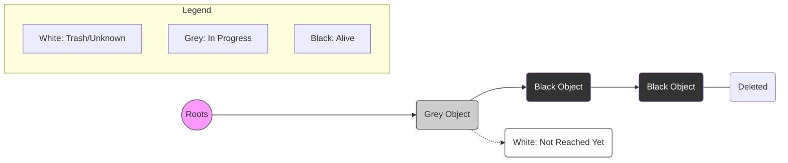

# 🗑️ Garbage Collector in Go
## 🛠️ Operating Principles, Concurrency, and Resource Management

---

## 0. 🏁 Introduction

Memory management in the heap (Heap) is automated in Go. The **Garbage Collector (GC)** takes on the task of finding and freeing objects that are no longer used by the program. This protects against memory leaks and manual management errors (as in C++).

The main goal of the GC in Go is **low latency**. Go sacrifices absolute collection speed for the sake of making program pauses (**Stop-The-World** or **STW**) practically imperceptible.

---

## 0.1. 🌍 Comparison of Memory Approaches

Memory management is always a trade-off between development convenience and performance.

| Language | Mechanism | Pros | Cons |
| :--- | :--- | :--- | :--- |
| **C / C++** | **Manual** (`malloc`/`free`) | Maximum control, no pauses. | High risk of leaks, segfaults, and "use-after-free" errors. |
| **Java / Go** | **Garbage Collector** | Security, development simplicity. | CPU overhead, program pauses (STW). |
| **Rust** | **Ownership & Borrowing** | Security + Speed (no GC). | High entry barrier ("fighting" the borrow checker). |

### 🛠️ Approaches in Detail:
1. **C/C++ (Manual)**: The developer decides when to allocate memory and when to return it to the OS. If you forget to `free()`, the memory will "leak." If you call a destructor twice, the program will crash.
2. **Go (Mark & Sweep)**: The runtime (Runtime) tracks living objects and cleans trash in the background. The developer doesn't think about freeing memory at all.
3. **Rust (Ownership - "The Third Mechanism")**: Memory is freed automatically when a variable goes out of scope (RAII). The compiler checks ownership rules at compilation, guaranteeing no leaks or data races without a GC.

---

## 1. 🎨 Tri-color Mark & Sweep Algorithm

To understand which objects are "alive" and which are "trash," Go uses a tri-color system.

### 1.1 Object Colors
- **White**: Candidate for removal. The GC hasn't checked this object yet.
- **Grey**: The object is "alive," but its referenced objects (its children) haven't been checked yet.
- **Black**: The object is definitely "alive," and all its references have been checked.

### 1.2 Coloring Process
1. At the beginning, all objects are **white**.
2. The GC takes the "roots" (**Roots**: stacks, global variables) and marks the objects they point to as **grey**.
> [!NOTE]
> **Roots** are the starting points for the garbage collector. This includes global variables and all variables on the stacks of active goroutines. If an object cannot be "reached" by following links from the roots, it's considered trash.
3. The GC takes a grey object, turns it **black**, and makes all its references **grey**.
4. Repeat until no more grey objects remain.
5. Anyone left **white** is trash.



---

## 2. ⚡ Concurrency and the 25% CPU Rule

Go uses **Concurrent GC**. This means garbage collection runs in parallel with your code execution.

### 2.1 Processor Usage
To prevent the GC from "eating" all system resources, Go follows a strict rule:
**Exactly 25% of processor resources (1/4 of GOMAXPROCS) are allocated to the Garbage Collector.**

How it works:
- If you have 4 logical processors (`GOMAXPROCS=4`), Go will allocate **exactly one** thread (P) purely for background GC worker needs.
- The other 75% of the time, the processors are occupied by your program.

### 2.2 Mark Assist
If a program allocates memory faster than the GC can clean it up (25% of resources aren't enough), Go forces the "offending" goroutines to help the collector. This is called **Mark Assist**. The program slows down slightly, but memory doesn't bloat uncontrollably.

---

## 3. ⏳ GC Lifecycle Phases

Garbage collection passes through several stages:

1.  **Sweep Termination (STW)**: A very brief pause of all goroutines. Preparation for a new cycle. **Write Barrier is enabled**.
2.  **Marking Phase (Concurrent)**: Main work. The GC colors objects using those 25% of CPU. The program continues to run with an active **Write Barrier**.
3.  **Mark Termination (STW)**: A second short pause. We finish coloring. **Write Barrier is disabled**.
4.  **Off/Sweeping (Concurrent)**: Freeing up memory (white objects) and returning it to the allocator.

> [!NOTE]
> Total STW (Stop-The-World) pause time in modern Go versions is typically less than **100 microseconds**. That is thousands of times faster than blinking an eye.

---

## 4. 🧱 Write Barrier

Since the GC runs **concurrently** with your program (mutator), object states may change while they are being scanned. This creates a risk of deleting "live" data.

### 4.1. The "Lost Object" Problem

Imagine a situation without a write barrier:
1. **GC**: Scans object `A`. Marks it **black** (processed).
2. **Program**: Object `B` (which is still **grey**) has a reference to object `C` (currently **white**).
3. **Program**: Performs two operations:
   - Copies the reference to `C` into the black object `A`.
   - Deletes the reference to `C` from the grey object `B`.
4. **Result**: Now the only path to `C` leads from the black object `A`. But the GC will no longer scan `A` because it's already black. Object `C` will remain white and be mistakenly deleted.

### 4.2. Solution: Dijkstra Write Barrier

Go uses a variant devised by **Dijkstra**. Its logic is simple:
> "Whenever an attempt is made to store a pointer to a white object in a black or grey object, that white object is immediately forced into being grey."

**Barrier Pseudocode:**
```go
// Executed with every operation: pointer = new_ptr
func writeBarrier(pointer *Object, new_ptr *Object) {
    if gcPhase == Marking {
        shade(new_ptr) // Turns the object grey if it was white
    }
    *pointer = new_ptr
}
```

### 4.3. When is it Active?
- **Enabled**: At the `Sweep Termination` phase.
- **Active**: Throughout the `Marking Phase`.
- **Disabled**: At the `Mark Termination` phase.

> [!TIP]
> Thanks to the Write Barrier, Go can allow the program to run simultaneously with the garbage collector without fear of the program "hiding" a living object in an already checked memory area.

---

## 5. ⚙️ Managing the GC: GOGC and GOMEMLIMIT

### 5.1 GOGC (Growth Factor)
By default, `GOGC=100`. This means: trigger a GC when the size of the new heap reaches 100% of the live data size after the previous collection.
- `GOGC=50`: collection 2 times more often, less memory.
- `GOGC=off`: collection only by memory limit.

### 5.2 GOMEMLIMIT
Added in Go 1.19. It allows setting a hard threshold (e.g., 2GB). If memory approaches this limit, the GC starts working more aggressively, ignoring GOGC settings to avoid an OOM (Out Of Memory) crash.

---

## 6. Summary

| Feature | Description |
| :--- | :--- |
| **Algorithm** | Tri-color Mark & Sweep. |
| **Mode** | Concurrent (works in parallel with the program). |
| **CPU Limit** | 25% of available processors (1/4 GOMAXPROCS). |
| **Pauses (STW)** | Minimal, typically < 100 µs. |
| **Protection** | Write Barrier prevents loss of live data during mutation. |

---

## 💡 Main Thought

The Garbage Collector in Go is a balance between memory efficiency and system responsiveness. It's not the most resource-efficient, but it guarantees that your application will run smoothly without the long "hangs" typical of older Java or Python versions.