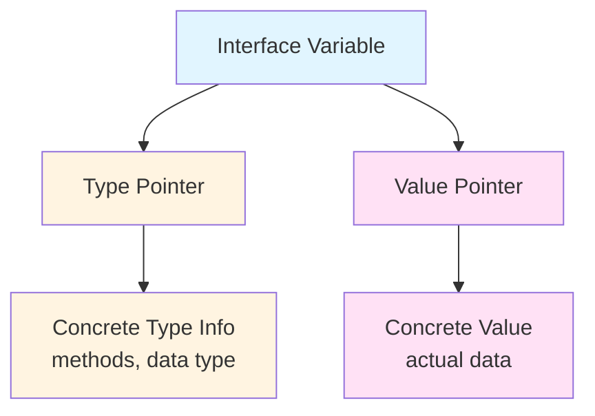
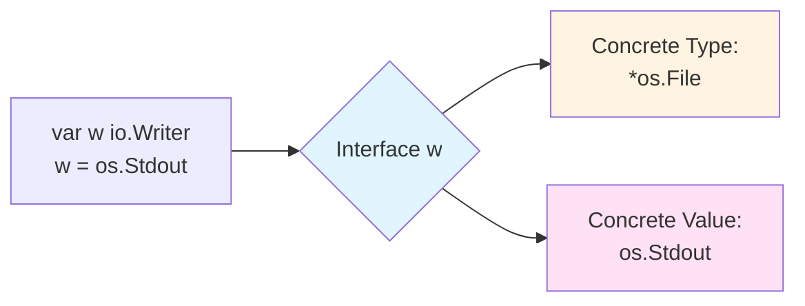
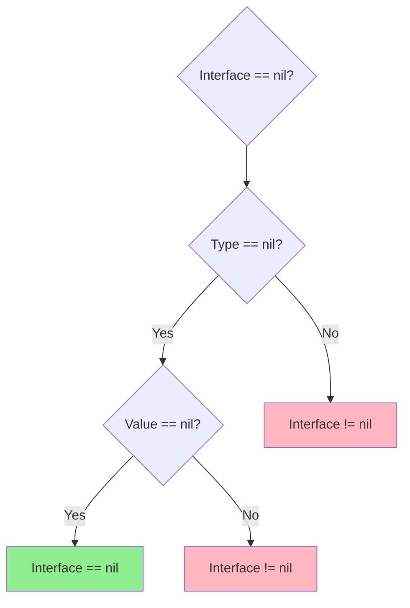

# 🔌 Interface in Go

## 📑 Table of Contents
1. [What is an Interface](#what-is-an-interface)
2. [Why Interfaces are Needed](#why-interfaces-are-needed)
3. [Internal Structure of an Interface](#internal-structure-of-an-interface)
4. [The Empty Interface (interface{} / any)](#the-empty-interface-interface--any)
5. [Concrete Type and Concrete Value](#concrete-type-and-concrete-value)
6. [When an Interface is nil](#when-an-interface-is-nil)
7. [Usage Examples](#usage-examples)

---

## ❓ What is an Interface

An **Interface** in Go is a **type** that defines a set of methods (method signatures) but **does not implement them**. An interface describes **behavior**, not a data structure.

> [!IMPORTANT]
> A key difference between Go and other languages: **implicit implementation of interfaces**. A type implements an interface automatically if it has all the methods defined in the interface. No `implements` or `extends` keywords are needed.

### Simple Example 📝

```go
// Interface definition
type Writer interface {
    Write(data []byte) (n int, err error)
}

// Any type with a Write([]byte) (int, error) method automatically implements Writer
type FileWriter struct {
    filename string
}

func (f *FileWriter) Write(data []byte) (int, error) {
    // implementation of writing to a file
    return len(data), nil
}

// *FileWriter implicitly implements the Writer interface
```

---

## 🎯 Why Interfaces are Needed

### 1. **Polymorphism**
Interfaces allow you to write code that works with different types through a common contract:

```go
type Animal interface {
    Speak() string
}

type Dog struct{}
func (d Dog) Speak() string { return "Woof!" }

type Cat struct{}
func (c Cat) Speak() string { return "Meow!" }

// Function works with any Animal
func MakeSound(a Animal) {
    fmt.Println(a.Speak())
}

func main() {
    MakeSound(Dog{}) // Woof!
    MakeSound(Cat{}) // Meow!
}
```

### 2. **Decoupling Dependencies (Dependency Inversion)**
Interfaces allow you to depend on abstractions rather than concrete implementations:

```go
// Bad: depending on a concrete type
type UserService struct {
    db *PostgreSQL // tight coupling to PostgreSQL
}

// Good: depending on an interface
type Database interface {
    Save(data interface{}) error
    Load(id int) (interface{}, error)
}

type UserService struct {
    db Database // we can use any Database implementation
}
```

### 3. **Testing**
Interfaces simplify the creation of mocks for testing:

```go
type EmailSender interface {
    Send(to, subject, body string) error
}

// In tests, we can use a mock
type MockEmailSender struct {
    sentEmails []string
}

func (m *MockEmailSender) Send(to, subject, body string) error {
    m.sentEmails = append(m.sentEmails, to)
    return nil
}
```

### 4. **Interface Composition**
Interfaces can be combined:

```go
type Reader interface {
    Read(p []byte) (n int, err error)
}

type Writer interface {
    Write(p []byte) (n int, err error)
}

// Interface composition
type ReadWriter interface {
    Reader
    Writer
}
```

---

## 🏗️ Internal Structure of an Interface

An interface in Go is stored as a pair of values: **type** and **value**.



### Internal Representation (runtime) 🖥️

In the runtime, an interface is represented by two main structures:

#### 1. **eface** (empty interface)
Used for `interface{}` (empty interface):

```go
type eface struct {
    _type *_type      // type information
    data  unsafe.Pointer // pointer to data
}
```

#### 2. **iface** (interface with methods)
Used for interfaces with methods:

```go
type iface struct {
    tab  *itab        // method table + type information
    data unsafe.Pointer // pointer to data
}

type itab struct {
    inter *interfacetype // interface type
    _type *_type         // concrete type
    hash  uint32         // copy of _type.hash for fast comparison
    _     [4]byte        // alignment
    fun   [1]uintptr     // array of pointers to methods
}
```

### Interface Fields 🗂️

> [!NOTE]
> **An interface contains two fields:**
> 1. **Type**: information about the concrete type stored in the interface
> 2. **Value**: a pointer to the actual data

This can be visualized like this:

```go
var w io.Writer
w = os.Stdout

// Internal representation:
// Type:  *os.File
// Value: address of os.Stdout
```

---

## 📦 The Empty Interface (interface{} / any)

An **empty interface** is an interface without methods. It can hold a value of **any type**.

```go
// Old notation
var x interface{}

// New notation (since Go 1.18+)
var y any
```

> [!TIP]
> `any` is just an alias for `interface{}`. They are completely equivalent.

### Using the Empty Interface ✨

```go
func PrintAnything(val any) {
    fmt.Println(val)
}

func main() {
    PrintAnything(42)           // int
    PrintAnything("Hello")      // string
    PrintAnything([]int{1, 2})  // slice
    PrintAnything(struct{}{})   // struct
}
```

### Type Assertion

To extract a concrete value from `any`, we use **type assertion**:

```go
var i any = "hello"

// Type assertion with check
s, ok := i.(string)
if ok {
    fmt.Println("String:", s)
}

// Type assertion without check (can cause panic!)
s := i.(string) // panic if i is not a string
```

### Type Switch

To check multiple types, we use a **type switch**:

```go
func Describe(i any) {
    switch v := i.(type) {
    case int:
        fmt.Printf("Integer: %d\n", v)
    case string:
        fmt.Printf("String: %s\n", v)
    case bool:
        fmt.Printf("Boolean: %t\n", v)
    default:
        fmt.Printf("Unknown type: %T\n", v)
    }
}
```

### When to Use `any`

> [!WARNING]
> **Avoid overusing `any`!**
> 
> Use `any` only when:
> - Working with libraries like encoding/json, database/sql
> - Writing universal containers (although Go 1.18+ with generics is better)
> - You truly need maximum flexibility
> 
> In other cases, prefer **concrete types** or **interfaces with methods**.

---

## 💎 Concrete Type and Concrete Value

### Concrete Type

The **concrete type** is the actual data type stored in the interface.

```go
var w io.Writer
w = os.Stdout

// Concrete type: *os.File
```

You can get the concrete type using reflection:

```go
import "reflect"

func main() {
    var w io.Writer = os.Stdout
    
    t := reflect.TypeOf(w)
    fmt.Println(t) // *os.File
}
```

### Concrete Value

The **concrete value** is the actual data stored in the interface.

```go
var i interface{} = 42

// Concrete type: int
// Concrete value: 42

v := reflect.ValueOf(i)
fmt.Println(v) // 42
```

### Visualization



### Example with Different Types

```go
type Shape interface {
    Area() float64
}

type Circle struct {
    Radius float64
}

func (c Circle) Area() float64 {
    return 3.14 * c.Radius * c.Radius
}

type Rectangle struct {
    Width, Height float64
}

func (r Rectangle) Area() float64 {
    return r.Width * r.Height
}

func main() {
    var s Shape
    
    // First assignment
    s = Circle{Radius: 5}
    // Concrete type: Circle
    // Concrete value: Circle{Radius: 5}
    
    // Second assignment
    s = Rectangle{Width: 10, Height: 5}
    // Concrete type: Rectangle
    // Concrete value: Rectangle{Width: 10, Height: 5}
    
    fmt.Printf("Type: %T, Value: %+v\n", s, s)
    // Type: main.Rectangle, Value: {Width:10 Height:5}
}
```

---

## 🚫 When an Interface is nil

This is one of the most **confusing** topics in Go! An interface is `nil` only when **both fields** (type and value) are `nil`.

### The nil Rule for Interfaces



> [!CAUTION]
> **An interface is nil if and only if:**
> - **Type** == nil
> - **Value** == nil
> 
> If at least one field is not nil, the interface is **not equal to nil**!

### Case 1: Fully nil Interface

```go
var w io.Writer
// Type:  nil
// Value: nil

fmt.Println(w == nil) // true ✅
```

### Case 2: Nil concrete value but non-nil type

```go
var buf *bytes.Buffer = nil
var w io.Writer = buf

// Type:  *bytes.Buffer (not nil!)
// Value: nil

fmt.Println(w == nil)  // false ❌ (unexpected!)
fmt.Println(buf == nil) // true
```

> [!WARNING]
> **This is a common mistake!** 
> 
> The interface `w` is not `nil`, even though its concrete value (`buf`) is `nil`. This happens because the **type field** contains information about `*bytes.Buffer`.

### Case 3: Nil check working unexpectedly

```go
func DoSomething() error {
    var err *MyError = nil
    return err // Returning a nil pointer
}

func main() {
    err := DoSomething()
    if err != nil {
        fmt.Println("Error!") // This will be printed! ❌
    }
}
```

**Why is "Error!" printed?**

```go
// After returning err, the error interface contains:
// Type:  *MyError
// Value: nil

// The interface is not nil because type != nil!
```

### Correct Approach ✅

```go
func DoSomething() error {
    var err *MyError = nil
    if err != nil {
        return err
    }
    return nil // Explicitly return a nil interface
}

// Or even better:
func DoSomething() error {
    // If there is no error, return nil
    return nil // Both Type and Value are nil
}
```

### How to Correctly Check for nil 🔍

#### Option 1: Verification via Reflection

```go
import "reflect"

func IsNil(i any) bool {
    if i == nil {
        return true
    }
    return reflect.ValueOf(i).IsNil()
}

func main() {
    var buf *bytes.Buffer = nil
    var w io.Writer = buf
    
    fmt.Println(w == nil)      // false
    fmt.Println(IsNil(w))      // true ✅
}
```

#### Option 2: Type Assertion

```go
func CheckNil(w io.Writer) {
    if w == nil {
        fmt.Println("Fully nil")
        return
    }
    
    // Check specific type
    if buf, ok := w.(*bytes.Buffer); ok && buf == nil {
        fmt.Println("Concrete value nil")
    }
}
```

#### Option 3: Avoid the Problem

```go
// Bad
func GetWriter() io.Writer {
    var buf *bytes.Buffer = nil
    return buf // Type != nil!
}

// Good
func GetWriter() io.Writer {
    var buf *bytes.Buffer = nil
    if buf == nil {
        return nil // Type and Value are both nil
    }
    return buf
}
```

### Comparison Table

| Type     | Value    | Interface == nil | Note                        |
|----------|----------|------------------|-----------------------------|
| `nil`    | `nil`    | ✅ `true`        | Fully nil interface         |
| `*T`     | `nil`    | ❌ `false`       | Type is set, but value is nil |
| `*T`     | `&value` | ❌ `false`       | Both fields are set         |
| `nil`    | `&value` | ❌ impossible    | Impossible state in Go      |

---

## 💡 Usage Examples

### Example 1: Basic Interface Usage

```go
package main

import "fmt"

type Greeter interface {
    Greet() string
}

type EnglishGreeter struct {
    name string
}

func (e EnglishGreeter) Greet() string {
    return "Hello, " + e.name
}

type RussianGreeter struct {
    name string
}

func (r RussianGreeter) Greet() string {
    return "Привет, " + r.name
}

func SayHello(g Greeter) {
    fmt.Println(g.Greet())
}

func main() {
    en := EnglishGreeter{name: "Alice"}
    ru := RussianGreeter{name: "Алиса"}
    
    SayHello(en) // Hello, Alice
    SayHello(ru) // Привет, Алиса
}
```

### Example 2: Interface for Working with Different Data Sources

```go
package main

import (
    "fmt"
    "os"
)

type DataSource interface {
    Read() (string, error)
}

type FileSource struct {
    filename string
}

func (f *FileSource) Read() (string, error) {
    data, err := os.ReadFile(f.filename)
    if err != nil {
        return "", err
    }
    return string(data), nil
}

type StringSource struct {
    data string
}

func (s *StringSource) Read() (string, error) {
    return s.data, nil
}

type URLSource struct {
    url string
}

func (u *URLSource) Read() (string, error) {
    // Simplified implementation
    return "Data from " + u.url, nil
}

func ProcessData(source DataSource) {
    data, err := source.Read()
    if err != nil {
        fmt.Println("Error:", err)
        return
    }
    fmt.Println("Data:", data)
}

func main() {
    sources := []DataSource{
        &FileSource{filename: "test.txt"},
        &StringSource{data: "Hello from string"},
        &URLSource{url: "https://example.com"},
    }
    
    for _, src := range sources {
        ProcessData(src)
    }
}
```

### Example 3: nil Interface - Pitfalls

```go
package main

import "fmt"

type MyError struct {
    msg string
}

func (e *MyError) Error() string {
    return e.msg
}

// ❌ BAD: returns a non-nil interface with a nil value
func BadFunction() error {
    var err *MyError = nil
    // logic...
    return err // Type: *MyError, Value: nil
}

// ✅ GOOD: correct check
func GoodFunction() error {
    var err *MyError = nil
    // logic...
    if err != nil {
        return err
    }
    return nil // Type: nil, Value: nil
}

func main() {
    err1 := BadFunction()
    fmt.Println("BadFunction:", err1 == nil) // false ❌
    
    err2 := GoodFunction()
    fmt.Println("GoodFunction:", err2 == nil) // true ✅
}
```

### Example 4: Type Assertion and Type Switch

```go
package main

import "fmt"

func Describe(i any) {
    fmt.Printf("(%v, %T)\n", i, i)
    
    switch v := i.(type) {
    case int:
        fmt.Printf("Integer twice as big: %v\n", v*2)
    case string:
        fmt.Printf("String length: %v\n", len(v))
    case bool:
        if v {
            fmt.Println("True!")
        } else {
            fmt.Println("False!")
        }
    case []int:
        fmt.Printf("Slice of integers, length: %d\n", len(v))
    default:
        fmt.Printf("Unknown type: %T\n", v)
    }
}

func main() {
    Describe(21)
    Describe("hello")
    Describe(true)
    Describe([]int{1, 2, 3})
    Describe(3.14)
}

// Output:
// (21, int)
// Integer twice as big: 42
// (hello, string)
// String length: 5
// (true, bool)
// True!
// ([1 2 3], []int)
// Slice of integers, length: 3
// (3.14, float64)
// Unknown type: float64
```

### Example 5: Interface Composition

```go
package main

import (
    "fmt"
)

type Reader interface {
    Read(p []byte) (n int, err error)
}

type Writer interface {
    Write(p []byte) (n int, err error)
}

type Closer interface {
    Close() error
}

// Interface composition
type ReadWriteCloser interface {
    Reader
    Writer
    Closer
}

// Example structure implementing all methods
type MyFile struct {
    name string
}

func (f *MyFile) Read(p []byte) (int, error) {
    fmt.Println("Reading from", f.name)
    return 0, nil
}

func (f *MyFile) Write(p []byte) (int, error) {
    fmt.Println("Writing to", f.name)
    return len(p), nil
}

func (f *MyFile) Close() error {
    fmt.Println("Closing", f.name)
    return nil
}

func UseReadWriteCloser(rwc ReadWriteCloser) {
    buf := make([]byte, 10)
    rwc.Read(buf)
    rwc.Write(buf)
    rwc.Close()
}

func main() {
    file := &MyFile{name: "test.txt"}
    UseReadWriteCloser(file)
}
```

### Example 6: Interface as a Contract for Testing

```go
package main

import "fmt"

// Interface for sending notifications
type Notifier interface {
    Notify(message string) error
}

// Real implementation via email
type EmailNotifier struct {
    smtpServer string
}

func (e *EmailNotifier) Notify(message string) error {
    fmt.Println("Sending email via", e.smtpServer, ":", message)
    // Real email sending logic
    return nil
}

// Mock for testing
type MockNotifier struct {
    Messages []string
}

func (m *MockNotifier) Notify(message string) error {
    m.Messages = append(m.Messages, message)
    fmt.Println("Mock: message saved:", message)
    return nil
}

// Business logic using the interface
type UserService struct {
    notifier Notifier
}

func (u *UserService) RegisterUser(username string) error {
    // User registration...
    return u.notifier.Notify("User " + username + " registered")
}

func main() {
    // Production code
    emailService := &UserService{
        notifier: &EmailNotifier{smtpServer: "smtp.gmail.com"},
    }
    emailService.RegisterUser("Alice")
    
    fmt.Println("---")
    
    // Test code
    mockNotifier := &MockNotifier{}
    testService := &UserService{
        notifier: mockNotifier,
    }
    testService.RegisterUser("Bob")
    
    fmt.Println("Saved messages:", mockNotifier.Messages)
}
```

### Example 7: Compile-time Interface Implementation Check

```go
package main

import "fmt"

type Writer interface {
    Write(data string) error
}

type FileWriter struct {
    filename string
}

func (f *FileWriter) Write(data string) error {
    fmt.Println("Writing to file:", f.filename, "-", data)
    return nil
}

// Compile-time check that *FileWriter implements Writer
var _ Writer = (*FileWriter)(nil)

// If the following line is uncommented, it will cause a compilation error:
// var _ Writer = FileWriter{} // error, because Write is defined on *FileWriter

func main() {
    fw := &FileWriter{filename: "log.txt"}
    fw.Write("Hello, World!")
}
```

---

## Summary

| Concept | Description |
|:---|:---|
| **Interface** | A set of methods defining behavior |
| **Implicit Implementation** | A type implements an interface automatically if it has all the methods |
| **Empty interface** | `interface{}` or `any` — can store any type |
| **Concrete Type** | The actual type stored in the interface |
| **Concrete Value** | The actual data stored in the interface |
| **nil Interface** | An interface equals `nil` only when both type **AND** value are `nil` |
| **iface/eface** | Internal runtime structures for storing interfaces |

> [!TIP]
> **Best Practices:**
> - Use interfaces to define contracts between components
> - Keep interfaces small (1-3 methods)
> - Declare interfaces where they are used, not where they are implemented
> - Avoid `any` where concrete types or generics can be used
> - Always remember the nuances with `nil` interfaces!
