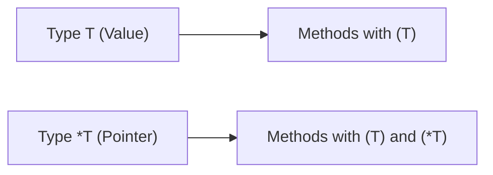
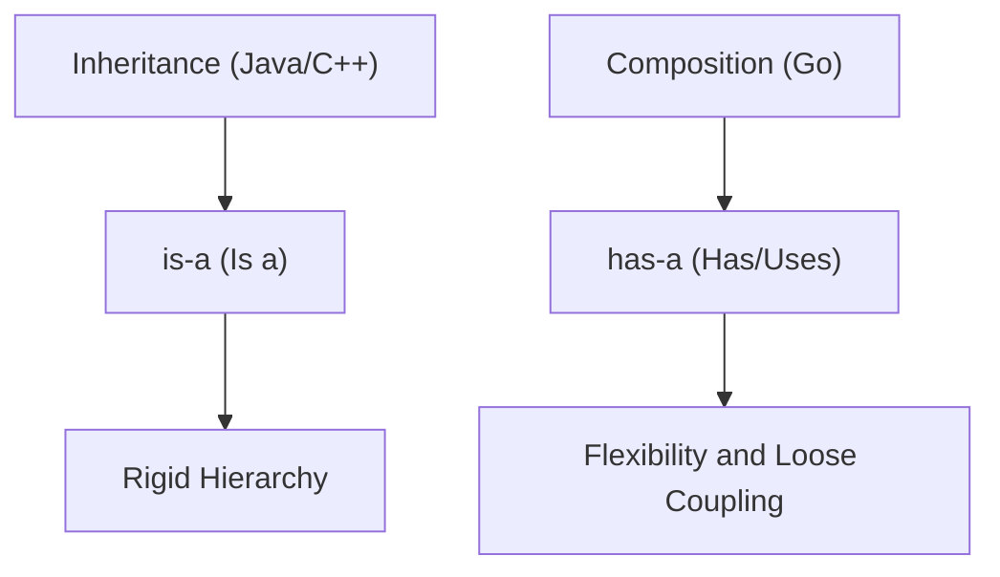

### 🏗️ Structs and Methods in Go

A structure (`struct`) is a composite data type that allows you to group fields of different types into a single entity. Go does not have classes, so structs are the primary way to model data and behavior.

---

# 1. 🧩 Struct Basics

A struct is a collection of named fields.

```go
type User struct {
    ID    int    // Exported field (starts with a capital letter)
    name  string // Hidden field (available only inside the package)
    Email string
}
```

### ⚙️ Key Properties
- **Exportability**: If the name of a field or the struct itself starts with a capital letter, they are available from other packages. If lowercase — only within the current package.
- **Comparison**: Structs can be compared (`==`, `!=`) if all their fields are **comparable** (e.g., numbers, strings, pointers). If a struct contains a slice (`slice`) or a map (`map`), it is incomparable.
- **Zero Value**: If fields are not initialized, they receive their zero values (`0`, `""`, `nil`).
- **Literals**: Can be initialized by field names or by order.
    ```go
    u := User{ID: 1, name: "Alice"} // Recommended
    u2 := User{2, "Bob", "bob@example.com"} // Not recommended (fragile to changes)
    ```

---

# 2. 🎭 Anonymous Structs

Sometimes you need to create a struct "on the fly" without declaring a type. This is useful for passing data to templates, JSON responses, or in tests.

```go
data := struct {
    ID    int
    Token string
}{
    ID:    1,
    Token: "secret",
}
```

---

# 3. 🛠️ Methods

A method in Go is a function that is attached to a specific type. It allows you to implement behavior for structs and other user-defined types.

### 📝 Syntax
To turn a function into a method, you need to add a **receiver** before the function name.

```go
type User struct {
    name string
}

// (u User) — is the receiver
func (u User) Greet() {
    fmt.Printf("Hello, I am %s\n", u.name)
}
```

---

# 4. 🎯 Pointer vs Value Receivers

This is a fundamental topic. The choice of receiver determines how the method works with data.

| Receiver Type | Copy? | Modifies Original? | When to Use? |
| :--- | :--- | :--- | :--- |
| **Value** `(u User)` | Yes (copy of object) | No | Small structs, immutable data. |
| **Pointer** `(u *User)` | No (copy of address) | **Yes** | Need to change state or struct is large (to avoid copying). |

### 🔍 What to Choose?
1. **Mutation**: If the method needs to change struct fields — use **Pointer**.
2. **Performance**: If the struct is large (more than 64 bytes) — use **Pointer** to avoid copying all memory.
3. **Consistency**: If a type already has methods with a Pointer receiver, all others should be the same.

---

# 5. 🍭 Under the Hood: Syntactic Sugar

For many beginners, methods seem like magic, but in Go it is pure **syntactic sugar**.

When you write:
```go
u.Greet()
```

The compiler actually turns this into a regular function call where the object is passed as the first argument:
```go
User.Greet(u)
```

### 🤯 Why is this important?
This explains two things:
1. **Call on nil**: We can call a method on a `nil` pointer because it is just a function taking `nil` as the first argument.
2. **Auto-dereferencing**: If you have `u` (value), and the method requires `(*u)` (pointer), Go will automatically take the address `(&u).Method()` so you don't have to do it manually. And vice versa!

---

# 6. ⚓ Method Sets

These are rules about which methods are available to an object depending on whether it is a value or a pointer.



1. **For a variable of type `T`**: Go automatically dereferences or takes the address, so you can call any method.
2. **For interfaces**: If an interface requires a method with `(*T)`, then **only a pointer** `*T` can implement it. A copy of `T` cannot guarantee modification safety.

---

# 5. 🏗️ Constructors

Go has no `constructor` keyword. Instead, the `New...` pattern is used.

```go
func NewUser(id int, name string) *User {
    // Validation can be added here
    return &User{
        ID:   id,
        name: name,
    }
}
```

> [!TIP]
> Returning a pointer `*User` avoids copying the struct when returning from the function.

---

# 6. 🧬 Nil Receivers

Since methods are functions taking an object as the first argument, we can call a method even on a `nil` pointer if there is a check inside the method.

```go
func (u *User) GetName() string {
    if u == nil {
        return "Guest"
    }
    return u.name
}

var u *User = nil
fmt.Println(u.GetName()) // Will print "Guest", not cause a panic!
```

---

# 7. 🏗️ Embedding

Go has no inheritance. Instead, **composition** via struct embedding is used.

```go
type Admin struct {
    User  // Embedding
    Level int
}

a := Admin{User: User{name: "Ivan"}, Level: 10}
fmt.Println(a.ID) // Direct access to fields of the nested struct
```

### ⚔️ Inheritance vs Composition



---

# 8. 📦 Memory Layout: Padding and Alignment

Structs are stored sequentially in memory, but the compiler adds "padding" to align data.

```go
type BadStruct struct {
    A int8  // 1 byte
    B int64 // 8 bytes
    C int8  // 1 byte
} // Occupies 24 bytes

type GoodStruct struct {
    B int64 // 8 bytes
    A int8  // 1 byte
    C int8  // 1 byte
} // Occupies 16 bytes
```

> [!CAUTION]
> **Size matters**: Incorrect field order can increase memory consumption by 1.5-2 times. See the section [Alignment](../Alignment/alignment.md) for details.

---

# 9. ⚠️ Dangerous Moments

### 🚫 Copying Mutex
If you embed `sync.Mutex` in a struct and copy it, you copy the mutex state (locked/unlocked) as well. This will lead to deadlocks.

```go
type Counter struct {
    mu    sync.Mutex
    count int
}

c1 := Counter{}
c2 := c1 // DANGEROUS: c2 now has a copy of c1's mutex
```

### 🏃‍♂️ Data Race with Value Receiver
If you launch a goroutine and pass a method with a Value Receiver there, you are working with a local copy. If a method with a Pointer Receiver — you are working with the original, which requires synchronization.

---

# 7. 🏷️ Struct Tags

Tags are metadata used by reflection (e.g., for JSON or working with DBs).

```go
type User struct {
    Name string `json:"user_name" db:"name"`
    Age  int    `json:"age,omitempty"` // omitempty — hide if 0
}
```

---

# 📊 Summary: Choosing a Receiver

1. **Changing state?** -> Pointer.
2. **Struct is large (> 64 bytes)?** -> Pointer.
3. **Is it `map`, `chan` or `func`?** -> Value (they are already references).
4. **Need thread safety?** -> Almost always Pointer (to work with shared state).
