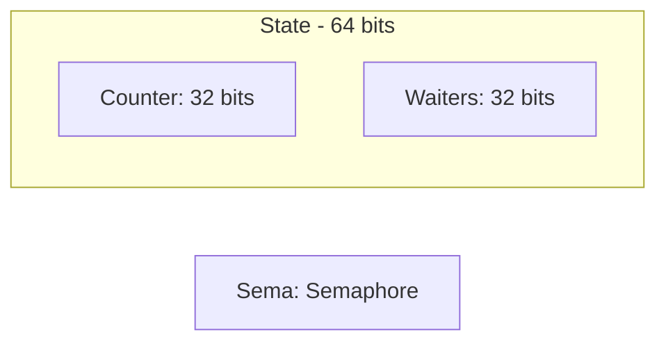
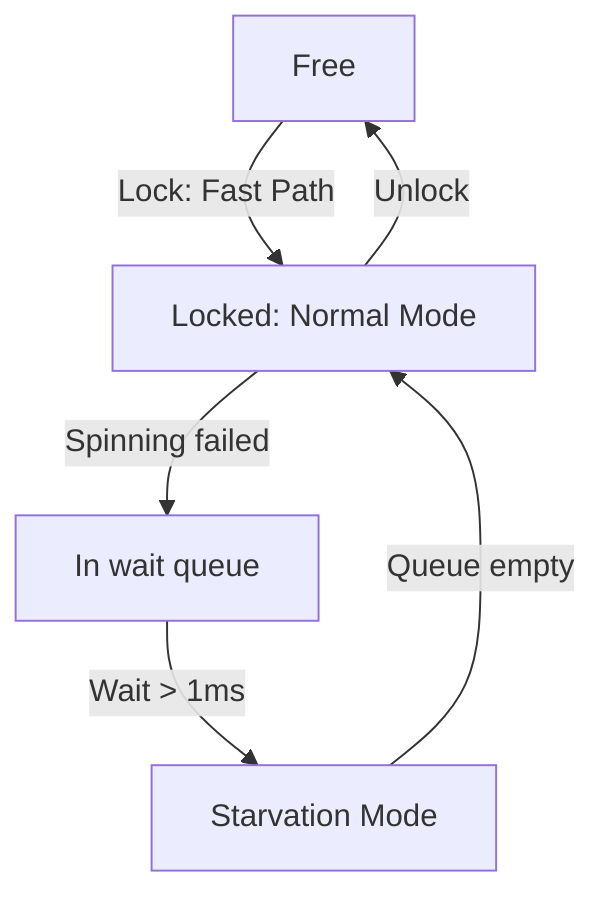
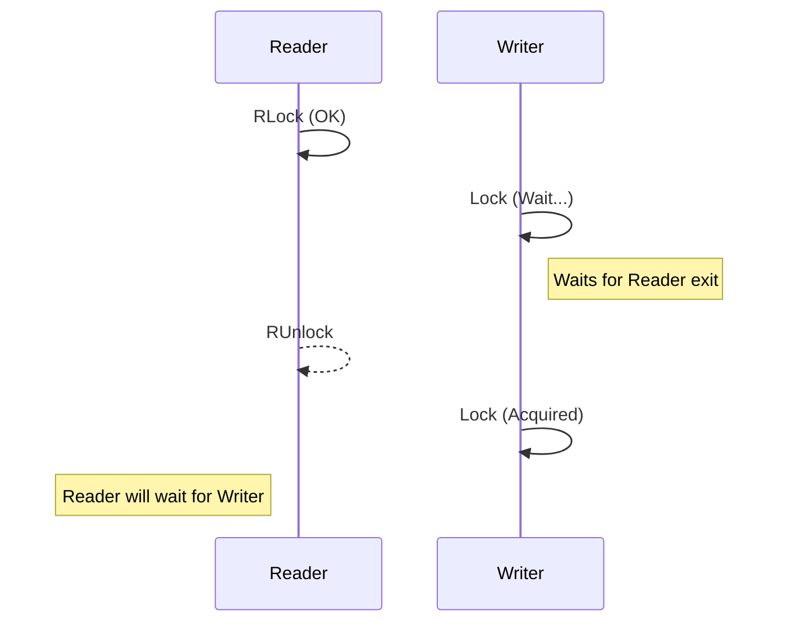

### 1. 👥 sync.WaitGroup

### ❓ Why needed?

WaitGroup is used to wait for a collection of goroutines to finish. It is convenient when you have multiple concurrent tasks and you want to wait for all of them to complete before proceeding.

### ⚙️ How it works?

- WaitGroup is essentially a counter that increments when you add a task (.Add(n)) and decrements when a task is completed (.Done()).

- The .Wait() method blocks execution until the counter becomes zero.

### 🔬 Under the hood implementation

In Go, **WaitGroup** is implemented via the `sync.WaitGroup` structure, which uses two key fields:

- **Counter** (state): stores the number of active tasks and the number of waiting goroutines (**waiters**).
- **Semaphore** (sema): used to block the `.Wait()` call until the counter drops to zero.

> [!IMPORTANT]
> **Alignment**: On 32-bit architectures, `WaitGroup` must be aligned to 8 bytes, otherwise atomic operations on `state` will crash. In 64-bit Go, this happens automatically.

**WaitGroup Internal Structure:**


When you call `.Add(n)`, the counter increments by `n`. `.Done()` decrements it by 1. The `.Wait()` method uses low-level synchronization via **semaphores** (e.g., **futex** in Linux) to efficiently block the execution flow.

### 💡 Usage Example

```Go
package main

import (
	"fmt"
	"sync"
)
func main() {
	var wg sync.WaitGroup

	for i := 0; i < 5; i++ {
		wg.Add(1) // Add a task
		go func(id int) {
			defer wg.Done() // Decrement counter after completion
			fmt.Printf("Goroutine %d completed\n", id)
		}(i)
	}
	wg.Wait() // Wait for all goroutines to complete
	fmt.Println("All tasks completed")
}
```

### When to use?

- When you need to launch several independent tasks and wait for their completion.

- Simple "fire and wait" scenario.

### Limitations

- Cannot reuse WaitGroup after .Wait() (need to create a new instance).

- No way to know the current counter state (only wait).

---

### 2. 🔒 sync.Mutex

### Why needed?

Mutex (mutual exclusion) is used to protect a critical section of code where access to shared data should be available to only one goroutine at a specific moment. This prevents a race condition.

### How it works?

- .Lock() locks the mutex, and only one goroutine can acquire it.

- .Unlock() releases the mutex, allowing another goroutine to acquire it.

- If the mutex is already acquired, the .Lock() call blocks the calling goroutine until it is released.

### Under the hood implementation

`sync.Mutex` uses a combination of **atomic operations** and system calls:

- Internally, it stores **state** (bit field: locked, if there are waiters, starvation mode) and uses the **CAS** (**Compare-And-Swap**) instruction to set the state.
- If the mutex is occupied by short operations, the goroutine may **spin** (**spinning**) — wait in a loop without yielding control to the OS.

#### Operation Modes (since Go 1.9):

1. **Normal Mode**: The queue of waiters works on a FIFO basis, but an awakened goroutine competes with new "incoming" goroutines. New ones usually win because they are already on the CPU.
2. **Starvation Mode**: If a goroutine waits for the mutex for more than **1 ms**, it switches to starvation mode. In this mode, ownership is passed strictly in order.

**Mutex State Diagram:**


> [!TIP]
> **Slow Path**: If **CAS** did not work immediately, Go uses the OS semaphore to "park" the goroutine.

### Usage Example

```Go
package main

import (
	"fmt"
	"sync"
)
func main() {
	var counter int
	var mu sync.Mutex

	var wg sync.WaitGroup
	for i := 0; i < 100; i++ {
		wg.Add(1)
		go func() {
			defer wg.Done()
			mu.Lock()         // Acquire mutex
			counter++         // Critical section
			mu.Unlock()       // Release mutex
		}()
	}

	wg.Wait()
	fmt.Println("Final value:", counter) // Always 100
}
```

### When to use?

- When you need to protect shared data from simultaneous access (e.g., counter, array, map).

- Simple scenarios where full locking is required.

### Limitations

- Blocks even read operations, which can be excessive if data is only read (see RWMutex below).

- Forgotten .Unlock() leads to a deadlock.


### 🚥 Data Race vs Race Condition

Often these concepts are confused, but in Go (and in programming in general) they have a fundamental difference.

#### 1. Data Race
This is a problem of the **memory level**. It occurs when:
- Two or more goroutines access the same variable simultaneously.
- At least one of these accesses is a **write**.
- There are no synchronization mechanisms (mutexes, channels, etc.).

> [!IMPORTANT]
> **Data Race** can be automatically caught using the built-in race detector: `go run -race` or `go test -race`.

**Example:**
```go
func main() {
    c := 0
    go func() { c++ }() // Write
    fmt.Println(c)       // Read (simultaneously with write)
}
```

#### 2. Race Condition
This is a problem of the **business logic or architecture level**. It occurs when the program logic depends on the order in which events are executed, even if memory access is protected.

> [!WARNING]
> **Race Condition** is much more dangerous because `-race` **will not catch** it. From the memory point of view, everything can be correct (all mutexes are in place), but the result will be incorrect due to the wrong order of operations.

**Example:**
Imagine a bank transfer:
1. Check balance (protected by mutex).
2. Debiting money (protected by mutex).

If another operation (e.g., another debit) intervenes between step 1 and 2, the check in step 1 becomes irrelevant. Mutexes protect each action separately, but do not protect the entire sequence as an atomic operation.

| Characteristic | Data Race | Race Condition |
| :--- | :--- | :--- |
| **Level** | Memory (Memory access) | Logic (Semantic/Flow) |
| **Detector `-race`** | Catches (99%) | **Does not catch** |
| **Cause** | Lack of synchronization | Errors in design/algorithm |
| **Cure** | Mutex, Atomic, Channels | Changing architecture (transactions, locking the entire chain) |

---

### 3. 📖 sync.RWMutex

### Why needed?

RWMutex (Read-Write Mutex) is an improved version of Mutex that distinguishes between read and write operations. Allows multiple goroutines to read data simultaneously, but only one to write.

### How it works?

- .RLock() and .RUnlock() — for reading (multiple readers allowed).

- .Lock() and .Unlock() — for writing (full lock, like in normal Mutex).

- Reading is blocked only during writing, and writing is blocked if there are active readers or another writer.

### Under the hood implementation

- Stores a counter of active readers and a flag for the writer.
- Uses **atomic operations** to manage the reader counter.
- **Writer Priority**: If a writer is waiting for the mutex, new readers will not be able to acquire it (via `.RLock()`) until the writer finishes work. This prevents the writer from being "buried" by an endless stream of readers.

**RWMutex Logic:**


### Usage Example

```Go
package main

import (
	"fmt"
	"sync"
	"time"
)
func main() {
	var rwmu sync.RWMutex
	data := 0

	// Readers
	for i := 0; i < 5; i++ {
		go func(id int) {
			rwmu.RLock()
			fmt.Printf("Reader %d: data = %d\n", id, data)
			time.Sleep(100 * time.Millisecond)
			rwmu.RUnlock()
		}(i)
	}
	// Writer
	go func() {
		time.Sleep(50 * time.Millisecond)
		rwmu.Lock()
		data = 42
		fmt.Println("Writer updated data")
		rwmu.Unlock()
	}()
	time.Sleep(500 * time.Millisecond)
}
```

### When to use?

- When read operations prevail over write (e.g., cache, configuration).

- To increase performance in scenarios with frequent reading.

### Limitations

- More complex to implement and may be excessive for simple cases.

---

### 4. ⚛️ sync/atomic

### Why needed?

The atomic package provides low-level operations for working with primitive data types (e.g., int32, int64, uint32) without using mutexes. This is faster than Mutex because operations are performed at the processor level.

### How it works?

- Operations like AddInt32, CompareAndSwapInt32, LoadInt32, StoreInt32 are performed atomically, i.e. as one indivisible instruction.

- Guaranteed that other goroutines will not interfere in the middle of the operation.

### Under the hood implementation

- Processor instructions like **LOCK** (in x86) or **LDREX/STREX** (in ARM) are used.
- **CAS** (**Compare-And-Swap**): The method `atomic.CompareAndSwapInt32(&addr, old, new)` checks if the value at the address is equal to `old`, and if so — writes `new`. All this happens in one processor cycle.

> [!IMPORTANT]
> **This is faster than a mutex**, because there is no call to the Go scheduler and no thread blocking in the OS. This is "non-blocking" synchronization.

### Usage Example

```Go
package main

import (
	"fmt"
	"sync"
	"sync/atomic"
)
func main() {
	var counter int32

	var wg sync.WaitGroup
	for i := 0; i < 100; i++ {
		wg.Add(1)
		go func() {
			defer wg.Done()
			atomic.AddInt32(&counter, 1) // Atomic increment
		}()
	}

	wg.Wait()
	fmt.Println("Final value:", atomic.LoadInt32(&counter)) // Always 100
}
```

### When to use?

- For simple operations with a single value (counters, flags).

- When maximum performance is important and there is no complex logic.

### Limitations

- Only for primitives (int32, int64, uint32, pointer, etc.).

- Not suitable for complex data structures.

---

### 5. 📬 Channels (chan)

### Why needed?

Channels are a synchronization and data transfer mechanism built into Go between goroutines. They allow avoiding explicit locks and simplify coordination.

### How it works?

- Channels block the goroutine when reading or writing if the other side is not ready.

- Buffered channels allow writing data without immediate reading (until the buffer is full).

### Under the hood implementation

- A channel is a structure with a queue (for buffered ones) and a mutex for synchronization.

- Uses the Go scheduler to park goroutines when waiting for data.

### Usage Example

```Go
package main

import "fmt"

func main() {
	ch := make(chan int)

	go func() {
		ch <- 42 // Sending data
	}()
	data := <-ch // Receiving data
	fmt.Println("Received:", data)
}
```

### When to use?

- For data transfer between goroutines.

- When synchronization with state transfer is needed.

### Limitations

- Less control over synchronization compared to Mutex.

---

### ⚖️ Comparison and Tool Selection

|            |                                 |                    |                               |
| ---------- | ------------------------------- | ------------------ | ----------------------------- |
| Tool | When to use              | Pros              | Cons                        |
| WaitGroup  | Waiting for a group of goroutines         | Simplicity           | No reuse  |
| Mutex      | Protecting shared data             | Reliability         | Blocks reading              |
| RWMutex    | Frequent reading, rare writing    | Performance | Harder to use       |
| atomic     | Fast operations with primitives  | High speed   | Limited functionality |
| Channels     | Data transfer and synchronization | Convenience in Go      | Not always flexible               |

---

### 🎯 Conclusion

Each tool solves its own task:

- WaitGroup — for waiting.

- Mutex/RWMutex — for protecting data.

- atomic — for speed.

- Channels — for transfer and coordination.
