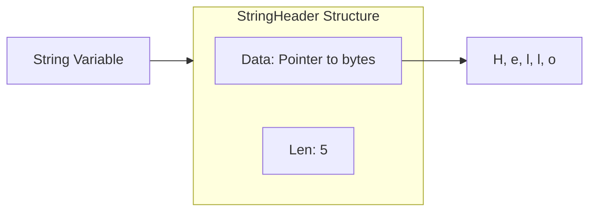

# ⚠️ Package unsafe: Walking on the Razor's Edge

## 📑 Table of Contents
1. [What is unsafe?](#what-is-unsafe)
2. [Main Tools](#main-tools)
3. [Pointer vs uintptr](#pointer-vs-uintptr)
4. [🔥 Dangerous Example: Changing an "immutable" string](#dangerous-example-changing-an-immutable-string)
5. [Why is it needed?](#why-use-it)

---

## ❓ What is unsafe?

**unsafe** is a special package in Go that allows bypassing language type safety. Usually, Go does not allow you to access memory directly or cast one type to another (e.g., `int` to `string`) if it is unsafe.

The `unsafe` package tells the compiler: *"I know what I'm doing, don't interfere with my work with raw memory addresses"*. 🛡️⛔

---

## 🛠️ Main Tools

The package has only a few functions and one special type:

1.  **unsafe.Pointer**: Universal pointer. This is a "bridge" through which any pointer (e.g., `*int`) can be turned into any other (`*string`).
2.  **unsafe.Sizeof**: Returns the size of the type in bytes.
3.  **unsafe.Offsetof**: Returns the offset of the field within the structure.
4.  **unsafe.Alignof**: Returns the alignment of the type.

---

## 🧠 Pointer vs uintptr

It is important to understand this for memory management:

- **unsafe.Pointer**: It is still a pointer for the Garbage Collector (GC). If the GC decides to move the object in memory, it will update this pointer.
- **uintptr**: It is just a **number** (unsigned integer) representing a memory address. The GC "does not see" it. If you save the address in `uintptr`, and the GC moves the object — your number will point to garbage. 🗑️

> [!CAUTION]
> **Golden Rule**: Turn `Pointer` into `uintptr` only for performing arithmetic (add offset) and **immediately** turn it back into `Pointer`. Do not store `uintptr` for long!

---

## 🔥 Dangerous Example: Changing an "immutable" string

In Go, strings (`string`) are read-only structures. But via `unsafe` we can get under the hood and modify the data.



### How to do it (practice):

```go
package main

import (
	"fmt"
	"unsafe"
)

func main() {
	s := "Hello"
	fmt.Println("Before:", s)

	// 1. Get a pointer to the underlying byte array of the string
	// We interpret the string address as a byte slice address.
	// Attention: StringHeader and SliceHeader have different lengths,
	// but their first two fields (Data and Len) are identical.
	b := *(*[]byte)(unsafe.Pointer(&s))

	// 2. Now we can change bytes in memory
	// This will work only if the string is not in read-only memory (e.g., if created dynamically)
	// For literals, this will likely cause a SEGFAULT.
	// b[0] = 'H' // In theory so, but better to use dynamic strings for tests
	
	fmt.Printf("Pointer to data: %v\n", unsafe.Pointer(&b[0]))
}
```

> [!WARNING]
> Editing strings via `unsafe` is **Undefined Behavior**. In modern Go versions, string literals usually fall into "read-only" memory. Attempting to change them will cause **panic: runtime error: invalid memory address or nil pointer dereference** or **segmentation fault**.

---

## 🏗️ How does casting without copying work?

One of the most frequent "legal" ways to use `unsafe` is converting `[]byte` to `string` without allocating new memory and copying:

```go
func BytesToString(b []byte) string {
    return *(*string)(unsafe.Pointer(&b))
}
```
Here we simply tell Go to look at the same bytes in memory, but consider them a string. This saves time and memory on large volumes of data.

---

## 🚀 Why use it?

If it is so dangerous, why does the package exist?

1.  **High Performance**: For example, casting `[]byte` to `string` without copying data. It is often used in the standard library for optimization.
2.  **Interoperability (cgo)**: For passing data to C functions.
3.  **System Programming**: If you write your own memory allocator or low-level driver.
4.  **Access to Private Fields**: You can calculate the offset (`Offsetof`) of a private struct field from another package and read it. 🕵️‍♂️

---

## 🏁 Summary

- `unsafe` is a **hack** of Go rules.
- Use it only if you have measured with a profiler and realized that this is the **only** way to speed up the code.
- Remember about **GC**: never do pointer arithmetic outside one line of code with type casting.
- If you can avoid `unsafe` — **avoid it**. 🚫

---

> [!IMPORTANT]
> Programs using `unsafe` may stop working when updating the Go version, as the internal representation of types (e.g., string or slice structures) may change.
