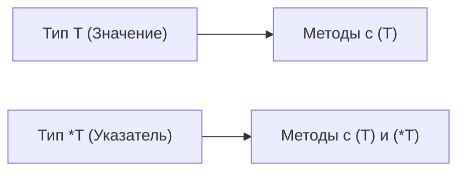
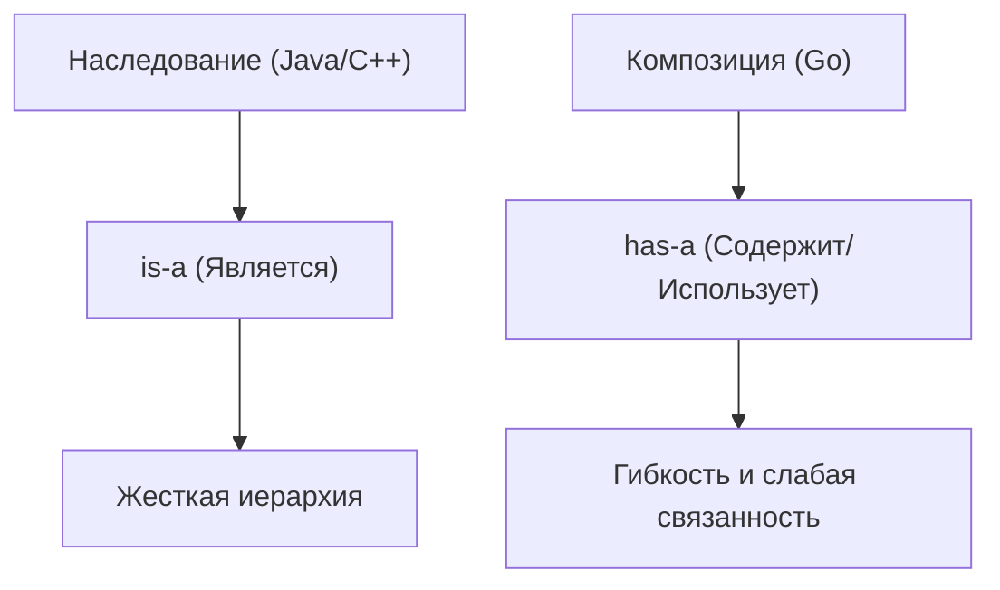

### 🏗️ Структуры и методы в Go

Структура (`struct`) — это композитный тип данных, который позволяет объединить поля различных типов в одну сущность. В Go нет классов, поэтому структуры являются основным способом моделирования данных и поведения.

---

# 1. 🧩 Основы структур

Структура — это набор именованных полей.

```go
type User struct {
    ID    int    // Экспортируемое поле (с большой буквы)
    name  string // Скрытое поле (доступно только внутри пакета)
    Email string
}
```

### ⚙️ Ключевые свойства
- **Экспортируемость**: Если имя поля или самой структуры начинается с заглавной буквы, они доступны из других пакетов. Если со строчной — только внутри текущего пакета.
- **Сравнение**: Структуры можно сравнивать (`==`, `!=`), если все их поля являются **сравнимыми** (например, числа, строки, указатели). Если структура содержит срез (`slice`) или карту (`map`), она несравнима.
- **Нулевое значение**: Если поля не инициализированы, они получают свои нулевые значения (`0`, `""`, `nil`).
- **Литералы**: Можно инициализировать по именам полей или по порядку.
    ```go
    u := User{ID: 1, name: "Alice"} // Рекомендуется
    u2 := User{2, "Bob", "bob@example.com"} // Не рекомендуется (хрупко при изменениях)
    ```

---

# 2. 🎭 Анонимные структуры

Иногда нужно создать структуру "на лету" без объявления типа. Это полезно для передачи данных в шаблоны, JSON-ответов или в тестах.

```go
data := struct {
    ID    int
    Token string
}{
    ID:    1,
    Token: "secret",
}
```

---

# 3. 🛠️ Методы (Methods)

Метод в Go — это функция, которая привязана к конкретному типу. Он позволяет реализовывать поведение для структур и других пользовательских типов.

### 📝 Синтаксис
Чтобы превратить функцию в метод, нужно добавить **receiver** (получателя) перед именем функции.

```go
type User struct {
    name string
}

// (u User) — это ресивер
func (u User) Greet() {
    fmt.Printf("Привет, я %s\n", u.name)
}
```

---

# 4. 🎯 Pointer vs Value Receivers

Это фундаментальная тема. Выбор ресивера определяет, как метод работает с данными.

| Тип ресивера | Копирование? | Изменяет оригинал? | Когда использовать? |
| :--- | :--- | :--- | :--- |
| **Value** `(u User)` | Да (копия объекта) | Нет | Маленькие структуры, неизменяемые данные. |
| **Pointer** `(u *User)` | Нет (копия адреса) | **Да** | Нужно изменить состояние или структура большая (чтобы не копировать). |

### 🔍 Что выбрать?
1. **Мутация**: Если метод должен изменить поля структуры — используйте **Pointer**.
2. **Производительность**: Если структура большая (больше 64 байт) — используйте **Pointer**, чтобы избежать копирования всей памяти.
3. **Консистентность**: Если у типа уже есть методы с Pointer ресивером, все остальные тоже должны быть такими.

---

# 5. 🍭 Под капотом: Синтаксический сахар

Для многих новичков методы кажутся магией, но в Go это чистый **синтаксический сахар**. 

Когда вы пишете:
```go
u.Greet()
```

Компилятор на самом деле превращает это в обычный вызов функции, где объект передается первым аргументом:
```go
User.Greet(u)
```

### 🤯 Почему это важно?
Это объясняет две вещи:
1. **Вызов на nil**: Мы можем вызвать метод на `nil` указателе, потому что это просто функция, принимающая `nil` как первый аргумент.
2. **Авто-разыменование**: Если у вас есть `u` (значение), а метод требует `(*u)` (указатель), Go сам возьмет адрес `(&u).Method()`, чтобы вам не пришлось делать это вручную. И наоборот!

---

# 6. ⚓ Method Sets (Наборы методов)
Это правила того, какие методы доступны объекту в зависимости от того, является ли он значением или указателем.



1. **Для переменной типа `T`**: Go автоматически разыменовывает или берет адрес, поэтому вы можете вызвать любой метод.
2. **Для интерфейсов**: Если интерфейс требует метод с `(*T)`, то реализовать его может **только указатель** `*T`. Копия `T` не может гарантировать безопасность изменений.

---

# 5. 🏗️ Constructors (Конструкторы)

В Go нет ключевого слова `constructor`. Вместо него используется паттерн `New...`.

```go
func NewUser(id int, name string) *User {
    // Здесь можно добавить валидацию
    return &User{
        ID:   id,
        name: name,
    }
}
```

> [!TIP]
> Возврат указателя `*User` позволяет избежать копирования структуры при возврате из функции.

---

# 6. 🧬 Nil Receivers

Так как методы — это функции, принимающие объект первым аргументом, мы можем вызывать метод даже на `nil` указателе, если внутри метода есть проверка.

```go
func (u *User) GetName() string {
    if u == nil {
        return "Guest"
    }
    return u.name
}

var u *User = nil
fmt.Println(u.GetName()) // Выведет "Guest", а не вызовет панику!
```

---

# 7. 🏗️ Embedding (Внедрение)

В Go нет наследования. Вместо него используется **композиция** через внедрение анонимных полей.

```go
type Admin struct {
    User  // Внедрение (embedding)
    Level int
}

a := Admin{User: User{name: "Иван"}, Level: 10}
fmt.Println(a.ID) // Прямой доступ к полям вложенной структуры
```

### ⚔️ Наследование vs Композиция



---

# 8. 📦 Memory Layout: Padding и Alignment

Структуры в памяти хранятся последовательно, но компилятор добавляет "пустоты" (padding) для выравнивания данных.

```go
type BadStruct struct {
    A int8  // 1 байт
    B int64 // 8 байт
    C int8  // 1 байт
} // Занимает 24 байта

type GoodStruct struct {
    B int64 // 8 байт
    A int8  // 1 байт
    C int8  // 1 байт
} // Занимает 16 байт
```

> [!CAUTION]
> **Размер имеет значение**: Неправильный порядок полей может увеличить потребление памяти в 1.5-2 раза. Подробнее см. раздел [Alignment](../Alignment/alignment.md).

---

# 9. ⚠️ Опасные моменты

### 🚫 Копирование Mutex
Если вы встроите `sync.Mutex` в структуру и скопируете её, вы скопируете и состояние мьютекса (заблокирован/разблокирован). Это приведет к дедлокам.

```go
type Counter struct {
    mu    sync.Mutex
    count int
}

c1 := Counter{}
c2 := c1 // ОПАСНО: c2 теперь имеет копию мьютекса c1
```

### 🏃‍♂️ Data Race с Value Receiver
Если вы запускаете горутину и передаете туда метод с Value Receiver, вы работаете с локальной копией. Если метод с Pointer Receiver — вы работаете с оригиналом, что требует синхронизации.

---

# 7. 🏷️ Struct Tags (Теги)

Теги — это метаданные, используемые рефлексией (например, для JSON или работы с БД).

```go
type User struct {
    Name string `json:"user_name" db:"name"`
    Age  int    `json:"age,omitempty"` // omitempty — скрыть, если 0
}
```

---

# 📊 Сводка: Выбор Receiver

1. **Меняете состояние?** -> Pointer.
2. **Структура большая (> 64 байт)?** -> Pointer.
3. **Это `map`, `chan` или `func`?** -> Value (они и так ссылочные).
4. **Нужна потокобезопасность?** -> Почти всегда Pointer (чтобы работать с общим состоянием).

